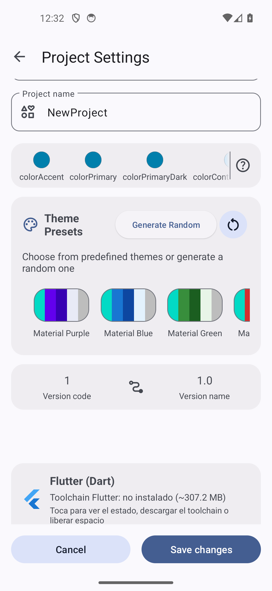
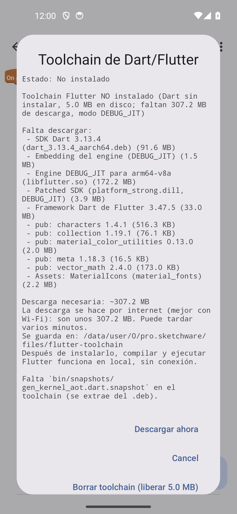
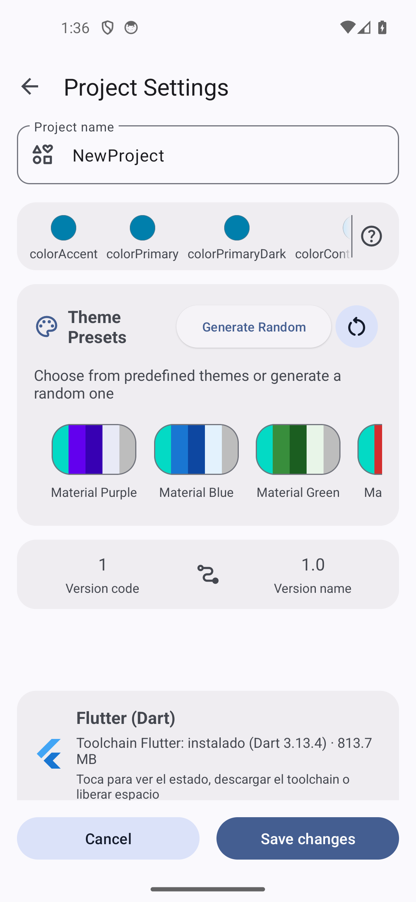

# Flutter: la descarga de Dart ya es una decisión tuya (v7.0.9.0)

Fecha: 2026-09-23 · Versión: **v7.0.9.0** (versionCode 166) · Repo: `Sketchware-Pro-main`

Actualizado en **v7.0.10.0** (versionCode 167): el toolchain ya se encuentra sin buscar el flag (ver «Dónde está ahora»).

Actualizado en **v7.0.10.1** (versionCode 168): el estado y la instalación del toolchain quedan arreglados
(ver «6. v7.0.10.1: el estado y la instalación del toolchain (arreglado)»).

Release: <https://github.com/aurenox-global/Sketchware-Pro/releases/tag/v7.0.9.0>

Antes, al compilar un proyecto Flutter (modo experimental, detrás del flag `FLUTTER_EXPERIMENTAL_ENABLE`) la app
podía **descargar sola** el toolchain de Dart (~307 MB) sin avisar ni preguntar. Ahora la descarga **no ocurre nunca
en silencio**: hay un diálogo que muestra qué falta, cuánto ocupa, dónde se guarda, y la decide el usuario.

## Dónde está ahora / Where it is now

Aunque este documento nació en **v7.0.9.0**, desde **v7.0.10.0** (versionCode 167) el toolchain de Dart ya no está
escondido detrás de un feature flag ni de un menú del editor de lógica: hay **tres entradas** y, además, el flag
`FLUTTER_EXPERIMENTAL_ENABLE` viene **activado por defecto** (a quien ya lo haya cambiado se le respeta su valor).

| Dónde | Entrada | Qué hace |
| --- | --- | --- |
| Ajustes del proyecto (*Change project settings*) | Tarjeta **"Flutter (Dart)"** con la línea de estado real (`Toolchain Flutter: no instalado (~307.2 MB)` / `instalado (Dart <v>) · <N MB>`) | Al tocarla abre el diálogo de estado/descarga/borrado de arriba |
| Pantalla de diseño → **drawer** | **"Flutter: estado del toolchain"** | Abre el mismo diálogo |
| Editor de lógica → menú | **Flutter: estado del toolchain** (ya existía) | El mismo diálogo |

El estado de la tarjeta se calcula en segundo plano (mientras tanto muestra `Toolchain Flutter: comprobando el
estado…`, sin bloquear la pantalla). Si el flag está **apagado**, las dos entradas nuevas siguen visibles —muestran
`Toolchain Flutter: función desactivada` y `Toca para ver cómo activarla`— y al pulsarlas aparece un diálogo que
explica activarlo en *Ajustes › Feature flags › "Flutter Experimental Enable"*, con un botón **Abrir Feature flags**:
nada desaparece en silencio.



Honesto: la línea `instalado (Dart <v>) · <N MB>` **no se llegó a ver renderizada** en la prueba (el emulador no
tenía toolchain y no se descargaron los ~307 MB); se construye con la misma API que ya usaba el diálogo del editor de
lógica. La evidencia es de un emulador arm64 API 34 con `uiautomator` y capturas.

## 1. Qué se ve en el diálogo

Menú del editor de lógica → **Flutter: estado del toolchain**. El estado se calcula en un hilo de fondo (ejecuta los
binarios y mide el disco) y el diálogo Material muestra:

- **Estado**: instalado o no (con una línea de resumen).
- **Lista de los componentes que faltan, cada uno con su tamaño**: SDK de Dart (`dart_3.13.4_aarch64.deb`, 91,6 MB),
  embedding del engine (1,5 MB), engine `libflutter.so` para arm64-v8a (172,2 MB), *patched SDK* (3,9 MB), framework
  Dart de Flutter 3.47.5 (33,0 MB), los paquetes de pub (characters, collection, `material_color_utilities`, meta,
  `vector_math`) y los `material_fonts`.
- **`Descarga necesaria: ~307.2 MB`** — el número real medido en el emulador, sumando solo lo que **falta** (no el
  toolchain entero). El tarball del framework es el único tamaño que no venía en el código: se midió a mano
  (34.580.315 B) porque GitHub no publica `content-length`.
- **Aviso de red**: se descarga por internet, mejor con Wi-Fi; son unos 307,2 MB y puede tardar varios minutos.
- **Dónde se guarda**: `/data/user/0/pro.sketchware/files/flutter-toolchain`.
- **Y que después funciona sin conexión**: una vez instalado, compilar y ejecutar Flutter va en local.

Botones del diálogo:

| Botón | Qué hace |
| --- | --- |
| **Descargar ahora** | Único camino que toca la red. Descarga solo los componentes que faltan. |
| **Borrar toolchain (liberar X MB)** | Solo aparece si hay algo instalado; pide **confirmación** aparte y libera el espacio ocupado. |
| **Cancelar** | Cierra sin descargar y sin tocar el disco. |



## 2. Compilar y ejecutar también pide permiso

El camino **Flutter: compilar y ejecutar** pide el **mismo consentimiento** antes de arrancar el build (bloquea el
hilo de compilación y muestra el diálogo). Si el usuario cancela, la compilación **no se ejecuta**, el log dice
`Build abortado: no se ha autorizado la descarga del toolchain.` y **no se escribe nada en disco**.

A nivel de código, `ensureInstalled(...)` — la variante que usan **todos** los caminos de build — ya **no descarga**:
solo deja el mensaje `Para compilar Flutter hace falta el toolchain de Dart: instalalo desde Flutter > Estado del
toolchain` y devuelve `false`. La descarga vive en la variante nueva `ensureInstalled(..., allowDownload = true)`,
que solo se invoca **después** de que el usuario acepte. El efecto colateral deseado es que
`DesignActivity`/`ExportProjectActivity` (vía `FlutterCompilerBridge`) tampoco descarguen a espaldas del usuario.

## 3. Información del proyecto

**Flutter: información del proyecto** incluye ahora si el toolchain está instalado, lo que falta y el espacio ocupado
(`Toolchain: no instalado (~307.2 MB)` o `Toolchain: listo`, `Dart instalado: …`, `Espacio ocupado por el toolchain:
…`). Todo el cálculo se movió a un hilo de fondo (antes `isReady` ejecutaba binarios en el hilo de UI).

## 4. Pendientes honestos

- **La descarga real de los 307 MB no se ejecutó** en la prueba (era opcional): el flujo "aceptar → descargar" no
  llegó a completarse en el emulador. Que el toolchain completo instala y compila después ya estaba verificado en
  fases anteriores.
- El **borrado** se probó con un toolchain **simulado de 5 MB**, no con uno real de 300 MB (el botón y la confirmación
  dependen solo de que haya bytes instalados, así que el camino es el mismo).
- La evidencia es de un **emulador** arm64 API 34 (`uiautomator` + capturas); no se ha probado en móvil físico.
- Los diálogos salen en inglés (`Cancel`) porque el emulador estaba en inglés; con el sistema en español se ve
  "Cancelar".

## 5. Reproducirlo

```bash
./gradlew assembleDebug
adb install -r -d app/build/outputs/apk/debug/app-arm64-v8a-debug.apk
# FLUTTER_EXPERIMENTAL_ENABLE=true en las prefs de la app (con la app parada)
# menú -> Flutter: estado del toolchain  ->  Descargar ahora / Borrar toolchain / Cancelar
# Flutter: compilar y ejecutar -> Cancelar -> "Build abortado: no se ha autorizado la descarga del toolchain."
```

## 6. v7.0.10.1: el estado y la instalación del toolchain (arreglado)

En la **v7.0.10.1** (versionCode 168) se arregla el falso *"Toolchain de Flutter no instalado"* que aparecía **después**
de descargar los 91 MB del `.deb` de Dart.

**Qué pasaba.** El instalador comprobaba la instalación **ejecutando** `<filesDir>/flutter-toolchain/dart/bin/dart
--version`. Ese ELF vive en el directorio de datos de la app (`app_data_file`) y SELinux **prohíbe ejecutarlo** en
`targetSdk >= 29` en el dominio `untrusted_app`:

```
avc: denied { execute_no_trans } for path="/data/data/pro.sketchware/files/flutter-toolchain/dart/bin/dart"
     scontext=u:r:untrusted_app:s0 tcontext=u:object_r:app_data_file:s0 tclass=file permissive=0
java.io.IOException: Cannot run program "…/bin/dart": error=13, Permission denied
```

La sonda devolvía `null` y el instalador **abortaba antes de bajar los artefactos del engine**, así que la UI concluía
*"Toolchain de Flutter no instalado"* cuando los datos del SDK **sí** estaban extraídos. Era un bug de comprobación
nuestro. Nota: `adb shell run-as pro.sketchware …/bin/dart --version` **sí** funciona (acaba en el dominio `runas_app`),
por eso esa vía no sirve como prueba — la sonda válida es la que ejecuta la propia app.

**Qué se cambió.**

- **"Instalado" pasa a ser un criterio de datos**: marcador `installed.properties`, `bin/snapshots/gen_kernel_aot.dart.snapshot`,
  `bin/snapshots/dartdev_aot.dart.snapshot` y `lib/_internal/vm_platform.dill`. Un `bin/dart` que no arranca ya **no**
  puede convertir una extracción correcta en "no instalado".
- **"Puede compilar" añade una sonda de ejecución real** desde el directorio de librerías nativas
  (`nativeLibraryDir/libdartaotruntime.so`, empaquetado en el APK arm64-v8a). **`bin/dart` ya no se ejecuta** en ningún
  camino; si algo no se puede lanzar, el mensaje dice **qué pieza**, **dónde** y **por qué** (SELinux/W^X), y hay un
  **estado intermedio honesto** (`SDK Dart … extraido … pero NO listo para compilar`) en lugar de culpar a W^X cuando lo
  que falta son artefactos del engine.
- **Segundo bug, pre-existente, arreglado:** la extracción de las dependencias de pub usaba el prefijo
  `<paquete>-<version>/`, que los tarballs de pub.dev **no** llevan → 0 ficheros → *"El paquete characters 1.4.1 no se
  extrajo bien"*. Ahora reintenta sin prefijo (`W/FlutterEngineArtifacts: characters-1.4.1.tar.gz: sin entradas con el
  prefijo …; se reintenta sin prefijo`) y la instalación termina con "Dependencias de pub listas".
- **El diálogo de consentimiento avisa del espacio real en disco:** la descarga son **~307 MB**, pero al extraerlo el
  toolchain ocupa **~800 MB** (medido: **813.7 MB** con el SDK Dart + artefactos del engine).

**Verificado en emulador** (arm64, API 34): instalación completa → `Toolchain Flutter: instalado (Dart 3.13.4) · 813.7 MB`,
y el log del instalador imprime que ejecutó `nativeLibraryDir/lib/arm64/libdartaotruntime.so` →
`Dart SDK version: 3.13.4 (stable) … on "android_arm64"`, es decir, la app lanzó su propio binario empaquetado dentro de
su proceso (`untrusted_app`).



**Pendiente honesto:** la **compilación completa** (pub get + build) disparada desde dentro de la app **no** se pudo
automatizar en el emulador (el disparador del build no es fiable por `adb input tap` y la fase Java del pipeline falla
allí por un problema de entorno ajeno a Flutter); lo que **sí** está probado es que el binario empaquetado **se ejecuta**
en el proceso de la app, que es la premisa de ese camino. Tampoco se ha re-verificado `RELEASE_AOT` ni otras ABIs.

## 7. v7.0.11.0: el toolchain de Flutter para x86_64

Antes de esta versión el editor solo podía compilar Flutter en la variante **arm64-v8a** del APK: en `x86_64` el AOT se
rechazaba a propósito y faltaban los dos ejecutables. Ahora `x86_64` tiene el mismo trato que `arm64-v8a`, y su
toolchain **ya viaja dentro del APK de esa ABI**:

- `app/src/main/jniLibs/x86_64/libdartaotruntime.so` — **5.873.176 B**, sha256 `f23e06ad…`, del `.deb` de Termux
  `dart_3.13.4_x86_64.deb` (137.243.692 B). **Trampa documentada:** el `bin/dartaotruntime` que se ve en `usr/bin/` del
  `.deb` **no** es un ELF, es un script de shell de 115 B; el que hay que empaquetar es el ELF de `lib/dart-sdk/bin/`.
- `app/src/main/jniLibs/x86_64/libfluttergensnapshot.so` — **5.123.768 B**, sha256 `2f37d687…`, **compilado** desde las
  fuentes del Dart SDK 3.13.4 con `./tools/build.py --no-rbe --arch x64c --mode product --os android gen_snapshot`
  (65,4 s). Flags con evidencia, no adivinados: Android x64 **también** usa **compressed pointers**, y el nombre de
  arquitectura correcto es `x64c` (`IsCompressedPointerArch(arch) = "64c" in arch`); lo confirman el `gen_snapshot`
  oficial del engine, el error del propio VM y el `strings` del binario recién compilado.

El **bloqueo por ABI** se sustituye por `abiHasAotBackend(abi)` (`arm64-v8a` | `x86_64`); `armeabi-v7a`/`x86` siguen
avisando, y si falta el binario en una ABI con backend el mensaje nombra **esa** ABI.

**Coste:** **+4,34 MB solo en x86_64** (APK release 112.136.131 → 116.476.809 B); el arm64 queda **idéntico**.
**Pendiente honesto: la ejecución real en x86_64 no está verificada** — no hay ninguna imagen x86_64 disponible y
compilar/ejecutar en Apple Silicon (arm64) es inviable. Lo que está probado es de dónde sale cada binario (sha256
pinneados) y con qué flags se generó el snapshot.
