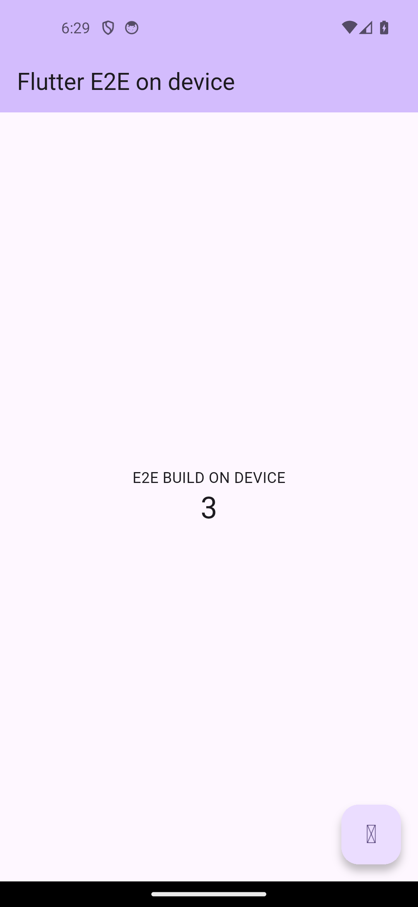

# Fase 7 — Flutter experimental en Sketchware Pro (v7.0.7.0)

**Versión:** v7.0.7.0 · versionCode **161** · Fecha: 2026-09-23
**Fuente principal de los datos técnicos:** `flutter-e2e/INFORME-E2E.md` (prueba real sobre emulador), junto con los
informes de los carriles A, B2 y C de esta misma fase.

Esta fase añade un **tipo de proyecto Flutter** al fork: el editor entiende Dart, la app siembra un proyecto Flutter
mínimo y el móvil descarga y usa su propio toolchain para compilar. Todo es **experimental** y va detrás de un flag
**apagado por defecto**.



---

## 1. Qué se entregó

| Área | Qué hay ahora |
|---|---|
| **Editor** | Gramática TextMate de Dart (del proyecto Dart-Code, licencia MIT) + `language-configuration.json` + entrada en `textmate/languages.json` + `SCOPE_NAME_DART` + `ProjectDartLanguage` (autocompletado de Dart) + ramas `.dart` en `SrcCodeEditor` + icono `ic_flutter`. |
| **Proyecto** | Paquete `pro/sketchware/flutter/` (`FlutterProject`, `Store`, `Serializer`, `ScaffoldTemplates`, `ScaffoldInitializer`): siembra `pubspec.yaml`, `lib/main.dart` (Material 3, contador), `assets/`, `.gitignore`, `android/` y `project.json` bajo `files/flutter/` del proyecto. |
| **Feature flag** | `FLUTTER_EXPERIMENTAL_ENABLE` en **Ajustes › Feature flags**, **apagado por defecto**. Con el flag apagado no se siembra nada ni aparece nada en el editor. |
| **Menú Flutter** | En el editor: *Flutter: compilar y ejecutar*, *Flutter: estado del toolchain*, *Flutter: información del proyecto*; al compilar se elige modo *Debug (JIT)* o *Release (AOT)*. |
| **Toolchain on-device** | Descarga al propio móvil el Dart SDK para Android (paquete `dart 3.13.4`, `.deb` del repo de Termux) y los artefactos del engine de Flutter 3.47.5 (embedding + `libflutter.so` + `flutter_patched_sdk` + fuentes del framework). Parser **ar** propio, XZ (`org.tukaani:xz:1.10`) y lector **tar** propio. |
| **Compilación** | `gen_kernel` en el dispositivo → `kernel_blob.bin` (modo DEBUG/JIT); empaquetado con el `aapt2` + dex + `apksigner` que el fork ya traía (**sin Gradle** en ningún momento). |

**No hay servicio en la nube.** La única red que se usa es la descarga inicial del toolchain; a partir de ahí todo se
ejecuta en el teléfono.

---

## 2. Cómo funciona el pipeline (comandos reales)

Los comandos de abajo son los exactos que se ejecutaron en la prueba E2E (informe, §4). Las rutas del informe
(`/data/local/tmp/e2e/…`) en la app corresponden al directorio de toolchain en `filesDir`.

```bash
# (1) Front-end Dart EN EL DISPOSITIVO  ->  app.dill  (modo release/AOT)
dartaotruntime bin/snapshots/gen_kernel_aot.dart.snapshot \
  --aot --tfa --target=flutter --target-os=android \
  --platform=<patched_sdk>/platform_strong.dill \
  --packages=<app>/.dart_tool/package_config.json \
  -Ddart.vm.product=true -Ddart.vm.profile=false \
  -o <build>/app.dill <app>/lib/main.dart

# (1b) Front-end Dart EN EL DISPOSITIVO  ->  kernel_blob.bin  (modo debug/JIT)
dartaotruntime bin/snapshots/gen_kernel_aot.dart.snapshot \
  --target=flutter \
  --platform=<patched_sdk>/platform_strong.dill \
  --packages=<app>/.dart_tool/package_config.json \
  -Ddart.vm.product=false \
  -o <build>/kernel_blob.bin <app>/lib/main.dart

# (2a) Back-end AOT EN EL DISPOSITIVO  ->  libapp.so   (INCOMPATIBLE, ver §3)
bin/utils/gen_snapshot --deterministic --snapshot_kind=app-aot-elf \
  --elf=<build>/libapp.so --strip <build>/app.dill

# (2b) Back-end AOT con el gen_snapshot DEL ENGINE (host, por ABI)
#      android-arm64-release/darwin-x64.zip -> gen_snapshot   (COMPATIBLE)
./gsnap/gen_snapshot --deterministic --snapshot_kind=app-aot-elf \
  --elf=<build>/libapp.so --strip <build>/app.dill

# (3) Empaquetado (lo que ya hace el fork): aapt2 -> d8 -> zip -0 -> zipalign -> apksigner
```

Dos detalles que importan y que costaron encontrar:

- El `gen_kernel` de este SDK **no** acepta `--sdk-root` / `--output-dill`; usa `--platform=<platform_strong.dill>`
  y `-o <salida>`.
- `platform_strong.dill` (del `flutter_patched_sdk.zip`) define `dart:ui`; **no** hace falta `sky_engine` en el
  `package_config.json`.
- **El engine elige AOT o JIT por el jar de embedding que se use**: el jar *release* implica AOT (`libapp.so`), el
  jar *debug* implica JIT (`kernel_blob.bin`). Ver `FlutterLoader`/`BuildConfig` del engine.

El punto de unión con el build Android existente es `FlutterCompilerBridge.compileFlutterCodeIfPossible(...)`,
llamado **antes** de `compileResources()` (los assets de Flutter tienen que existir cuando AAPT2 enlaza) desde
`DesignActivity` y `ExportProjectActivity`.

---

## 3. La limitación honesta: el AOT en el dispositivo está bloqueado

> **Nota (fase 8):** esta limitación **ya no aplica**. En la fase 8 se construyó un `gen_snapshot` arm64/Android con
> compressed pointers (`--arch arm64c --mode product`) y el dispositivo genera con él un `libapp.so` que el engine
> oficial acepta; el APK release arranca sin cinta DEBUG. El AOT on-device pasa a estar disponible (el modo por
> defecto sigue siendo Debug/JIT). Los detalles y los comandos están en
> [docs/flutter-fase8.md](flutter-fase8.md). El texto de abajo se conserva como registro de la causa raíz.

**Hoy el único modo usable es DEBUG/JIT.** El modo RELEASE/AOT no se puede cerrar en el propio móvil.

Causa técnica exacta: el `gen_snapshot` (y el VM) del **Dart SDK para Android** está compilado **sin compressed
pointers**, mientras que el **engine oficial de Flutter los exige**. El error literal del runtime es:

```
CreateRootIsolate failed: Snapshot not compatible with the current VM configuration:
the snapshot requires 'product … arm64 android no-compressed-pointers'
but the VM has 'product … arm64 android compressed-pointers'
```

No es cuestión de una flag: ese `gen_snapshot` **ni siquiera acepta** `compressed_pointers`
(`Setting VM flags failed: Unrecognized flags: compressed_pointers`). Un `gen_snapshot` compatible **solo se
publica para hosts** linux-x64 / darwin-x64 / windows-x64 (para arm64/android la descarga da **404**). En la prueba
se resolvió ejecutando en el host el `gen_snapshot` del propio engine sobre el `app.dill` generado en el dispositivo
(pasó de `no-compressed-pointers` a `compressed-pointers` y el APK arrancó) — pero eso ya **no** es 100 % on-device.

**La UI lo dice**: el modo *Release (AOT)* se ofrece, se intenta y falla con un mensaje explícito; el camino que
funciona es *Debug (JIT)*.

Otras cosas que **no** están y no se deben prometer:

- **Sin hot reload** ni VM service (el engine debug lo intenta levantar y el socket falla por política; ver informe §10.3).
- **Sin resolución de pub de terceros**: el `package_config.json` de la prueba era **sintético**, escrito a mano; no
  hay `dart pub get` real en el dispositivo.
- **Sin plugins** (`GeneratedPluginRegistrant`): registrar plugins añade dex y registro real; no se probó.
- **No probado en móvil físico** ni con ABIs distintas de **arm64-v8a** (todo fue emulador arm64 API 34 con `adb root`).
- **Assets del bundle incompletos**: faltan `fonts/MaterialIcons-Regular.otf` (por eso el glifo del FAB sale como
  caja vacía), `shaders/ink_sparkle.frag`, `AssetManifest.bin` y `NOTICES.Z`.
- **Ejecutar binarios desde dentro de la app**: con `targetSdk >= 29` SELinux puede bloquear el `execve` desde el
  data dir. En el emulador se probó **como root**, así que esa restricción **no está verificada** en condiciones reales.

---

## 4. Números medidos en la prueba E2E

| Medición | Valor |
|---|---|
| `gen_kernel` (AOT, todo `package:flutter/material.dart` de 23 MB) en el dispositivo | **7,52 s** → `app.dill` **25.076.128 B** |
| `gen_kernel` (JIT) en el dispositivo | **4,22 s** → `kernel_blob.bin` **54.258.928 B** |
| `gen_snapshot` (gen_snapshot del SDK) en el dispositivo | **3,86 s** → `libapp.so` 4.260.744 B (**incompatible**) |
| `gen_snapshot` del engine, en host | **6,0 s** → `libapp.so` 3.867.528 B (**válido**) |
| APK AOT final | **174 MB** (`libflutter.so` release de 165 MB) |
| APK debug/JIT final | **416 MB** (`libflutter.so` debug de 395 MB + kernel 54 MB) |
| Toolchain que se descarga al móvil | `.deb` de Dart 3.13.4 = **96.035.948 B** (aarch64; x86_64 = 137.243.692 B) |
| Fuentes del framework | tag `3.47.5`, `packages/flutter/lib` = **23 MB** |

---

## 5. La prueba real (lo que sí está demostrado)

Entorno: **emulador AVD `RV_API34`** (`emulator-5554`), **arm64-v8a**, **API 34**, con `adb root`. Engine Flutter
`af7e796e161ae0bb1ff0758c71a7105418bd9ded` (Flutter 3.47.5). **Sin móvil físico en ningún momento.**

- Se generó un `kernel_blob.bin` **con el Dart del propio dispositivo** y se armó un APK a mano con
  `aapt2` + `d8` + `zipalign` + `apksigner` (firma de test del propio fork).
- La app **arrancó**: `FlutterActivity` en **RESUMED**, engine cargando `libflutter.so`, **Impeller (OpenGLES)**
  renderizando el `MaterialApp`.
- La **UI Material se ve** (appbar, texto centrado) y el **contador responde a toques reales**: 3 pulsaciones
  (`adb shell input tap …`) → 3 `setState` → el valor pasa de 0 a 3. Es el pantallazo que abre este documento.
- Variante AOT: APK de 174 MB con `libapp.so` generado por el `gen_snapshot` del engine, también arrancado y con
  contador 0 → 3.

Logcat representativo del arranque JIT (informe §5.5):

```
I ResourceExtractor: Extracted baseline resource assets/flutter_assets/kernel_blob.bin
D FlutterJNI: flutter (null) was loaded normally!
I flutter : Using the Impeller rendering backend (OpenGLES).
```

---

## 6. Cómo activarlo

1. **Ajustes › Feature flags › `FLUTTER_EXPERIMENTAL_ENABLE`** → activar. Viene **apagado** a propósito.
2. Crear o abrir un proyecto: al guardar el proyecto se siembra `files/flutter/` (`pubspec.yaml`, `lib/main.dart`,
   `assets/`, `android/`, `project.json`).
3. En el editor, abrir el menú **Flutter**:
   - *Instalar/actualizar toolchain* — descarga el Dart SDK y los artefactos del engine al propio dispositivo
     (necesita red y espacio libre; el `.deb` son ~96 MB). Se puede consultar después con *Estado del toolchain*.
   - *Compilar y ejecutar* — elegir **Debug (JIT)**, que es el modo que funciona hoy.
   - *Información del proyecto* — estado del proyecto Flutter detectado.

---

## 7. Siguientes pasos

1. **AOT on-device de verdad**: construir (o conseguir) un `gen_snapshot` android-arm64 **con compressed pointers**,
   o un engine sin compressed pointers. Es la única vía para release 100 % en el móvil.
2. **Pub real**: `dart pub get` en el dispositivo (red + cliente + resolución de versiones) en vez del
   `package_config.json` sintético.
3. **Hot reload / VM service**: requiere engine debug + socket accesible (`flutter attach` / `--use-existing-app`).
4. **Assets completos del bundle**: fuente `MaterialIcons-Regular.otf`, `ink_sparkle.frag`, `AssetManifest.bin`,
   `NOTICES.Z`.
5. **Probar en móvil físico** y en otras ABIs (`android-arm`, `android-x64`), y validar el `exec` desde la app con
   SELinux restrictivo (posible vía: empaquetar los ELF como `lib*.so` en `jniLibs`).
6. **Plugins** (`GeneratedPluginRegistrant`) y registro/dex de plugins.

---

## 8. Créditos y licencias

- Gramática TextMate de Dart: **Dart-Code** (licencia **MIT**).
- Dart SDK para Android: paquetes **Termux** (`dart 3.13.4`).
- Engine y framework: **Flutter 3.47.5** (`download.flutter.io` / `flutter_infra_release`).
- Dependencia nueva añadida al fork: **`org.tukaani:xz:1.10`** (necesaria para el `data.tar.xz` del `.deb`).

## 9. Estado honesto de esta fase

- La prueba E2E se hizo con **scripts equivalentes al pipeline** (`build_apk.sh`, `build_apk_jit.sh`), no ejecutando
  la app Sketchware Pro.
- La implementación dentro de la app (carriles A/B2/C: editor, scaffold, toolchain, bridge) **no se ha compilado ni
  ejecutado** en un dispositivo: el host de desarrollo no tiene un SDK de Android usable para esos carriles y
  **Gradle está prohibido** en este trabajo. La verificación fue relectura de imports, firmas cruzadas contra el repo
  y balance de llaves, más los chequeos estructurales de los informes.
- Por tanto: **la capacidad está demostrada; la integración en la app está escrita y sin probar.** Si algo falla en un
  dispositivo real, los sospechosos documentados están en el informe E2E §9 (fallos F0–F5) y en el informe del
  carril C §6.
