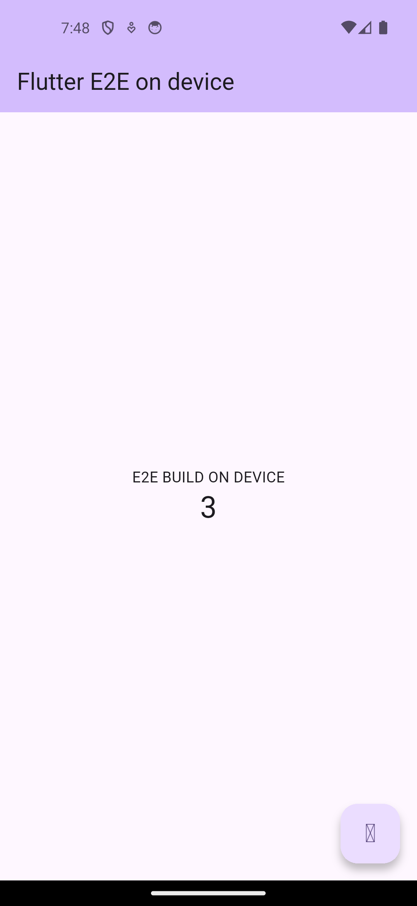

# Fase 8 — Flutter experimental en Sketchware Pro (v7.0.8.0)

**Versión:** v7.0.8.0 · versionCode **162** · Fecha: 2026-09-23
**Fuentes:** `flutter-aot/INFORME-AOT.md` (receta AOT y prueba release), `flutter-carril-A2.md` (assets del bundle),
`flutter-carril-P.md` (pub real y plugins) y `flutter-carril-I.md` (integración en el fork). Todo sobre el mismo
emulador arm64 API 34.

La fase 7 dejó Flutter funcionando en el dispositivo **solo en modo Debug/JIT**, con tres limitaciones declaradas:
el release/AOT bloqueado, los assets del bundle incompletos y el `pub` sintético. Esta fase cierra las tres **en la
capacidad demostrada** y deja la integración escrita y type-checked. Sigue siendo **experimental** y detrás del flag
`FLUTTER_EXPERIMENTAL_ENABLE` (apagado por defecto).



---

## 1. Qué se ha desbloqueado

| Área | Fase 7 | Fase 8 |
|---|---|---|
| **Release/AOT** | Bloqueado: el `gen_snapshot` del SDK para Android no lleva compressed pointers y el engine oficial los exige. | **Desbloqueado**: se construye un `gen_snapshot` propio con compressed pointers y el propio dispositivo genera un `libapp.so` que el engine acepta. |
| **Ejecutar binarios desde la app** | No verificado (el spike iba con `adb root`). | **Verificado**: desde `untrusted_app` la app ejecuta los ELF empaquetados en `nativeLibraryDir`; `filesDir` y `/data/local/tmp` están denegados por SELinux. |
| **Assets del bundle** | Faltaban fuentes Material, shaders, `AssetManifest.bin` y `NOTICES.Z`. | **Completos**, generados por código Kotlin propio; el glifo `+` se dibuja y el error del shader desaparece. |
| **pub** | `package_config.json` sintético escrito a mano. | **`dart pub get` real en el dispositivo**, con paquetes de pub.dev de verdad. |
| **Plugins** | Sin `GeneratedPluginRegistrant`. | Compilador de plugins y registrante generados; **sin ejecutar en dispositivo** (pendiente declarado). |
| **Modo por defecto del IDE** | Debug/JIT. | **Sigue Debug/JIT**: el release AOT está disponible y documentado, no es el camino por defecto. |

---

## 2. La receta AOT: los comandos reales

### 2.1 Por qué funciona (la causa raíz, no una bandera)

1. **Los compressed pointers se activan por el nombre de la arquitectura:** en `tools/gn.py`, `IsCompressedPointerArch(arch)` es `"64c" in arch` y eso define `dart_use_compressed_pointers = true`; la arquitectura se llama **`arm64c`**. **No existe** ningún flag `--compressed-pointers` en `tools/build.py`: por eso el SDK de Termux (`--arch arm64`) no lo lleva y además lo rechaza.
2. **El primer token del feature string es de tiempo de compilación:** `Dart::FeaturesString()` escribe `product` con `--mode product`, `debug` en DEBUG y `release` en cualquier otro caso. El `gen_snapshot` del engine para `android-arm64-release` es un build **product**, así que un binario `--mode release` produce un snapshot `release …` que el engine **rechaza** aunque el resto coincida.

Con las dos cosas juntas (`--arch arm64c --mode product`), el snapshot declara exactamente

```
product no-asan no-msan no-tsan no-shared_data no-code_comments no-dwarf_stack_traces arm64 android compressed-pointers
```

que es lo que exige el engine oficial `af7e796e161ae0bb1ff0758c71a7105418bd9ded` (Flutter 3.47.5).

### 2.2 Construcción del binario (host, una vez)

```bash
# Dart SDK 3.13.4 (tag = commit b530c21f7de367b94fb04787bfed9d8e989d75e8, mismo que el engine)
git clone --branch 3.13.4 --depth 1 --no-tags https://dart.googlesource.com/sdk.git
# .gclient con download_android_deps=false y el NDK local enlazado en third_party/android_tools
cd sdk && ./tools/build.py --no-rbe --arch arm64c --mode product --os android gen_snapshot   # 76,4 s
cp xcodebuild/ProductAndroidARM64C/exe.stripped/gen_snapshot ../artifacts/gen_snapshot_arm64c_android_product
```

| Dato | Valor |
|---|---|
| Binario | **4.991.592 B**, sha256 `9921983f8765fe10e45e2010b73c6599d6a3ed13ea564f96190ba00587354233` |
| Tipo | `ELF 64-bit LSB pie executable, ARM aarch64`, bionic, stripped |
| `DT_NEEDED` | solo `libc.so`, `libdl.so`, `libm.so`, `liblog.so` (libc++ estático: no hay que empaquetar nada más) |

### 2.3 Pipeline en el dispositivo (lo que hace la app, en orden)

```bash
# (1) front-end: kernel AOT, en el dispositivo, con flutter_patched_sdk_product  (~6 s)
dartaotruntime bin/snapshots/gen_kernel_aot.dart.snapshot \
  --aot --tfa --target=flutter --target-os=android \
  --platform=<patched_sdk_product>/platform_strong.dill \
  --packages=<app>/.dart_tool/package_config.json \
  -Ddart.vm.product=true -Ddart.vm.profile=false -o <build>/app.dill <app>/lib/main.dart

# (2) back-end AOT, en el dispositivo, con el gen_snapshot empaquetado  (~3,4 s)
<nativeLibraryDir>/libfluttergensnapshot.so --deterministic --snapshot_kind=app-aot-elf \
  --elf=<build>/libapp.so --strip <build>/app.dill

# (3) APK release: aapt2 -> d8 -> zip -0 -> zipalign -> apksigner (sin Gradle)
```

- **Control A/B:** el `gen_snapshot` de Termux, con el mismo APK y el mismo engine, produce
  `… arm64 android no-compressed-pointers` y el arranque falla con *Snapshot not compatible with the current VM
  configuration: the snapshot requires '… no-compressed-pointers' but the VM has '… compressed-pointers'*. Aísla la
  causa: solo faltaban los compressed pointers.
- El `libapp.so` generado en el dispositivo es **determinista**: mismo sha256
  `34baa8d918c108393227678977ecb3e5c7ccb36434ffab175a86d1f589a78e20` (3.343.240 B) como root, como shell sin root y
  desde dentro de la propia app.
- **Prueba final:** APK arm64 **release** (173.564.618 B, con el `libflutter.so` release del AAR
  `arm64_v8a_release`) en el emulador arm64 API 34: la activity queda **RESUMED**, no aparece
  `CreateRootIsolate failed`, la UI Material se pinta, el contador pasa de **0 a 3 con toques reales** y **no hay
  cinta DEBUG**.

---

## 3. Ejecutarlo desde la app real: `nativeLibraryDir` y SELinux

La fase 7 dejaba esto como riesgo no verificado. Con una sonda dentro de la app (uid de app, dominio
`untrusted_app`, `targetSdk 34`) queda cerrado:

| Ubicación probada | Resultado |
|---|---|
| `nativeLibraryDir` (`/data/app/~~…/lib/arm64/…`) | **FUNCIONA** — `exit=0`, `Dart SDK version: 3.13.4 …` |
| `filesDir` (datos privados de la app) | **DENEGADO** — `IOException: error=13, Permission denied` |
| `/data/local/tmp` | **DENEGADO** — `IOException: error=13, Permission denied` |

El AVC crudo lo explica: `avc: denied { execute_no_trans } for comm="com.e2e.hola" path="/data/data/com.e2e.hola/files/gs.bin" scontext=u:r:untrusted_app:s0 … tcontext=u:object_r:app_data_file:s0 … tclass=file`.

**Conclusión operativa:** los ejecutables se empaquetan como `lib/<abi>/lib*.so` (el instalador los extrae a `nativeLibraryDir` con permiso de **ejecución** y etiqueta `apk_data_file`); **nunca** se copian a `filesDir` para ejecutarlos. La app hizo el AOT completo desde su propio proceso en **3,9 s**, con el mismo sha256.

---

## 4. Assets del bundle completos

Todos generados por código Kotlin propio (`FlutterBundleAssets.kt`), sin subir nada al repositorio:

| Asset | Origen / formato |
|---|---|
| `fonts/MaterialIcons-Regular.otf` | **No** es un artefacto del engine: el pin real está en `flutter/bin/internal/material_fonts.version` → `fonts.zip` (2.306.678 B, verificado por tamaño y sha256). Dentro, el `.otf` son 1.645.184 B. |
| `FontManifest.json` | Escribía `[]`; ahora lista la familia `MaterialIcons` y las familias declaradas en el `pubspec.yaml`. |
| `shaders/ink_sparkle.frag` y `shaders/stretch_effect.frag` | Precompilados **en el host** con el `impellerc` del artefacto host del engine (mismos flags que `flutter_tools`) y **embebidos en base64** en el Kotlin: el móvil solo los escribe, no puede recompilarlos. |
| `AssetManifest.bin` | Binario de `StandardMessageCodec` (`writeSize` de 1/2/4 bytes, no Int32 fijo), con las variantes de densidad (`2.0x`, `3x`, `1.5x`) y su `dpr`. |
| `NOTICES.Z` | gzip estándar del texto de licencias; sin el diccionario preajustado de `flutter_tools`, que gzip no envía en la cabecera y el runtime no usa. |

**Verificado en el emulador:** el icono `+` del FAB **se dibuja** (antes era una caja vacía) y el error
`Asset 'shaders/ink_sparkle.frag' not found` **desaparece** (con el APK viejo, como control negativo, sí aparecía).
`FragmentProgram.fromAsset('shaders/ink_sparkle.frag')` devuelve un `FragmentShader` real.

---

## 5. pub real en el dispositivo

- El cliente de pub **ya viene** en el `.deb` de Dart (`bin/snapshots/dartdev_aot.dart.snapshot`, 16.384.904 B):
  no hay que descargar nada extra.
- Con eso, `dart pub get` corre **en el dispositivo** y resuelve paquetes reales de pub.dev: 13 dependencias con
  `http` + `intl` + `collection`, 26 con el `pubspec` del scaffold y **45 con plugins** (`path_provider`,
  `shared_preferences`), con `PUB_CACHE` dentro del almacenamiento de la app.
- `sdk: flutter` necesita un `FLUTTER_ROOT` sintético; el fichero que decide si el SDK existe es **`$FLUTTER_ROOT/bin/cache/flutter.version.json`** (sin él: *the Flutter SDK is not available*). La app lo reconstruye junto al framework, `sky_engine` y los `pubspec.yaml` del SDK.
- El kernel se compila después con el `package_config.json` **auténtico** que genera pub, no con el sintético de la fase 7. Los errores de red se traducen a mensajes en español (`NO_NETWORK`, `VERSION_SOLVING`, `MISSING_FLUTTER_SDK`, `PROXY`, `RATE_LIMITED`…), con la salida cruda en `build/pub_get.log`.

---

## 6. Plugins: hasta dónde se ha llegado (sin adornos)

**Escrito y type-checked:** `FlutterPluginSupport` detecta los plugins del `package_config.json` (cadena **federada**,
deduplicada por implementación) y genera `GeneratedPluginRegistrant.java` (con un `try/catch` por plugin, como
`flutter build`) y `dart_plugin_registrant.dart` + `entrypoint.dart` cuando el plugin tiene `dartPluginClass`.
`FlutterPluginCompiler` (ECJ en proceso + `K2JVMCompiler` del fork) y `FlutterPluginPackager` (fuentes Java/Kotlin
del plugin, deps AAR vía el `DependencyResolver` del fork, merge de manifests y registro de librerías locales).

**Lo que falta, y es lo que manda: ningún plugin se ha compilado ni arrancado en el emulador.** El primer
`shared_preferences` real puede sacar fallos de AARs transitivas o de `res` que haya que leer en el log. Nota útil:
`path_provider_android` **no** trae Kotlin (es Dart + JNI y necesitaría un `libdartjni.so` que el paquete `jni` no
publica), mientras que `shared_preferences_android` **sí** lo trae y es el candidato para la primera prueba.

---

## 7. Tamaño que añade al APK

| Fichero en `jniLibs/arm64-v8a/` | Tamaño | sha256 |
|---|---|---|
| `libdartaotruntime.so` (front-end, del `.deb` de Dart 3.13.4) | 5.684.384 B | `e2ea1775e28bc92ce738c5df3b4ac4f95103ee2b13aefee87d90972dad3d1eb1` |
| `libfluttergensnapshot.so` (el `gen_snapshot` propio, backend AOT) | 4.991.592 B | `9921983f8765fe10e45e2010b73c6599d6a3ed13ea564f96190ba00587354233` |
| **Total** | **10.676.000 B ≈ +10,18 MB** en **arm64-v8a** | |

Se pide a AGP que no pase el `strip` del NDK por esos dos ficheros (`jniLibs.keepDebugSymbols`) para no reescribir
binarios validados por sha256. Las otras ABIs **no** los llevan y por eso no pueden hacer AOT on-device: la app lo
dice con un mensaje claro en español en vez de fallar en silencio.

---

## 8. Cómo probarlo

1. Compilar e instalar la variante **arm64-v8a** (`./gradlew :app:assembleDebug`, o el flujo del fork), activar `FLUTTER_EXPERIMENTAL_ENABLE` (Ajustes › Feature flags) y crear un proyecto Flutter.
2. Menú **Flutter › Instalar/actualizar toolchain** (necesita red la primera vez).
3. **Flutter › Estado del toolchain**: además de ZIPs y rutas, muestra `aot=` y cada ejecutable con su ubicación (`nativeLibraryDir` o `filesDir`) y si es ejecutable de verdad (lo comprueba **ejecutándolo**).
4. **Flutter › Compilar y ejecutar** en **Debug (JIT)** (camino por defecto) o en **Release (AOT)**. El log del build debe mostrar `dartaotruntime: …nativeLibraryDir…/libdartaotruntime.so (empaquetado)` y `gen_snapshot: …libfluttergensnapshot.so (empaquetado, product+compressed-pointers)`.
5. Comprobación rápida del `libapp.so`: `strings -a libapp.so | grep -c no-compressed-pointers` = **0** y el feature string contiene `compressed-pointers`. Al arrancar el APK **no** debe aparecer `CreateRootIsolate failed: Snapshot not compatible` ni la cinta DEBUG.

---

## 9. Pendientes honestos

- **Plugins sin ejecutar en dispositivo**: el pendiente número uno (ver §6).
- **Solo emulador arm64 API 34, sin móvil físico**: los procesos se probaron sin root y bajo `untrusted_app`, que es lo que importaba, pero en un SoC real no está medido.
- **Sin hot reload** ni VM service: el engine debug lo intenta levantar y el socket falla por política.
- **Solo `arm64-v8a`** tiene backend AOT (no hay SDK de Dart publicado para las demás ABIs): en el resto el release AOT se rechaza con mensaje, no con un APK que arranca y crashea.
- **La integración en la app está escrita y type-checked, no ejecutada**: la prueba de arranque release es de un APK armado a mano con el pipeline equivalente, y el primer `RELEASE_AOT` real puede revelar detalles de rutas o argumentos.
- **SELinux de otros fabricantes**: `execute_no_trans` sobre `apk_data_file` está concedido en AOSP (comprobado en la imagen `google_apis`); si un OEM lo endureciera, el AOT on-device no sería posible desde la app.
- **`keepDebugSymbols`** en `app/build.gradle` no está verificado con Gradle; si el DSL se comportara distinto, esas dos líneas se pueden quitar sin tocar nada más.

---

## 10. Estado honesto de esta fase

Se han resuelto **las tres limitaciones técnicas** que la fase 7 declaró (AOT, assets y pub), cada una con evidencia cruda en su informe: logcat, hashes y experimentos de control. Lo verificado **en el emulador** es la capacidad; lo verificado **en el código** es la integración (Kotlin + Java type-checked, 0 errores). Lo que **no** hay es la cadena completa dentro de la app corriendo: para eso hace falta compilar el APK con el padre. Nada de esto cambia el modo por defecto (**Debug/JIT**) ni quita la condición de **experimental**: el flag sigue apagado y el AOT release se ofrece como opción documentada, no como camino silencioso.

## 11. Créditos y licencias

- Dart SDK para Android: paquetes **Termux** (`dart 3.13.4`); árbol del SDK: `dart.googlesource.com/sdk` (BSD).
- Engine y framework: **Flutter 3.47.5**, `flutter_infra_release` (BSD). Gramática TextMate de Dart: **Dart-Code** (MIT).
- Sin dependencias nuevas: el códec/base64/JSON/gzip de los assets son propios y los dos ejecutables van como `.so`.

---

## 12. Hotfix v7.0.8.1 (versionCode 163)

La release **minificada** (R8) rompía la compilación de **cualquier** proyecto dentro de la app, con
`ExceptionInInitializerError` en `javax.lang.model.SourceVersion.<clinit>` y en
`com.itsaky.androidide.config.JavacConfigProvider.<clinit>`. Eran **tres** fallos encadenados, todos por acceso
por reflexión invisible para R8, y cada uno solo aparecía al arreglar el anterior:

1. **`javax.lang.model.SourceVersion`.** R8 renombraba los campos del enum (`RELEASE_17/11/8`), que
   `JavacConfigProvider` busca por nombre con `getDeclaredField`; el `IllegalStateException` resultante reventaba
   el compilador Java (ECJ) del IDE. Fix: `-keep class javax.lang.model.SourceVersion { *; }`, más una regla de
   seguridad para los enums de `javax.lang.model`.
2. **`org.eclipse.jdt.internal.compiler.util.Messages`.** R8 renombraba sus campos y los mensajes de ECJ salían
   como `MessageFormat.format(null)`. Fix: keep de esa clase, más red de seguridad para las tablas de mensajes
   de ECJ.
3. **`apksig`.** R8 borraba el constructor vacío que el firmador usa por reflexión y el **firmado del APK**
   fallaba. Fix: keep de `com.android.apksig.**` y `com.android.apksigner.**`.

Todo son reglas `keep` en `app/proguard-rules.pro` (+46 líneas); no se tocó código. **Verificado en
dispositivo**: en el emulador arm64 API 34 la app compila un proyecto real (ECJ 663 ms → dx → empaquetado → APK
firmado V3.0) y `JavacConfigProvider` / `ExceptionInInitializerError` aparecen **0 veces** en logcat; la app
arranca y el editor y el drawer siguen bien. APK arm64 sha256
`0a490b19ef9d07d0d320a2eb737a21946cd3c41b283a638fcc93b93dc35b850e`.

**Pendientes honestos:** solo emulador arm64 (sin móvil físico), y la prueba de compilación fue con un proyecto
Java vacío — no se probó Flutter, Kotlin ni las demás ABIs.
