# La vista previa de diseños vuelve a pintar (v7.0.8.2)

Fecha: 2026-09-23 · Versión: **v7.0.8.2** (versionCode 164) · Repo: `Sketchware-Pro-main`

Release: <https://github.com/aurenox-global/Sketchware-Pro/releases/tag/v7.0.8.2>

Arreglo del **centinela `0xffffff`** en la vista previa de diseños (layouts) hechos con elementos View: el IDE
aplicaba como color real el valor con el que su propio modelo de datos dice "aquí no hay color elegido", así que la
zona del diseño salía vacía (en blanco o en negro según el tema) mientras los widgets que se pintan solos y el HTML
del WebView seguían viéndose.

## 1. El síntoma

En un mismo layout (`LinearLayout` raíz + `Button` + `WebView`), la vista previa mostraba:

- la zona del diseño **vacía**: blanca en tema claro, negra en tema oscuro;
- **sí** se veían los widgets que se pintan por sí mismos (`SeekBar`, `Switch`, iconos) y el **HTML del WebView**
  (que nunca falló), en claro y en oscuro.

Eso es exactamente lo que reportaba el usuario: *"si el diseño tiene icono o un Switch, esos sí se ven, pero el resto
de la zona del diseño no"*. La vista previa de HTML/WebView era el caso que siempre funcionó.

| Antes (v7.0.8.1) | Después (v7.0.8.2) |
| --- | --- |
| 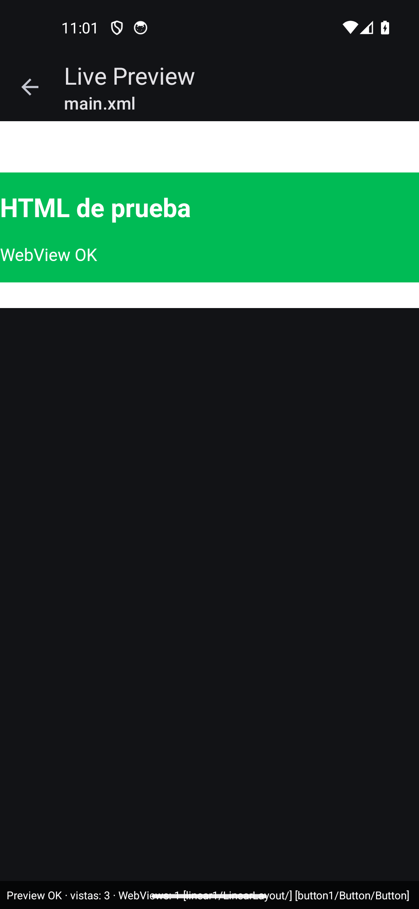 | 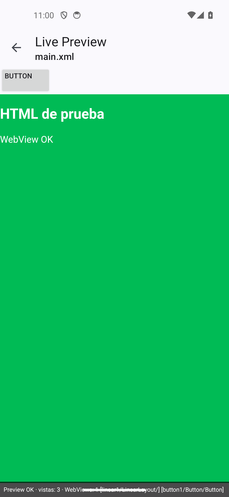 |

Antes, la zona del `Button` (`[0,406][242,538]`) era **255,255,255 al 100 %** — 31.944 píxeles del mismo blanco, sin
un solo glifo —, aunque `uiautomator dump` sí encontraba el nodo con sus bounds reales. No era un fallo de inflado ni
de tamaño: era un fallo de **pintado** (un rectángulo invisible). Después se ve el botón con su fondo gris y su texto,
y el HTML del WebView sigue renderizado.

## 2. La causa raíz: el centinela `0xffffff`

El modelo de datos del IDE usa `0xffffff` para decir "el usuario no ha elegido color":

- `com/besome/sketch/beans/TextBean.java`: `textColor = 0xffffff;` y `hintColor = 0xffffff;`
- `com/besome/sketch/beans/LayoutBean.java`: `backgroundColor = 0xffffff;`
- `a/a/a/Ox.java` (el generador de XML del proyecto) **solo escribe** `android:textColor`, `android:textColorHint` y
  `android:background` cuando el valor es **distinto** de `0xffffff`; es decir, un layout sin colores propios llega al
  parser con el centinela intacto.

`LayoutPreviewActivity.applyBeanAppearance()` comprobaba `!= 0` y aplicaba el centinela como color real. Como `int`,
`0xffffff` es **`0x00FFFFFF`**: **alfa 0**.

1. `setTextColor(0x00FFFFFF)` → texto **totalmente transparente**.
2. `setBackgroundColor(0x00FFFFFF)` → fondo transparente que además **borra el fondo que el tema daría al widget** (un
   `Button` pinta su `colorPrimary`; con esto pasa a pintar nada).

Un `LinearLayout` + `Button` quedaba como un rectángulo invisible. Y el agravante del "blanco o negro según el tema":
`ViewPane.initialize()` forzaba el lienzo a **blanco fijo** para proyectos sin Material3, mientras los widgets se inflan
con el contexto de la Activity, que **sí** sigue el tema claro/oscuro del IDE → contraste roto e invisibilidad para
cualquier texto que venga del tema.

Bugs secundarios encontrados en la misma ruta (todos producían pantallas mudas):

- `createRealView()` devolvía `null` si una clase no se podía instanciar → la vista desaparecía **en silencio**;
- la raíz inflada se colgaba siempre con alto `WRAP_CONTENT` aunque el XML dijera `match_parent` → un layout con hijos
  con peso podía colapsar a 0 px y parecer vacío;
- el único aviso de fallo era el panel `debug_status`, que no distinguía éxito de degradación parcial.

## 3. El arreglo, fichero por fichero (3 ficheros, +143/−15)

**`LayoutPreviewActivity.java`**

- Regla central, la misma que usa el generador de XML (`Ox`):
  `isColorNotSet(color)` → `true` si el color es `0`, `0xffffff` o tiene **alfa 0**. Entonces **no se aplica** y decide
  el tema del widget.
- `applyBeanAppearance()`: `textColor`, `hintColor` y `backgroundColor` pasan por `isColorNotSet()` (antes `!= 0`).
- `applyInjectAttributes()`: igual para `android:background`, `android:backgroundTint` y `android:textColor`.
- `createRealView()`: si el IDE no puede instanciar una clase, en vez de un hueco mudo se coloca un **marcador rojo
  visible** (`⚠ NombreClase: no disponible en el editor`) y se avisa con `Preview PARCIAL · … · no disponibles: …` en
  barra roja + `Log.w`.
- `debug()` / `debugWarning()`: barra siempre visible con el motivo (INFO negro / WARN rojo) y `Log.i` / `Log.w` con el
  tag `LayoutPreview`, además de toast si fallan los dos caminos.

**`ViewPane.java`**

- En modo vista previa (`isPreviewMode = true`) el lienzo usa el `colorSurface` del **mismo tema** con el que se inflan
  las vistas, en vez del blanco fijo. El editor de diseño (`isPreviewMode = false`) mantiene exactamente su aspecto
  anterior.
- La raíz inflada usa las dimensiones declaradas en el XML (`rootLayoutParams()`), no un `WRAP_CONTENT` forzado.

**`res/layout/activity_layout_preview.xml`**

- El contenedor de la vista previa pasa a `match_parent` (antes `wrap_content`), coherente con las dimensiones reales
  del layout.

## 4. Verificación (recompilar, instalar y medir la captura)

- Build: `./gradlew assembleDebug` → **BUILD SUCCESSFUL**; instalado en un emulador **arm64 API 34** (`adb root`).
- Mismos pasos en el IDE (editor de diseño → *Live preview*) y el mismo layout, en tema claro y oscuro.
- Medición de píxeles sobre las capturas, en la zona del botón:
  - **antes** (claro y oscuro): `(255,255,255) × 31.944 px`, **0 glifos**;
  - **después** (claro): fondo `(214,215,215)` + glifos oscuros `(27,27,31)`; **después** (oscuro): fondo `(90,89,91)`
    + glifos claros.
- Regresión de HTML/WebView: sigue funcionando end-to-end. Log crudo con el arreglo:
  `I LayoutPreview: info: Preview OK · vistas: 3 · WebViews: 1 [linear1/LinearLayout/] [button1/Button/Button]`.

## 5. Pendientes honestos (lo que NO está verificado)

- **Componentes Material en pantalla**: `MaterialButton` / `CardView` no se pudieron colocar por automatización
  (`adb input draganddrop`), así que la ruta está cubierta con la degradación visible (marcador rojo + aviso) pero
  **sin captura**. La clase sí está en el classpath del IDE.
- **Proyectos con Material3 activo**: no probado (el proyecto de prueba no usa M3).
- **Temas y recursos personalizados del proyecto**: no probados; los `?attr/…` se resuelven con los atributos del
  **IDE**, no del proyecto.
- **Móvil físico**: nada probado fuera del emulador arm64 API 34.

---

## 6. Ronda 2 (v7.0.8.3)

Fecha: 2026-09-23 · Versión: **v7.0.8.3** (versionCode 165) · Release:
<https://github.com/aurenox-global/Sketchware-Pro/releases/tag/v7.0.8.3>

Los defectos y el arreglo de la ronda 1 están descritos arriba (secciones 1–5) y **no se repiten aquí**. Esta ronda
cierra tres cabos que seguían abiertos en la misma ruta de la vista previa. Todo medido **píxel a píxel** sobre
capturas de un emulador arm64 API 34, en tema claro y oscuro.

### 6.1 Los recursos de color del proyecto no se resolvían

Para un fondo escrito como `@color/…` o `?attr/…`, `ViewBeanFactory.applyBackground()` guarda el **nombre real** en
`backgroundResColor` y deja `backgroundColor = 0xFFFFFFFF` (blanco opaco) como marcador de «pendiente de resolver»;
la vista previa solo miraba `backgroundColor` e **ignoraba** `backgroundResColor`. Resultado: un fondo definido en el
`colors.xml` del proyecto se veía **blanco**. Ahora se resuelven los `@color/…` del proyecto y los `?attr/…`
referenciados por el layout.

**Evidencia:** caja con `@color/color_proyecto` (`#0000FF`) → **azul puro `(0,0,255)`** (antes: `(255,255,255)`).

### 6.2 Cuelgue al abrir la vista previa en frío

En arranque en frío (sin pasar por el editor de diseño) la Activity moría con un `NullPointerException` y dejaba una
**pantalla muerta sin ningún mensaje**: `ColorsEditorManager` usa `import static
com.besome.sketch.design.DesignActivity.sc_id;` (el proyecto «en curso» global) y con el proceso recién arrancado ese
campo es `null` → `jC.c(null)` → NPE, antes de que hubiera ninguna salvaguarda. Arreglado **fijando el proyecto
(`sc_id`) antes de inicializar** la preview y con un `try/catch` que muestra un **error visible** en pantalla en vez de
una pantalla muda.

### 6.3 La vista previa honra el extra `xml`

Si la vista previa se abre desde el **editor de XML de vistas** del IDE, ahora previsualiza **exactamente lo que estás
editando**, sin necesidad de guardar. (Es además la vía con la que se inyecta XML exacto por
`am start --es xml "<layout…>"` para estas pruebas.)

### 6.4 Extras verificados en la misma ronda

- `com.google.android.material.button.MaterialButton` **sí está en el classpath** del IDE y **se ve**: índigo
  `(68,94,145)` en claro, azul claro `(173,198,255)` en oscuro.
- `TextView`/`Button` **sin atributos** ya son **legibles en ambos temas**: `(68,71,79)` sobre `(250,249,253)` en
  claro; `(196,198,208)` sobre `(18,19,22)` en oscuro.
- **HTML/WebView intacto**: `WebView webview1 fallback html -> …/files/assets/index.html`, zona verde `(0,187,85)`.
- Las **vistas no instanciables** dan marcador rojo + aviso rojo «Preview PARCIAL · … · no disponibles: …».

### 6.5 Evidencia gráfica

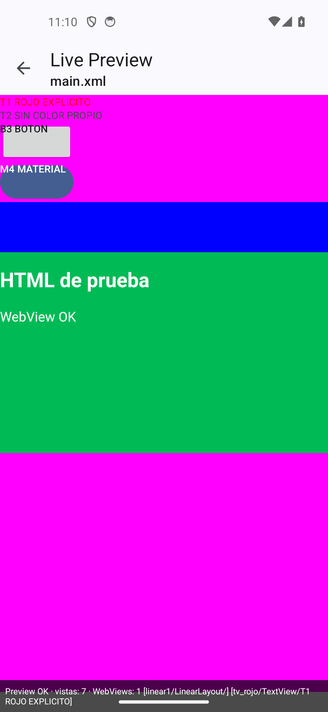

Medidas sobre esta captura (`44_test_light_B_magenta.png`, en `preview-evidence/`):

| Comprobación | Medida |
| --- | --- |
| Raíz `android:background="#FF00FF"` | magenta puro `(255,0,255)` |
| Fondo `@color/color_proyecto` (del proyecto) | azul puro `(0,0,255)` |
| `MaterialButton` | visible (índigo en claro) |
| Texto por defecto, claro / oscuro | `(68,71,79)` sobre `(250,249,253)` / `(196,198,208)` sobre `(18,19,22)` |
| HTML/WebView | verde `(0,187,85)`, intacto |

### 6.6 Pendientes honestos de la ronda 2

- Material **más allá de `MaterialButton`**: `CardView`, `TextInputLayout`, `BottomNavigationView`, `TabLayout`…
  **sin verificar en pantalla**.
- Proyecto con **Material3 activo**: no probado.
- **Temas y estilos personalizados** del proyecto: los `@color/…` del proyecto sí se resuelven (verificado con el
  azul); la fidelidad de estilos propios (`styles.xml`, `my_sc_theme`) **no** está verificada.
- **Móvil físico**: no probado (todo en emulador arm64 API 34).
- **Regresión formal del editor de diseño**: solo comprobado que su camino (`isPreviewMode=false`) queda intacto.

---

## 7. Ronda 3 (v7.0.9.0)

Fecha: 2026-09-23 · Versión: **v7.0.9.0** (versionCode 166) · Release:
<https://github.com/aurenox-global/Sketchware-Pro/releases/tag/v7.0.9.0>

Cuatro síntomas distintos, **cuatro causas raíz distintas**, todas reproducidas y medidas **píxel a píxel** sobre un
emulador arm64 API 34. «Antes» es el build de la ronda 2 (v7.0.8.2/164).

### 7.1 Color de texto desde la paleta Material (`?colorPrimary`)

El selector de color del editor guarda el valor como `"?" + attr` (p. ej. `?colorPrimary`) y escribe
`android:textColor="?colorPrimary"`; la vista previa solo entendía la forma `?attr/...`, así que **no resolvía nada y
el texto caía al color por defecto del tema**. Ahora `resolveColor()` acepta cualquier expresión que empiece por `?`
(`?colorPrimary`, `?attr/colorPrimary`, `?android:attr/colorPrimary`, `?android:colorPrimary`) y la resuelve contra el
tema del IDE. Medido con un texto `PALETA` = `?colorPrimary` y un texto control `CONTROL` = `#FF0000`:

| | texto `?colorPrimary` | texto control `#FF0000` |
| --- | --- | --- |
| Antes | `(68,71,79)` — color por defecto del tema | `(255,0,0)` |
| Después | **`(68,94,145)` — `colorPrimary` del tema** | `(255,0,0)`, intacto |

### 7.2 Layouts / lineales que se pintaban blancos

Mismo fallo de resolución, pero por el lado del fondo: `ViewBeanFactory.applyBackground()` guarda el valor de respaldo
`0xFFFFFFFF` (el marcador «pendiente de resolver» del propio IDE) y, al no resolverlo, la preview pintaba el lineal
**blanco opaco**. Sobre un lienzo claro, el lineal desaparecía. Medido en tres bandas: un
`android:background="?colorPrimary"` pasó de **`(255,255,255)`** a **`(68,94,145)`**, mientras un
`@color/...` del proyecto (`(0,0,255)`) y un `@drawable/...` con forma y borde no cambiaron. Ahora
`applyBeanBackground()` no cae al color literal cuando el recurso no se pudo resolver: deja el fondo del tema y lo
reporta.

### 7.3 Estilos de texto: cursiva, negrita+cursiva, monoespaciada y fuentes del proyecto

Solo se aplicaba `textType == 1` (negrita); cursiva (`2`) y negrita+cursiva (`3`) se ignoraban, y no existía rama para
`android:fontFamily`. Ahora `applyTextTypeface()` aplica los tres estilos, las familias del sistema (`serif`,
`monospace`, …) y las **fuentes TTF del proyecto** (`@font/nombre` → `files/resource/font/…`, `.ttf/.otf/.ttc`). Si la
fuente no existe, se pinta el texto por defecto **con aviso** (`no disponibles: @font/no_existe`). Medido a 30 sp:

| texto | Antes | Después |
| --- | --- | --- |
| `textStyle="italic"` | recto | **cursiva** |
| `textStyle="bold\|italic"` | recto, sin negrita | **negrita + cursiva** |
| `fontFamily="monospace"` | proporcional | **monoespaciado** |
| `fontFamily="@font/fuente_proyecto"` (TTF real) | ignorada | **fuente del proyecto aplicada** |

### 7.4 Imágenes

El resolvedor solo miraba `files/resource/drawable/<nombre>.{xml,png,jpg}` y, si no estaba, devolvía `null` **sin
marcador** (hueco mudo). Ahora busca en **todos** los directorios `drawable*` (recursivo, con carpetas de densidad y
subcarpetas), en `files/assets`, en el resto de `files/` y, como último recurso, en los drawables del propio IDE
(`default_image`, `ic_mtrl_*`). Extensiones: `.xml .png .jpg .jpeg .webp .gif .bmp`. Se añaden `app:srcCompat`, las
rutas `file://…`, `assets/…`, `@asset/…`, `@android:drawable/…` y los **vectores** `.xml`, que se dibujan con un
`PathParser` propio (`VectorPathDrawable`; `VectorDrawableCompat` no puede inflar desde una cadena). Lo que no se
puede resolver muestra un **marcador rojo con borde** y el motivo en la barra de estado.

Medido con ocho `ImageView` de 50 dp, cada uno con una variante distinta (bandas de 137 px): antes solo se veían las
dos primeras (`drawable/v_png.png` y `V_MAYUS.PNG`); después se ven también `.webp`, `.jpeg`, `drawable-xhdpi/`,
subcarpeta, fichero de `files/assets`, `app:srcCompat`, vector, `.gif` y el `default_image` del IDE, y `@drawable/noexiste`
da marcador rojo `(176,0,32)` + aviso. Este es el caso que ilustran las capturas:

| Antes (v7.0.8.2) | Después (v7.0.9.0) |
| --- | --- |
| 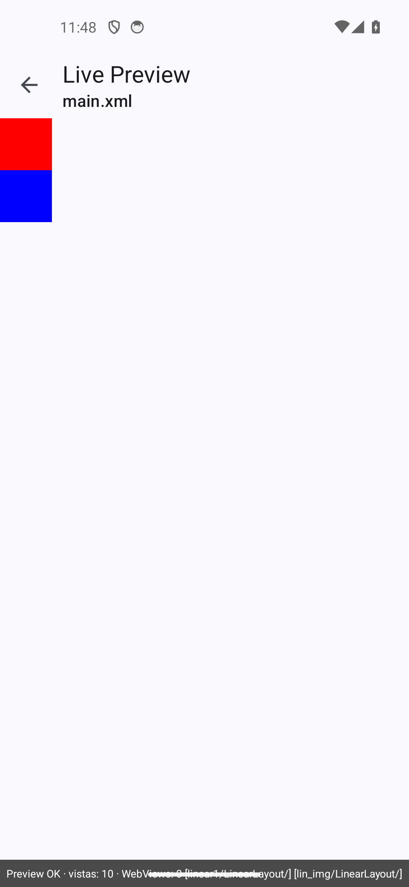 | 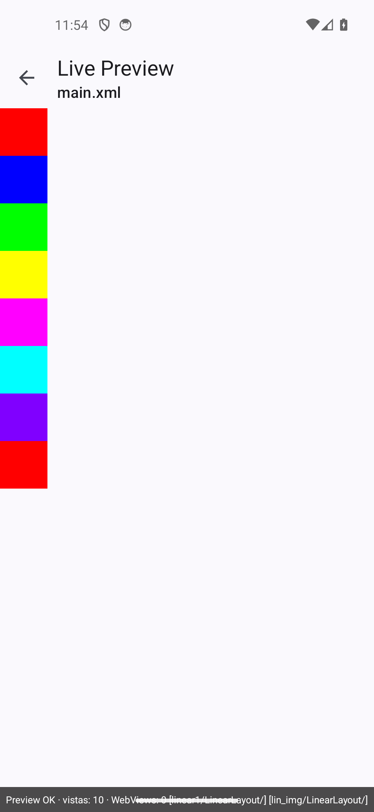 |

### 7.5 Extra encontrado por el camino

`applyInjectAttributes()` comparaba los nombres de atributo **con prefijo** (`"android:textColor"`) mientras
`InjectAttributeHandler` devuelve **nombres locales** (`"textColor"`): ninguna rama del `switch` coincidía nunca, así
que *todos* los atributos «extra» (`fontFamily`, `srcCompat`, `alpha`, `gravity`, paddings, `maxLines`…) se
descartaban en silencio. Ahora se normalizan, así que funcionan. Regresión comprobada: layout real del proyecto
(claro/oscuro), HTML/WebView, `@color/` del proyecto, hex explícitos y `MaterialButton` siguen bien.

### 7.6 Pendientes honestos de la ronda 3

- `<selector>`, `<ripple>`, `<layer-list>`, `<inset>`, `<clip>`: se aproximan dibujando su **última forma** (la preview
  no tiene estados pressed/disabled que reproducir).
- **Vectores complejos**: solo `<path>` con `pathData` + `fillColor`/`strokeColor`; un vector con `<group>`,
  `translateX/Y`, `scale`, `clip-path` o degradados puede salir desplazado.
- Los **`.9.png`** se leen como bitmap normal, **sin parches**.
- Los `?atributo` se resuelven con el tema del **IDE**, no con el del proyecto; **M3 night variants no probado**.
- Un `@color/` que no esté en `files/resource/values/colors.xml` da aviso y no se aplica.
- **Nada probado en móvil físico**: todo en emulador arm64 API 34.

El detalle completo (método, XML de los casos, evidencia cruda) está en `preview-r3.md` y en
`preview-evidence/r3/`.

---

## 8. Ronda 4 (v7.0.10.0)

Fecha: 2026-09-24 · Versión: **v7.0.10.0** (versionCode 167) · Release:
<https://github.com/aurenox-global/Sketchware-Pro/releases/tag/v7.0.10.0>

Las rondas 1-3 están arriba (secciones 1-7) y **no se repiten aquí**. Esta ronda arregla un fallo real de resolución
de recursos, hace útil el aviso de «vista previa parcial» y corrige una lectura equivocada del mensaje. Todo medido
**píxel a píxel** sobre capturas de un emulador arm64 API 34.

### 8.1 El «32» no eran 32 vistas rotas

El reporte era `Preview PARCIAL · vistas: 32 · no disponibles: @drawable/ic_tune_white`. Son **tres cosas distintas**
y solo una era un fallo de resolución de recursos:

- el **32** son las vistas que **SÍ se dibujaron**, no las que fallaron. El mensaje juntaba `vistas: 32` con
  `no disponibles: …` y se leía como «32 vistas no disponibles»; en la reproducción exacta (33 nodos en el XML = 32
  vistas creadas) el único problema real era **1 drawable**.
- la lista mezclaba en el mismo saco **clases no instanciables** y **recursos no resueltos**, sin motivo ni recuento.
- **`@drawable/ic_tune_white` no existe en ninguna fuente de este IDE** (ver 8.3).

Ahora el aviso es un **resumen corto y agrupado** —`Preview PARCIAL: <N> recursos no encontrados · <M> vistas no
instanciables` (singular/plural correcto)— y **pulsando la barra** se abre un **diálogo de detalle** agrupado por causa
(colores, atributos de tema, drawables/imágenes, fuentes, vistas no instanciables), con recuento por grupo, el motivo
de cada elemento, **dónde se buscó** (`buscado en: N carpetas drawable* del proyecto, assets del proyecto, M recursos
de librerías, recursos del IDE`) y un **tope de 12 líneas por grupo** (`…y N mas (ver log LayoutPreview)`). El detalle
completo sigue en logcat (tag `LayoutPreview`). Medido con un XML mixto (color, atributo de tema, drawable y fuente
rotos + 1 vista no instanciable):

| | Barra de estado |
| --- | --- |
| Antes | `Preview PARCIAL · vistas: 6 · no disponibles: @font/no_existe_font, com.example.noexiste.OtroWidget, @color/no_existe_color (no esta en …), @drawable/no_existe_img, ?attr/noExisteEsteAttr (…)` (una línea larguísima) |
| Después | `Preview PARCIAL: 4 recursos no encontrados · 1 vista no instanciable` |

### 8.2 El fallo real: la vista previa no miraba las librerías del proyecto

`ResourceCompiler` enlaza los recursos de las librerías con `aapt2` (`-R`): los AAR locales que
`DependencyResolver` descomprime en `.sketchware/libs/local_libs/<lib>/` (paths `resPath` del JSON
`files/local_library`, gestionados por `ManageLocalLibrary`) y las librerías integradas del IDE ya extraídas
(`BuiltInLibraries.getLibraryResourcesPath()` → `<filesDir>/libs/libs/<lib>/res`). **La vista previa no miraba
ninguna de las dos.**

`ProjectResourceResolver` ahora indexa y busca (recursivo, solo `drawable*`/`mipmap*` dentro de `res/`) en el JSON
`files/local_library` (`resPath`/`assetsPath` + `.sketchware/libs/local_libs/<name>/{res,assets}`), en la ruta heredada
`<proyecto>/files/library/res` (+ `library/assets`) y en las librerías integradas ya extraídas.

Probado con un **fixture de librería local** (`testlib` con
`.sketchware/libs/local_libs/testlib/res/drawable/ic_tune_white.xml`, registrada en el JSON del proyecto):

| caso | Antes | Después |
| --- | --- | --- |
| `@drawable/ic_tune_white` **de la librería** | marcador rojo `(176,0,32)` — 2.076 px | **icono dibujado** `(0,200,83)` — **6.174 px** |
| `@drawable/ic_tune_white_24dp` (librería, `drawable-xhdpi`) | marcador rojo | **icono dibujado** (rojo del propio vector) |
| `@drawable/ic_tune_24` (recurso del IDE) | visible | visible |
| `@android:drawable/ic_menu_preferences` (framework) | visible | visible |
| `@mipmap/ic_launcher` | marcador rojo | marcador rojo (no resoluble aquí, ver 8.6) |
| `@drawable/noexiste_zzz` (no está) | marcador rojo | marcador rojo + motivo |

Con el fixture, **el caso exacto del usuario pasa de «PARCIAL» a `Preview OK · vistas: 32`**:

```
I LayoutPreview: info: recursos de librerias indexados: 1
I LayoutPreview: info: Preview OK · vistas: 32 · WebViews: 0 [linear1/LinearLayout/] [img1/ImageView/]
```

| Antes (v7.0.9.0) | Después (v7.0.10.0) |
| --- | --- |
| 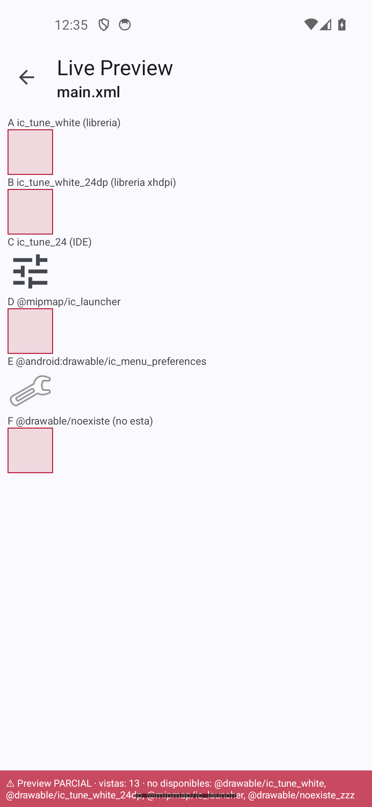 | 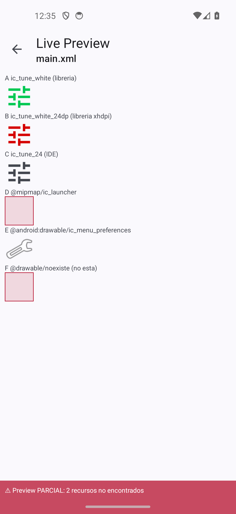 |

En el «antes» (izquierda) los dos drawables de la librería salen con **marcador rojo** y la barra enumera todos los
nombres en una línea; en el «después» (derecha) el drawable de la librería ya **se dibuja** y la barra es un resumen
corto. `@mipmap/ic_launcher` y el nombre inexistente siguen en rojo, como debe ser.

### 8.3 `@drawable/ic_tune_white`: de dónde sale y qué se puede arreglar

| Fuente | ¿Está `ic_tune_white`? | Evidencia |
| --- | --- | --- |
| `res/drawable*` del proyecto | No | `ls` del proyecto en el dispositivo |
| Recursos del IDE (APK debug) | **No** | `unzip -l …apk \| grep -i tune` → solo `ic_mtrl_tune.xml` y `ic_tune_24.xml` |
| AAR de Material (`material-1.13.0`) | No | 84 entradas `res/drawable*`, ninguna `*tune*` |
| `OldResourceIdMapper` (ids viejos de Sketchware) | El id viejo `2131166544` → `R.drawable.ic_mtrl_tune` | `app/src/main/java/mod/jbk/util/OldResourceIdMapper.java:1297` |

**Conclusión honesta:** `ic_tune_white` es un **nombre heredado** (la vieja Sketchware usaba `ic_*_white`; el id
viejo `2131166544` se mapea hoy a `ic_mtrl_tune`), **no un drawable de este IDE**, así que ese nombre concreto **no se
puede dibujar**. Ahora la barra lo dice claro y se marca **solo el recurso**, sin marcar la vista entera. Lo que **sí**
era un fallo real y queda arreglado es 8.2: si el nombre existe en una **librería del proyecto**, ahora se resuelve.

### 8.4 Extras de la ronda

- Las **fuentes rotas** (`@font/…`) pasan a la categoría «recurso»: ya **no cuentan como vistas** no instanciables.
- La **barra de aviso respeta el inset de la barra de navegación**: antes el texto quedaba cortado por abajo (parte
del «aviso ilegible»).

### 8.5 Regresión (las rondas 1-3 siguen bien)

| Comprobación | Resultado medido | Captura |
| --- | --- | --- |
| Color de texto de la paleta (`?colorPrimary`) | `(68,94,145)` 4.665 px + control rojo `(255,0,0)` 6.025 px | `reg_R4_B1_color_attr.png` |
| Fondos: `?colorPrimary` / `@color/proyecto` / shape con borde | `(68,94,145)` 356.400 px · `(0,0,255)` 356.400 px · `(255,152,0)` + borde negro | `reg_R4_B3_fondos.png` |
| Estilos de texto (cursiva, negrita+cursiva, monoespaciada) | los tres correctos | `reg_R4_B2_estilo.png` |
| Imágenes (png/webp/jpeg/`drawable-xhdpi`/subcarpeta/assets/vector/gif) | 10 vistas dibujadas, todas las bandas de color visibles | `reg_R4_B6b_img_variantes.png` |
| `MaterialButton` + `WebView` (HTML) | HTML `(0,187,85)` 698.570 px + `MaterialButton` índigo | `reg_R4_C_material_regresion.png` |
| Layout real del proyecto (sin `--es xml`, con WebView) | `Preview OK · vistas: 3 · WebViews: 1` | `reg_R4_proyecto_real.png` |

Todas salen con **`Preview OK`**, sin avisos.

### 8.6 Pendientes honestos de la ronda 4

- **`@drawable/ic_tune_white` sigue sin poder dibujarse** en este entorno: no existe en ninguna fuente disponible
  (proyecto, librerías declaradas, IDE, Material). No se ha «inventado»: si el usuario lo tiene en una **librería
  local de su proyecto**, ahora **sí** se resuelve (probado con fixture).
- **Librerías integradas no extraídas**: si el IDE nunca ha compilado en ese dispositivo, `<filesDir>/libs/libs/` no
  existe y sus recursos (material, firebase…) tampoco se pueden leer. **No** se ha añadido una ruta que lea los zips
  de `assets/libs/libs.zip` del propio APK (copiar 26 MB a caché en cada preview no compensa); tras la primera
  compilación del proyecto esos `res/` se extraen y entonces sí se resuelven.
- **`@mipmap/ic_launcher`**: vive en el proyecto de compilación generado
  (`.sketchware/mysc/<scId>/app/src/main/res/mipmap-*`), que no es una fuente de recursos de diseño (podría mostrar
  recursos obsoletos de la última compilación); no se ha añadido.
- **Nombres heredados** de Sketchware que el IDE ya no incluye: **no hay renombrado automático** en la preview (existe
  `OldResourceIdMapper`, pero solo se usa para el selector de icono de app; un alias por nombre sería adivinar).
- Siguen en pie los pendientes de las rondas 1-3 (selector/ripple/layer-list aproximados, vectores con `<group>`/
  degradados, `.9.png` sin parches, `?atributo` con el tema del IDE, Material3 sin probar, nada en móvil físico).

El detalle completo (método, XML de los casos, evidencia cruda) está en `preview-r4.md` y en `preview-evidence/r4/`.

## 9. Ronda 5 (v7.0.10.1)

### 9.1 Nombres heredados de iconos (`ic_tune_white` y familia)

El diseño real usa `@drawable/ic_tune_white`, un nombre heredado de una Sketchware vieja, y la vista previa lo marcaba
en rojo. El mensaje ya era correcto y se mantiene; lo nuevo es una **red de último recurso**: si el nombre heredado **se
puede mapear sin ambigüedad** a un icono que el IDE **sí** tiene, se dibuja ese icono y **el aviso lo explica** (nunca
se sustituye en silencio).

**Qué nombres usa de verdad el IDE (dato, no suposición).** Se volcaron los recursos del APK del IDE con
`aapt2 dump resources`: **2.382 nombres de drawable únicos**. `drawable/ic_tune_white` **no existe**; los equivalentes
actuales son **`ic_tune_24`** (convención del IDE) e **`ic_mtrl_tune`** (familia Material, 272 iconos `ic_mtrl_*`).

**Reglas implementadas** (en `ProjectResourceResolver.java`, más el aviso en `LayoutPreviewActivity.java`):

- **Normalización (solo para buscar, nunca para renombrar lo que pide el XML):** se quitan los prefijos `ic_`, `img_`,
  `icon_` y, repetidamente, los sufijos de color/estilo (`_white`, `_black`, `_dark`, `_light`, `_primary`, `_accent`,
  `_grey600`, `_holo_light`…) y de tamaño (`_24`, `_24dp`, `_48dp`, `_96dp`…). Guardas: base vacía, de 1 carácter o con
  caracteres raros → no se mapea nada.
- **Candidatos en dos pasos deterministas:** primero variantes estructurales por orden fijo
  (`ic_<base>`, `ic_<base>_24`, `ic_mtrl_<base>`, `ic_<base>_24dp`, `ic_<base>_48dp`…); después variantes de
  color/tamaño, que **solo** se usan si existe **exactamente una** — si hay dos o más, es ambiguo y **no se resuelve**.
- **Ultimo recurso:** el mapa solo se consulta después de que fallen proyecto, assets, librerías e IDE (los 44
  drawables `*_white`/`*_black` que el IDE **sí** conserva se resuelven por la vía normal).
- **Nada en silencio:** el nombre heredado resuelto no cuenta como "recurso no encontrado"; la barra añade
  `… · N nombre(s) heredado(s) resuelto(s)` (ámbar si no hay fallos reales), el diálogo de detalle tiene un **grupo
  propio** (`Nombres heredados resueltos -> icono actual` con pares `heredado -> real`) y queda en el log
  (`I LayoutPreview: info: nombre heredado resuelto: @drawable/ic_tune_white -> @drawable/ic_tune_24 [base: tune, variante estructural]`).

**Caso real medido** (`ic_tune_white` + un nombre inexistente):

| | Barra | Marcador rojo |
| --- | --- | --- |
| **ANTES** | `⚠ Preview PARCIAL: 2 recursos no encontrados` | **2 bloques** (2.080 px) |
| **DESPUÉS** | `⚠ Preview PARCIAL: 1 recurso no encontrado · 1 nombre heredado resuelto` | **1 bloque** (1.040 px) |

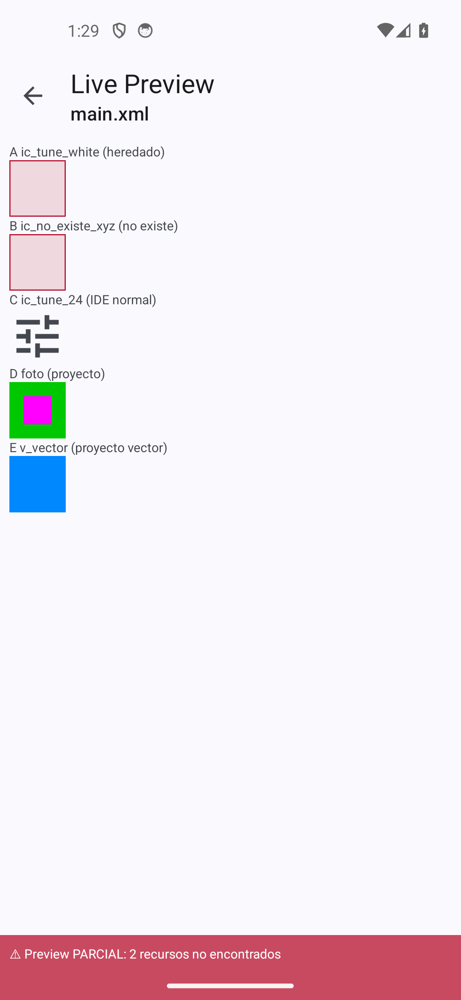
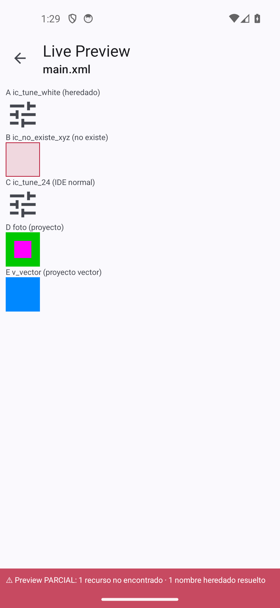

En la captura *después*, la fila **A** (`ic_tune_white`, heredado) dibuja el icono *tune* del IDE, la fila **B**
(`ic_no_existe_xyz`) sigue con el marcador rojo, y las filas **C/D/E** (`ic_tune_24` exacto del IDE, `foto` del proyecto
y vector del proyecto) se dibujan igual que antes: la resolución normal queda intacta.

**Regresión**: `reg_R5_variants` mantiene el icono **de la librería** (verde, 3.240 px) y **no** lo sustituye; el
detalle agrupado de la ronda 4 (`4 recursos no encontrados · 1 vista no instanciable`) es idéntico; y los casos de
color/estilos/fondos/imágenes/`MaterialButton`+WebView/layout real siguen en `Preview OK`.

### 9.2 Pendientes honestos de la ronda 5

- Cubre los nombres heredados cuyo **concepto sigue existiendo** en el IDE con una base compatible: en la simulación
  contra los 2.382 drawables, si desaparecieran los 44 nombres `*_white`/`*_black` actuales las reglas reconstruirían
  **19** (≈43 %). El resto (`footprint_96_white`, `spades_96_white`, `bg_rectangle_black`…) **se queda en rojo**, que es
  lo correcto.
- **Typos y nombres inventados** (`ic_tune_whit`, `ic_hom_white`, `ic_no_existe_xyz`) siguen en **rojo**: no se adivina.
- Nombres con **más de una** variante de color/tamaño posible: ambiguo → **no se resuelve** (anotado en el log).
- `@mipmap/ic_launcher` y recursos generados por el compilador del proyecto: sin cambios (limitación de la ronda 4).
- El mapa es **por nombre**, no por id (`OldResourceIdMapper` sigue siendo solo del selector de icono de app).
- Todo probado en **emulador** arm64 API 34; nada en móvil físico ni con Material3 activado.

## 10. Ronda 6 (v7.0.10.2)

Release: <https://github.com/aurenox-global/Sketchware-Pro/releases/tag/v7.0.10.2> · Fecha: 2026-09-24
Dispositivo: emulador `emulator-5554` (`sdk_gphone64_arm64`, arm64-v8a, API 34) · Build del IDE: **release real**
(`minifyEnabled = true`, R8). Evidencia: `preview-evidence/r6/` (`release/` antes, `final/` despues, `debug/`,
`logcat_crudo_antes.txt`, `r6.diff`).

### 10.1 El sintoma

El aviso **`Preview PARCIAL · 10 vistas no instanciables`** era **exactamente reproducible** en el APK release del
IDE. Las 10 clases eran `CoordinatorLayout`, `AppBarLayout`, `CollapsingToolbarLayout`, `MaterialToolbar`,
`MaterialButton`, `CircleImageView`, `SwipeRefreshLayout`, `TabLayout`, `BottomNavigationView` y `CardView`, y el
lienzo las pintaba como 10 cajas rojas identicas (*"⚠ CoordinatorLayout: no disponible en el editor"*, ...) con la
barra en rojo: marcador rojo = **58.716 px**. En **debug** (`minifyEnabled = false`) las 10 funcionan, por eso el
fallo **solo aparece en releases**, que es donde lo vio el usuario.

### 10.2 La causa real (medida): R8 borra el constructor, no la clase

**Las 10 clases SI estan en el dex con el nombre intacto** (`mapping.txt` da `X -> X:` para las diez y sus
descriptores aparecen en `classes*.dex`). Lo que rompia era el **constructor que usa la reflexion**:

1. **9 de las 10** (todo AndroidX/Material) habian perdido el constructor `<init>(android.content.Context)` por obra
   de **R8**: nadie del bytecode lo llama (solo esta reflexion), asi que lo borra; el de inflado
   `(Context, AttributeSet)` sobrevive porque lo piden las reglas de las propias librerias. `Class.forName`
   funciona y `getDeclaredConstructor(Context.class)` lanza `NoSuchMethodException`.
   **Logcat crudo** (`logcat_crudo_antes.txt`):
   `java.lang.NoSuchMethodException: androidx.coordinatorlayout.widget.CoordinatorLayout.<init> [class
   android.content.Context]` — **x9**, una por clase.
2. **La decima**, `de.hdodenhof.circleimageview.CircleImageView`, si conservaba su constructor de 1 argumento, pero
   **R8 optimizo la jerarquia** (`ItemCircleImageView extends CircleImageView`) y el constructor de la clase "plana"
   revienta al ejecutarse: `InvocationTargetException → ClassCastException: CircleImageView cannot be cast to
   dev.aldi.sayuti.editor.view.item.ItemCircleImageView`. Eso explica por que el usuario listaba **las 10**.

| # | Clase | en el APK | nombre intacto | debug `(Context)` | release ANTES | release DESPUES |
|---|---|---|---|---|---|---|
| 1 | `androidx.coordinatorlayout.widget.CoordinatorLayout` | si | si | si | **NO** (solo `(C,AS)`) | si |
| 2 | `com.google.android.material.appbar.AppBarLayout` | si | si | si | **NO** (solo `(C,AS)`) | si |
| 3 | `com.google.android.material.appbar.CollapsingToolbarLayout` | si | si | si | **NO** (solo `(C,AS)`) | si |
| 4 | `com.google.android.material.appbar.MaterialToolbar` | si | si | si | **NO** (solo `(C,AS)`) | si |
| 5 | `com.google.android.material.button.MaterialButton` | si | si | si | **NO** (solo `(C,AS)` y `(C,AS,int)`) | si |
| 6 | `de.hdodenhof.circleimageview.CircleImageView` | si | si | si | si… **pero roto** (CCE, ver arriba) | si |
| 7 | `androidx.swiperefreshlayout.widget.SwipeRefreshLayout` | si | si | si | **NO** (solo `(C,AS)`) | si |
| 8 | `com.google.android.material.tabs.TabLayout` | si | si | si | **NO** (solo `(C,AS)`) | si |
| 9 | `com.google.android.material.bottomnavigation.BottomNavigationView` | si | si | si | **NO** (solo `(C,AS)`) | si |
| 10 | `androidx.cardview.widget.CardView` | si | si | si | **NO** (solo `(C,AS)` y `(C,AS,int)`) | si |

`C = Context`, `AS = AttributeSet`. Constructores extraidos con `dexdump` (build-tools 35.0.0).

### 10.3 Arreglo 1 — la preview deja de depender de un constructor concreto

- **Cadena de constructores (`InvokeUtil`):** prueba en orden
  `(Context)` → `(Context, AttributeSet = null)` → `(Context, AttributeSet = null, int = 0)`, y devuelve
  `CreateResult{ view, failureReason }` en vez de un `null` mudo. Motivos que produce:
  `la clase no esta en el APK del editor (ClassNotFoundException)`,
  `no hay constructor usable con Context: faltan ...`,
  `el constructor <init>(...) fallo: IllegalArgumentException: ...`. Cuando cae al constructor de inflado lo deja
  trazado en el log:
  `I SketchwarePro: InvokeUtil: <clase> creada con <init>(Context, AttributeSet) (el de 1 argumento no esta en el APK)`.
  Probado por separado con `com.airbnb.lottie.LottieAnimationView` (fuera de los paquetes con `-keep`, solo
  `(Context, AttributeSet)` en el dex): **la cadena funciona sola** (`caseR6_fallback.xml`,
  `final/after_R6_fallback.png`).
- **Reglas `-keepclassmembers` acotadas (`app/proguard-rules.pro`):** el **conjunto minimo** que devuelve el
  constructor a las 10 clases del aviso —
  `androidx.**`, `com.google.android.material.**` y `de.hdodenhof.**`, siempre `extends android.view.View`, solo
  `public <init>(android.content.Context)`. **No** impide el shrinking ni la ofuscacion de nada mas (`-keepclassmembers`,
  no `-keep` de clases completas).
- **Coste medido:** APK release arm64-v8a **115.922.740 B → 115.972.420 B = +49.680 B (+49,7 KB, +0,04 %)**.

| | ANTES (release sin arreglar) | DESPUES (release con el arreglo) |
|---|---|---|
| Clases no instanciables | **10 / 10** | **0 / 10** |
| Barra de estado | `⚠ Preview PARCIAL: 10 vistas no instanciables` (roja) | `ℹ Preview PARCIAL: 1 atributo no aplicado` (ambar) |
| Cajas rojas "no disponible en el editor" | 10 (58.716 px rojos) | 0 |
| Widgets reales dibujados | 0 | **10** (textos hijos rojos = 8.331 px) |
| `(Context)` en el dex release | 1 / 10 (y el 1 roto) | **10 / 10** |

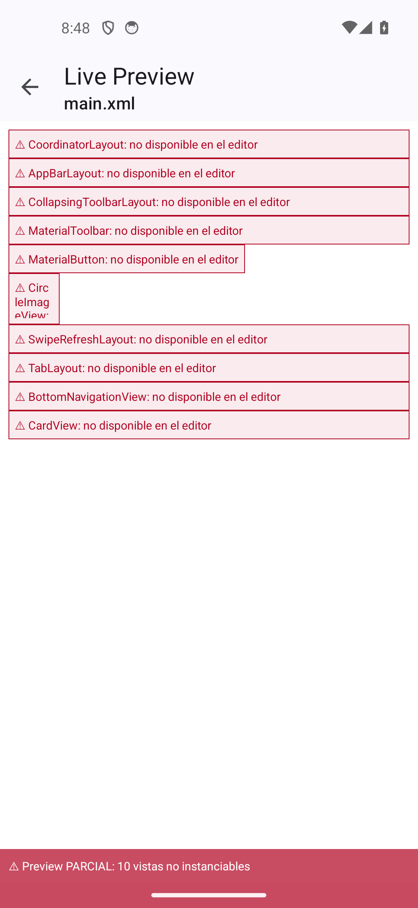
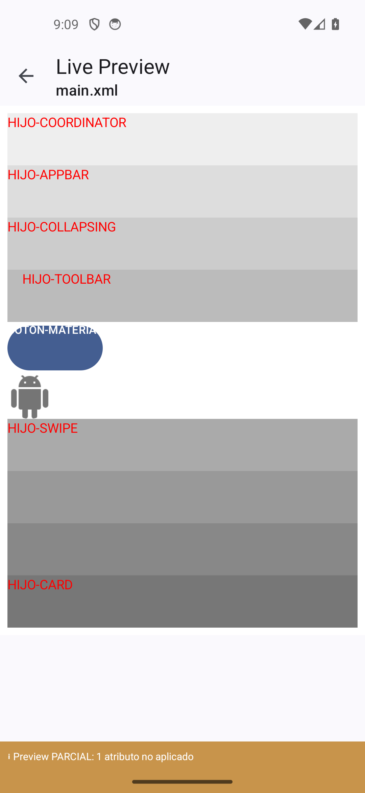

En la captura *despues* (variante compacta `final/after_R6_ten_compact.png`) se ven los 10 widgets de verdad:
`CoordinatorLayout`/`AppBarLayout`/`CollapsingToolbarLayout`/`MaterialToolbar` con sus `HIJO-*` dentro,
`MaterialButton` azul, `CircleImageView`, `SwipeRefreshLayout`, `TabLayout`, `BottomNavigationView` y `CardView` con
`HIJO-CARD`; el log cierra con `Preview OK · vistas: 10`.

### 10.4 Arreglo 2 — placeholders utiles (aproximado, con hijos)

`createMissingViewPlaceholder()` (un `TextView` rojo que se comia a los hijos) se sustituye por
`createApproximateView(className, bean)`:

- Es un **`FrameLayout`** ⇒ sigue siendo un contenedor: los **hijos del XML se cuelgan dentro y se dibujan** (antes,
  al no ser `ViewGroup`, se perdian).
- Conserva **fondo, padding y tamano** declarados (mismo `applyBeanAppearance`).
- Marca **discreta de "aproximado"**: **borde ambar de 1 dp** (foreground, no tapa a los hijos) + **pastilla
  translucida `≈ NombreClase`** arriba-derecha (9 sp, sin simbolos raros). **Nada de rojo de error**: la app
  compilada si tendra ese widget.
- El **motivo** va al dialogo y al log.

Fixture `caseR6_absent.xml` (`com.example.noexiste.OtroWidget`, fondo `#FFDDEE`, padding 12 dp y dos niveles de
hijos dentro):

| Medicion (captura, PIL) | ANTES | DESPUES |
|---|---|---|
| Fondo del contenedor `#FFDDEE` | **AUSENTE** | **169.875 px** |
| Hijo azul `HIJO-NIVEL-2` | **AUSENTE (0 px)** | **1.418 px** |
| Hijo verde `HIJO-NIVEL-2-BIS` | **AUSENTE (0 px)** | **1.915 px** |
| Marcador rojo de error | 8.093 px | 0 |
| Barra | `⚠ Preview PARCIAL: 2 vistas no instanciables` | `ℹ Preview PARCIAL: 1 vista aproximada · 1 atributo no aplicado` |

El dialogo de detalle (texto real) separa **"Vistas aproximadas (clase no disponible en el editor; se dibujan sus
hijos)"** de **"Atributos no aplicados (la vista SI se ha dibujado)"**, con el motivo de cada una, y explica que el
resto del diseno si se ha dibujado.

### 10.5 Extra encontrado probando: un atributo no admitido ya no aborta todo

`CircleImageView` solo admite `CENTER_CROP`/`CENTER_INSIDE`; el bean usa `scaleType = CENTER` por defecto y
`setScaleType` lanzaba `IllegalArgumentException` que **escapaba de `tryInflateRealLayout`**: la preview nativa se
abortaba entera (medido en debug: `Preview FAIL: ScaleType FIT_CENTER not supported`). Ahora `applyScaleType()` lo
captura y se anota en la barra/dialogo como **"atributo no aplicado (la vista SI se ha dibujado)"**, en ambar. El
`applyBeanAppearance` de cada vista va tambien en `try/catch` por el mismo motivo: un atributo raro en un widget no
puede ocultar el resto del diseno.

### 10.6 Regresion (rondas 1-5)

Todo con el **release arreglado** (mas exigente que debug), 8 casos:

| Caso | Resultado | Medicion (px, PIL) |
|---|---|---|
| `caseB1_color_attr` (colores/`?attr`) | `Preview OK · vistas: 4` | `(68,94,145)`=**4.665** y `(255,0,0)`=**6.025** → identico a r4 |
| `caseB2_estilo` (cursiva/negrita/mono) | `Preview OK · vistas: 5` | textos correctos |
| `caseB3_fondos` (`?colorPrimary`, color de proyecto, shape) | `Preview OK · vistas: 4` | **356.400** px + `(255,152,0)`=325.572 → identico a r4 |
| `caseB6b_img_variantes` (png/webp/jpeg/dpi/vector/gif) | `Preview OK · vistas: 10` | 10 vistas dibujadas |
| `caseC_material_regresion` (**HTML/WebView** + MaterialButton) | `Preview OK · vistas: 5 · WebViews: 1` | HTML `(0,187,85)`=**698.570** → identico a r4 |
| `caseE_extra` | `Preview OK · vistas: 6` | — |
| `caseR4_variants` (drawables) | `Preview PARCIAL: 2 recursos no encontrados` | mismo recuento que r4 |
| `caseR4_mixed` (color+tema+drawable+fuente+1 vista no instanciable) | `Preview PARCIAL: 4 recursos no encontrados · 1 vista aproximada` | mismo recuento; cambia la palabra "no instanciable" → "aproximada" |

Tambien comprobado en **debug** con el arreglo: `debug_R6_ten` → `Preview PARCIAL: 1 atributo no aplicado`
(0 no instanciables) — **release y debug se comportan igual** (antes divergian).

### 10.7 Pendientes honestos de la ronda 6

- **`CircleImageView` + `android:scaleType` (sin arreglar, es del generador):** el generador del IDE escribe
  `android:scaleType="center"` **por defecto** para cualquier `ImageBean` (`a.a.a.Ox:569-571`), y `CircleImageView`
  **solo** acepta `CENTER_CROP`/`CENTER_INSIDE`. En la preview se captura y se explica, pero **es probable que ese
  layout tambien falle al inflarse en la app compilada** (es un `IllegalArgumentException` en el constructor del
  widget). No se ha tocado: es del generador, no de la vista previa.
- **`MaterialButton` con `wrap_content`:** se dibuja, pero el texto sale algo recortado por los *insets* por defecto
  del widget (material 1.14.0-alpha05); solo se ve ahora que la vista se crea de verdad.
- **`"vistas dibujadas: N"`** cuenta vistas creadas, incluidas las que quedan huerfanas si el padre no es un
  contenedor (p. ej. el hijo de un `LottieAnimationView`, que no admite hijos). Es un matiz de conteo
  **preexistente**.
- **`ViewBeanParser`** sondea el tipo creando la vista con el **contexto de aplicacion** (tema no AppCompat): 4 de
  las 10 lanzan ahi `The style on this component requires your app theme to be Theme.AppCompat`. **No afecta a la
  preview** (que crea con el contexto de la Activity) y el parser conserva el tipo por defecto; queda documentado
  porque aparece en el log.
- Siguen vigentes los pendientes de las rondas 1-5: `?atributo` se resuelve con el tema del IDE,
  `<selector>`/`<ripple>`/`<layer-list>` se aproximan, Material3 del proyecto sin probar, y todo medido en emulador
  (no en movil fisico).

---

## 11. Ronda 7 (v7.0.10.3)

Release: <https://github.com/aurenox-global/Sketchware-Pro/releases/tag/v7.0.10.3> · Fecha: 2026-09-24
Dispositivo: emulador `emulator-5554` (`sdk_gphone64_arm64`, arm64-v8a, API 34) · Build del IDE: **release real**
(`minifyEnabled = true`, R8). Evidencia: `preview-evidence/r7/` (`before_*`, `after2_*`, `reg7/`, `r7.diff`,
`measure7.py`).

### 11.1 El sintoma

El usuario veia, en la vista previa de un diseno con un `CircleImageView`, este aviso (reproducido en
`before_civ_center.log`):

```
W LayoutPreview: warning: scaleType CENTER no admitido por de.hdodenhof.circleimageview.CircleImageView
W LayoutPreview: java.lang.IllegalArgumentException: ScaleType FIT_CENTER not supported.
W LayoutPreview: warning: Preview PARCIAL: 1 atributo no aplicado
W LayoutPreview: warning: [atributo no aplicado] CircleImageView: scaleType CENTER no admitido (...)
```

La ronda 6 lo habia **capturado** (ya no abortaba la vista previa entera) pero no lo habia arreglado: la ronda 7
lo ataca de raiz, en el generador y en los proyectos ya existentes, no solo en la vista previa.

### 11.2 La causa raiz (triple)

1. **Mayusculas en el bean.** `ImageBean` arranca con `scaleType = "CENTER"` — el **nombre del enum**, en
   mayusculas (`ImageBean:24-30`, `:39`) — mientras el XML usa `center`/`centerCrop` (camelCase). La vista previa
   aplicaba el valor tal cual y su traductor era **sensible a mayusculas**: `"CENTER"` no coincidia con ningun
   `case` y caia al valor por defecto `FIT_CENTER` → `setScaleType(FIT_CENTER)` →
   `IllegalArgumentException`. **De ahi que el mensaje diga `FIT_CENTER` aunque el valor guardado fuese `CENTER`.**
2. **El generador escribia un valor no admitido.** Para el `CircleImageView` el XML **no llevaba
   `android:scaleType`**: el filtro `!widgetTag.toCode().contains(".")` de `Ox` descarta el atributo en todo widget
   cuyo nombre de clase lleve punto, y el `convert` real es `de.hdodenhof.circleimageview.CircleImageView`. Pero con
   un bean antiguo o importado de **nombre corto** (`CircleImageView`) o **sin `convert`**, ese filtro si pasa y el
   generador escribia `android:scaleType="center"` → **eso peta tambien en la app compilada del usuario**, no solo en
   la vista previa (es un `IllegalArgumentException` en el constructor del widget).
3. **La libreria admite un solo valor.** El encargo daba por hecho que
   `de.hdodenhof:circleimageview:3.1.0` admite `CENTER_CROP` **y** `CENTER_INSIDE`; **no es asi**. Comprobado con
   `dexdump -d classes4.dex` sobre el APK release (§11.4): el metodo compara contra un **unico** campo estatico
   (`CircleImageView.u = ScaleType.CENTER_CROP`) y lanza la excepcion con cualquier otro valor, `CENTER_INSIDE`
   incluido (medido en tiempo de ejecucion: `ScaleType CENTER_INSIDE not supported.`). Por eso el arreglo **no**
   conserva `CENTER_INSIDE`.

### 11.3 Los cinco cambios

1. **El generador (`a.a.a.Ox`) escribe siempre un valor soportado y sanea el `inject`.** Con un `CircleImageView`
   (detectado por `convert` o por `type == 43`) el XML sale siempre con `centerCrop`, y si el `inject` trae un
   `scaleType` escrito a mano no admitido, se sanea antes de volcarlo y se deja traza en el log. El resto de widgets
   de imagen conservan el comportamiento historico.
2. **Clase nueva `pro.sketchware.utility.ScaleTypeCompat`** (logica pura, sin Android, para poder probarla en JVM):
   traduccion XML↔enum en los dos sentidos, deteccion del widget, valor soportado, ajuste e idempotencia
   (`adjustEnum(adjustEnum(x)) == adjustEnum(x)`) y saneado del `inject`. **60 comprobaciones en JVM, 0 fallos.**
3. **Normalizacion de proyectos ya existentes en cuatro puntos:** al **compilar/generar** (`Ox`), al **leer XML**
   (`ViewBeanFactory.applyImage` → `normalizeCircleImageViewScaleType`), al **abrir el editor de diseno**
   (`ViewPane.updateItemView`, que ademas ya no usa `valueOf` a pelo) y al **previsualizar**
   (`LayoutPreviewActivity`). Un proyecto viejo con `CENTER`/`FIT_CENTER`/`CENTER_INSIDE` en un `CircleImageView`
   se corrige en el bean y en el XML que se guarda, sin tocar ningun otro widget.
4. **La vista previa aplica el respaldo soportado y el aviso dice el valor.** `applyScaleType()` detecta el
   `CircleImageView` recorriendo superclases, ajusta a `CENTER_CROP` y el aviso ambar pasa a ser explicito:
   `CircleImageView: scaleType MATRIX -> ajustado a CENTER_CROP (el widget solo admite CENTER_CROP)`. Si algo
   falla igualmente, el `catch` aplica el respaldo `CENTER_CROP` y anota el motivo.
5. **El selector de propiedades solo ofrece `CENTER_CROP`** para un `CircleImageView`
   (`ViewPropertyItems` + `PropertyStringSelectorItem.setAllowedItems`), antes ofrecia los **7** valores y dejaba
   elegir combinaciones que la libreria rechaza.

### 11.4 Verificacion

- **XML generado por el IDE** con un `CircleImageView` de la paleta en el proyecto real 601 (`TestFixR8`), tras
  abrirlo y guardarlo desde el editor de diseno:

```xml
<ImageView
	android:id="@+id/imageview1"
	android:scaleType="center" />                 <!-- ImageView normal: sin cambios -->
<de.hdodenhof.circleimageview.CircleImageView
	android:id="@+id/circleimageview1"
	android:scaleType="centerCrop"                <!-- ANTES: atributo ausente (o "center" en beans antiguos) -->
	app:civ_border_width="3dp" … />
```

  y el mismo layout cierra con `I LayoutPreview: info: Preview OK · vistas: 5 · WebViews: 1`, **sin ningun aviso**.
- **Emulador con release R8:** el `CircleImageView` se dibuja **recortado en circulo** llenando su caja — caja
  330×330 px, anchura maxima 324 px, extremos 138 px, **fraccion de area 0.768 ≈ π/4** (medido con
  `python3 measure7.py after2_civ_center.png`; un cuadrado inscrito daria 1.000) y las 4 esquinas con el fondo del
  padre. El caso `civ_none` (sin atributo) y el `civ_inside` (`CENTER_INSIDE`) quedan igual de bien; con `matrix` en
  el `inject` sale el aviso de §11.3.4 en ambar.
- **Regresion de las rondas 1-6 identica:** los resumenes de log de los 9 casos con log previo son **identicos** a
  los de la ronda 6, y los 4 casos `caseR6_*` siguen bien (`caseR6_fallback` → `Preview OK · vistas: 4`,
  `caseR6_ten`/`caseR6_ten_compact` → `Preview OK · vistas: 17`).

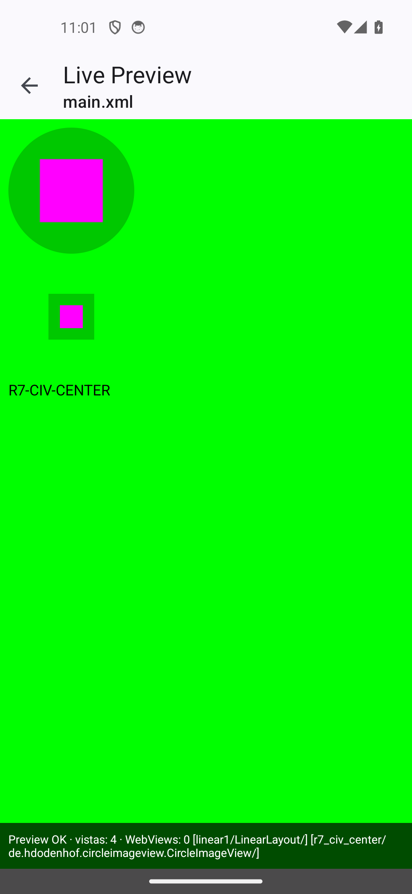

### 11.5 Diferencia intencionada respecto a las `ImageView` normales

Las `ImageView` normales con `scaleType` por defecto (`CENTER` en el bean, `center` en el XML) **ya no se dibujan
estiradas** en la vista previa: antes el traductor caia a `FIT_CENTER` y estiraba la imagen a toda la caja, ahora se
aplica `CENTER` como lo hara la app (tamano intrinseco). Es un **cambio de fidelidad, no una regresion**: en
`caseB6b_img_variantes` el diff de pixeles es del 4,96 % justo por eso. Si alguien prefiere el aspecto anterior,
esta aislado: basta devolver `FIT_CENTER` como valor por defecto en `parseScaleType` para las no-`CircleImageView`.

### 11.6 Pendientes honestos de la ronda 7

- **La app compilada del usuario no se ha probado**: lo verificado es que el XML que genera el IDE lleva
  `android:scaleType="centerCrop"` (§11.4) y que la libreria 3.1.0 rechaza cualquier otro valor, por lo que el XML
  generado es seguro — pero **la confirmacion final es del usuario**.
- **No se ha ejecutado una compilacion completa on-device** (aapt2/javac en el telefono) que confirme el fichero
  `res/layout/main.xml` en disco tras un `Run`.
- **El dialogo del selector de propiedades** para un `CircleImageView` no se ha recorrido a mano en el emulador
  (si estan el codigo y la prueba JVM del ajuste).
- **La persistencia del punto 3 de §11.3** (normalizacion al abrir y guardar en el editor de diseno) esta
  implementada y probada de forma indirecta, pero no se ha comparado el fichero `view` del proyecto antes/despues
  de abrir un layout viejo con un valor no soportado.
- **Evidencia:** proyecto de pruebas 601 (`TestFixR8`) con un `ImageView` y un `CircleImageView` anadidos para
  medir; **no es el proyecto del usuario**.
- Siguen vigentes los pendientes de las rondas 1-6 (tema del IDE para los `?atributo`, `MaterialButton` con
  `wrap_content`, Material3 del proyecto sin probar, todo medido en emulador y no en movil fisico).

---

## 12. Ronda 8 (v7.0.10.4)

Release: <https://github.com/aurenox-global/Sketchware-Pro/releases/tag/v7.0.10.4> · Fecha: 2026-09-24
Dispositivo: emulador `emulator-5554` (`sdk_gphone64_arm64`, arm64-v8a, API 34, densidad 2.75) · Build del IDE:
**debug** (`:app:assembleDebug`, arm64-v8a) · Baseline «antes»: **release** pre-cambio (rondas 1-7) sobre los MISMOS
XML. Evidencia: `preview-evidence/r8/` (`pre8_*`, `after_*`, `dark_pre8_*`, `dark_after_*`, `reg8/`, `reg8b/`,
`measure8.py`, `run_case8.sh`, `run_regression8.sh`).

### 12.1 El síntoma

La queja del usuario era una sola frase: *«los colores no se ven en ninguno»*. En la vista previa, los widgets con
color o tamaño configurado (`TabLayout`, `CircleImageView`, `MaterialButton`, `CardView`, `ProgressBar`, `DigitalClock`…)
salían sin ese color y **sin ningún aviso**: la vista previa cerraba con `Preview OK` como si todo estuviese bien.

### 12.2 La causa: `applyInjectAttributes` era una lista blanca de 19 atributos

`LayoutPreviewActivity.applyInjectAttributes()` resolvía los atributos `app:*`/`android:*` con un `switch` literal de
**19 nombres** (`background`, `backgroundTint`, `textColor`, `gravity`, `orientation`, `elevation`, `alpha`,
`visibility`, `padding`, `paddingLeft/Top/Right/Bottom`, `textSize`, `hint`, `src`/`srcCompat`, `scaleType`,
`singleLine`, `maxLines`) y **descartaba todo lo demás en silencio**: ni aviso ámbar, ni log, ni nada. El editor de
diseño (`ViewPane`) **sí** tenía handlers propios para esas propiedades (`updateTabLayout`, `updateCircleImageView`,
`updateMaterialButton`, `updateCardView`) — el motor bueno era el del editor, y la vista previa usaba casi siempre el
otro camino (`tryInflateRealLayout`, el principal). De ahí que el mismo diseño se viera bien en el editor de diseño y
sin ningún color en la vista previa.

### 12.3 El diseño del arreglo

| # | Cambio | Fichero |
|---|---|---|
| 1 | **Appliers compartidos** (`TabLayout`, `CircleImageView`, `MaterialButton`, `CardView`) extraídos del editor de diseño: un solo sitio para los dos motores | **NUEVO** `pro/sketchware/utility/WidgetInjectApplier.java` |
| 2 | `applyInjectAttributes` reescrito: familias + **aplicador genérico por tipo de vista** (TextView, ImageView, Progress/Seek/Rating, CompoundButton, ListView/GridView/Spinner, BottomNavigationView, TextInputLayout, Calendar/Date/TimePicker, SearchView, LinearLayout…) + **último recurso por reflexión** (`app:loQueSea` → `setLoQueSea`) | `LayoutPreviewActivity.java` |
| 3 | Lo que NO se aplica → **aviso ámbar con el motivo**, nunca más un descarte mudo | `LayoutPreviewActivity.java` |
| 4 | `@dimen`/`@color`/`@drawable`/`?attr` resueltos también en estos atributos: nuevo `resolveDimen()` (dimens.xml del proyecto, `@android:dimen/`, dp/sp/px) | `activities/preview/ProjectResourceResolver.java` |
| 5 | `<size>` de un shape con **solo alto o solo ancho** (un divider `android:height="4dp"` quedaba con altura intrínseca 0 → invisible) | `ProjectResourceResolver.java` |
| 6 | `AnalogClock`/`DigitalClock` son `TextView` para el parser: `android:textColor`/`textSize` ya no se descartan | `tools/ViewBeanFactory.java` |
| 7 | Un `ProgressBar` creado por reflexión heredaba el estilo «círculo indeterminado» del tema: cuando el XML pide la barra horizontal se construye con `progressBarStyleHorizontal` | `LayoutPreviewActivity.java` |
| 8 | Un `TabLayout` **sin pestañas** no pintaba NADA (ni indicador ni textos): se le añaden 3 pestañas de ejemplo, exactamente lo que hace el editor de diseño | `LayoutPreviewActivity.java` |

**`ViewPane` NO se ha tocado** (mtime 10:48, anterior al inicio de la ronda): el editor de diseño sigue siendo el
mismo motor y `DesignActivity` abre sin crash.

### 12.4 Medición: antes → después

XML de cada caso: `preview-evidence/r8/caseX_*.xml` (uno por familia, colores y tamaños explícitos). Método:
`measure8.py` (numpy) cuenta los píxeles del color elegido en el lienzo (zona útil, sin barra de herramientas ni
barra de aviso) y comprueba > 0 px. Las ocho filas que pasan de 0 a visible:

| Propiedad medida | Caso | ANTES | DESPUÉS |
|---|---|---|---|
| `strokeColor` `#1100AA` + `strokeWidth` 3dp del card (borde exterior) | B AndroidX | 0 px | **19.988 px** |
| `tabIndicatorColor` `#FF0000` + `tabIndicatorHeight` 6dp | B | 0 px | **1.496 px** |
| `tabSelectedTextColor` `#00FF00` | B | 0 px | **689 px** |
| `civ_border_color` `#00FF00` 4dp (borde del círculo) | C Widgets | 0 px | **11.924 px** |
| `civ_circle_background_color` `#0000FF` (fondo del círculo) | C | 0 px | **90.660 px** |
| `progressTint` `#FF00FF` (barra horizontal, progress 40/100) | C | 0 px | **18.907 px** |
| `divider="@drawable/r8_divider"` (shape del proyecto) | D List | 0 px | **11.880 px** |
| `DigitalClock` `textColor` `#CC0000` 24sp | G Date & Time | 0 px | **3.060 px** |

**7/7 casos: todos los colores obligatorios presentes**, en claro y en oscuro (`/tmp/r8_final_light.txt`,
`/tmp/r8_final_dark.txt`). En oscuro los colores **con alfa** del caso D se mezclan con el lienzo oscuro: el padre
mide `#410F12` y el `ListView` `#343F0E` antes y después (el color sigue aplicándose; solo cambia la mezcla).

| Antes (release pre-cambio) | Después (debug de la ronda 8) |
| --- | --- |
| 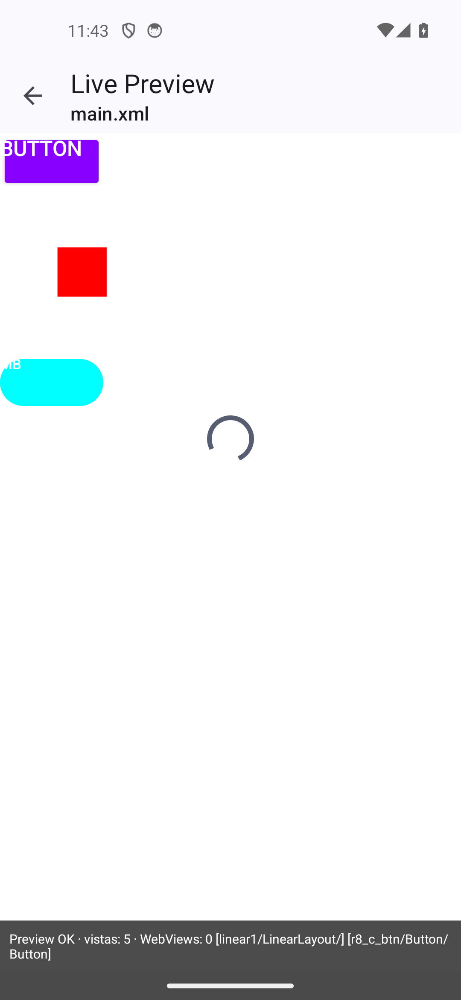 | 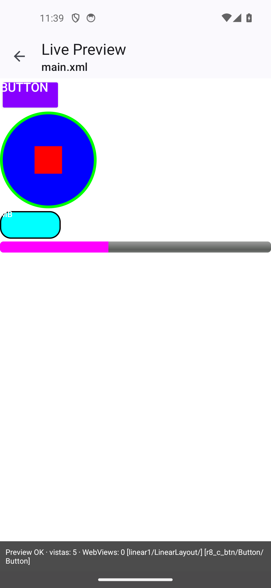 |

Caso C: el `CircleImageView` salía sin borde ni fondo de círculo y el `ProgressBar` salía como **círculo
indeterminado** en vez de barra; después se ven el borde verde (11.924 px), el fondo azul del círculo (90.660 px) y
la barra horizontal magenta (18.907 px).

### 12.5 El aviso ámbar: ni calla, ni miente

| Caso | Resumen de la barra (después) |
|---|---|
| A, B, C, D, G | `Preview OK` (ningún atributo de color o tamaño en el aviso) |
| E Library | `Preview PARCIAL: 4 vistas aproximadas · 5 atributos no aplicados` → son los atributos **de librería** que la clase ausente no puede recibir |
| F Google | `Preview PARCIAL: 2 vistas aproximadas` (AdView y YouTubePlayerView; **0** atributos no aplicados) |

Antes estas mismas propiedades **no salían en el aviso porque se descartaban en silencio**; ahora, o se aplican (y no
se listan) o se listan con el motivo exacto (`sidebar_text_size="14sp" · no se ha encontrado un setter equivalente
en FrameLayout`).

### 12.6 Regresión de las rondas 1-7

17 casos re-ejecutados con el APK nuevo → `preview-evidence/r8/reg8/` (+ `reg8b/` para los afectados por el aviso de
fuente). **17/17 con el mismo resumen que el baseline**, incluidos el `CircleImageView` de la ronda 7 y los 10
widgets de la ronda 6 (`caseR6_ten` y `caseR6_ten_compact` → `Preview OK · vistas: 17`).

**Desviación encontrada y corregida dentro de la ronda:** en la primera pasada, `fontFamily="monospace"` /
`@font/no_existe_font` aparecían como *«no se ha encontrado un setter equivalente en TextView»* — un **aviso ámbar
falso**, porque la fuente la aplica `applyTextTypeface`. Se marcaron `fontFamily`/`textStyle` como atendidos y
`caseB2_estilo` (→ `Preview OK · vistas: 5`) y `caseR4_mixed` vuelven a su resumen exacto de la ronda 7 (`reg8b/`).

### 12.7 Pendientes honestos de la ronda 8

- **El proyecto del usuario y su APK no se han probado.** Todo está medido con el proyecto de pruebas 601 (al que se
  añadieron `dimens.xml`, `r8_anillo.png` y `r8_divider.xml` como material de prueba).
- **Tipos de build mezclados:** el «antes» es el APK **release** pre-cambio y el «después» el **debug** de esta ronda
  (firmar distinto obliga a desinstalar). Los widgets de estos casos se dibujan igual en los dos builds.
- **Medir color ≠ medir tamaño:** la tabla mide el COLOR. Los tamaños (`cornerRadius`, `strokeWidth`,
  `tabIndicatorHeight`, `textSize`, `firstDayOfWeek`…) se verifican por el mismo camino (el applier compartido) y por
  la ausencia de aviso, pero **no se han medido píxeles de grosor ni de radio** salvo donde el color revela la forma
  (borde / indicador / barra).
- **Cambios de aspecto intencionados** en diseños ya existentes: (i) un `TabLayout` sin pestañas ahora muestra 3
  pestañas de ejemplo; (ii) un `ProgressBar` con `progress`/`progressTint` se dibuja horizontal; (iii)
  `AnalogClock`/`DigitalClock` reciben sus atributos de texto. Son las tres cosas que hacían «que no se viera» lo
  configurado.
- **Widgets cuya clase no está en el editor** (Library/Google/ads/map/lottie): el contenedor aproximado conserva
  fondo, padding, tamaño y alpha, pero sus atributos propios no tienen dónde aplicarse; se listan uno a uno con el
  motivo.
- **Rendimiento:** `applyInjectAttributes` recorre ahora todos los atributos y, en el peor caso, prueba reflexión. En
  los 7 casos + 17 de regresión no ha habido lentitud perceptible, pero no se han medido tiempos.
- Siguen vigentes los pendientes de las rondas 1-7 (tema del IDE para los `?atributo`, Material3 del proyecto sin
  probar, `<selector>`/`<ripple>`/`<layer-list>` aproximados, todo medido en emulador y no en móvil físico).

---

## 13. Ronda 9 (v7.0.10.5)

Release: <https://github.com/aurenox-global/Sketchware-Pro/releases/tag/v7.0.10.5> · Fecha: 2026-09-24
Dispositivo: emulador `RV_API34` (`sdk_gphone64_arm64`, arm64-v8a, API 34, `adb root`) · Build del IDE:
**debug** (`:app:assembleDebug`, arm64-v8a) · Evidencia: `preview-evidence/r9a/` y `preview-evidence/r9b/`.

La ronda 9 va en **dos piezas**: la primera (r9a) quita el rojo mal pintado y resuelve los `@style/...` del
proyecto; la segunda (r9b) aplica de verdad `android:theme` y `app:tabTextAppearance`. Dos ficheros tocados en
total, ninguno más (ni README/web/docs, ni `versionCode`/`versionName`):

- `app/src/main/java/pro/sketchware/activities/preview/LayoutPreviewActivity.java`
- `app/src/main/java/pro/sketchware/activities/preview/ProjectResourceResolver.java`

### 13.1 Pieza A (r9a): regla nueva — rojo solo si la vista NO se puede dibujar

El rojo se reserva a lo que de verdad **impide dibujar** (una imagen que no existe, una clase sin reserva).
Cualquier referencia de estilo/medida/tema que no se pueda **aplicar** pero que **no impide dibujar** pasa al
grupo ÁMBAR *"no aplicado / ajustado"*, siempre con su motivo.

| Antes (rojo) | Ahora (ámbar, con motivo) |
|---|---|
| `@style/...` llegando a `resolveDimen` → *"referencia de medida no resoluble"* | *"es un estilo, no una medida...; la vista se dibuja igual"* |
| `@dimen/x` ausente de `dimens.xml` | *"...se dibuja con su valor por defecto"* |
| `@android:dimen/x` del framework no encontrado | *"...se dibuja con su valor por defecto"* |
| `?attr/...` de tema no resoluble | *"atributo del tema no aplicable en la vista previa"* |
| `@style/...` en `android:background` (pasaba a `resolveDrawable` → marcador rojo) | ámbar; ya **no** se pinta el marcador rojo de "drawable no encontrado" |

**Textos del diálogo**: se eliminó por completo la alusión a *"referencia de medida"* (0 ocurrencias en el
código, verificado con grep). El detalle tiene ahora un grupo explícito:

> `No aplicado / ajustado · estilos y medidas (no impide dibujar; la vista sale con su valor por defecto)`

y la barra cuenta esas referencias como *"N estilos/medidas no aplicados"* (ámbar). La barra solo se pinta roja
(`0xB3B00020`) cuando hay **recursos no encontrados**; el resto (vistas aproximadas, atributos no aplicados,
estilos/medidas no aplicados) es ámbar (`0xB3B26A00`).

### 13.2 Pieza A: `@style/...` del proyecto resueltos de verdad

`ProjectResourceResolver` ahora **lee `files/resource/values/styles.xml` del proyecto** (`ensureStylesLoaded()` +
`parseStyles()`, tolerante a `values/styles.xml`, `value/styles.xml` y `values/style.xml`), con:

- `<item name="...">valor</item>` de cada estilo;
- `parent="..."` explícito **y** herencia implícita por puntos (`AppTheme.PopupOverlay` → padre `AppTheme`);
- encadenado de padres hasta 6 niveles (`collectStyleItems`, con `visited` para no entrar en bucles);
- si el estilo no está en el proyecto, se prueba el APK del editor (`app` / `com.google.android.material` /
  `androidx.appcompat`) y, para `@android:style/...`, `android`.

API nueva: `resolveStyle(reference, usage)` → `StyleResolution{requested, resolvedName, styleId, items, reason}` y
`isStyleReference(value)`. Resultado en la vista previa:

- `@style/AppTheme.AppBarOverlay` / `@style/AppTheme.PopupOverlay` → **resueltos** (ya no "no resuelto");
- `@style/AppTheme.NoExiste` → ámbar *"no esta en files/resource/values/styles.xml ni en el editor"*;
- lo que no es aplicable a la vista: silencio o ámbar, **nunca rojo**.

Diff completo de la pieza: `preview-evidence/r9a/r9a.diff` (610 líneas; 404 inserciones / 13 borrados).

### 13.3 Pieza A: medición y capturas (antes → después)

| | Barra inferior |
|---|---|
| **Antes** (binario de `HEAD`, `16fe17e`) | **ROJA**: `⚠ Preview PARCIAL: 1 recurso no encontrado · 2 atributos no aplicados` |
| **Después** (build de r9a) | **ÁMBAR / sin rojo**: `ℹ Preview PARCIAL: 1 atributo no aplicado` (caso 1) y `1 atributo no aplicado · 1 estilo/medida no aplicado` (caso 2) |

| Antes (barra roja) | Después (sin rojos) |
| --- | --- |
| 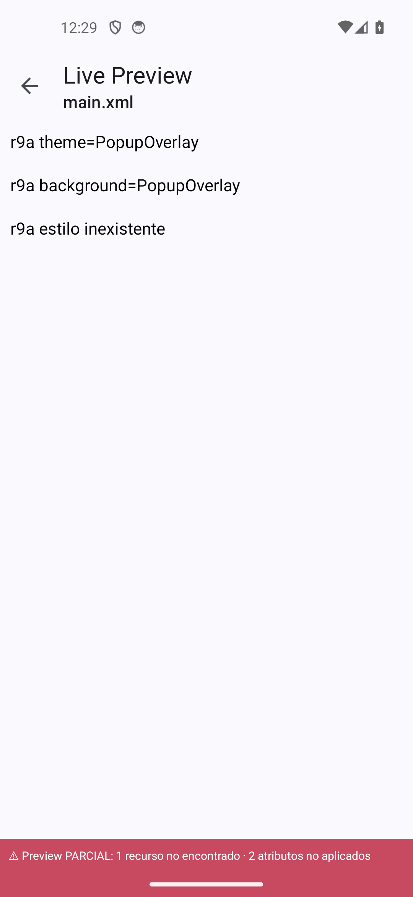 | 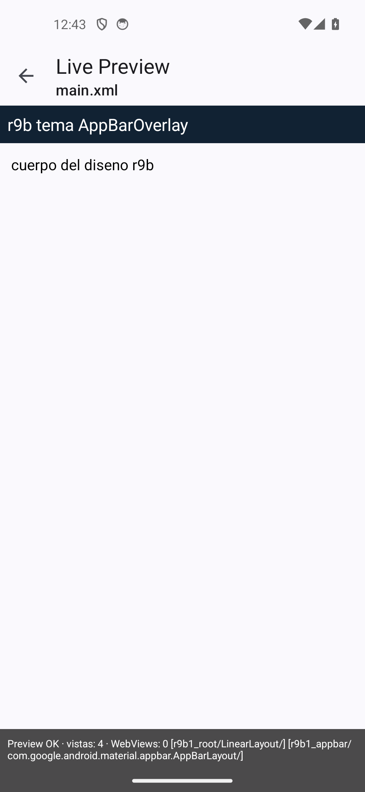 |

Las cuatro capturas de r9a se revisaron con `view_image`: **0 bloques/píxeles rojos** en el lienzo y la barra
inferior en ámbar (dorado) tras el arreglo.

**Regresión (casos de rondas anteriores), 15 XML de r6/r7:**

| Caso | r8 (antes) | r9a (ahora) |
|---|---|---|
| caseB1_color_attr / caseB3_fondos / caseB6b_img_variantes | Preview OK | **Preview OK** |
| caseC_material_regresion / caseE_extra | Preview OK | **Preview OK** |
| caseR6_fallback / caseR6_ten / caseR6_ten_compact | Preview OK | **Preview OK** |
| caseB2_estilo | PARCIAL 1 atributo | **Preview OK** (mejora de `HEAD`, ver nota) |
| caseR4_mixed | 4 recursos no encontrados · 1 vista aprox · 1 atributo | **3 recursos no encontrados** · 1 vista aprox · 1 estilo/medida |
| caseR4_variants | 2 recursos no encontrados | = |
| caseR6_absent | 1 vista aproximada | = |
| caseR7_civ_ajustado | 1 atributo no aplicado | = |
| caseR7_civ_center / _inside / _none / _mixed | Preview OK | **Preview OK** |

**Ningún caso que diera `Preview OK` ha dejado de darlo**; en `caseR4_mixed` un recurso pasa de rojo a ámbar
(efecto buscado). Nota honesta sobre `caseB2_estilo`: la mejora **no es de esta ronda** — el `HEAD` (`16fe17e`,
11:56) ya añadía `handled.add("fontFamily")` y los logs de `r8/reg8` se tomaron a las 11:34 con un APK anterior.

### 13.4 Pieza B (r9b): `android:theme` se aplica al construir la vista

Un tema **no se puede inyectar** en una vista ya creada; hay que construirla con el tema. Ahora
`createRealView(bean, contextoDelPadre)`:

1. lee `theme` del XML y lo resuelve con `resolveStyle()`;
2. **estilo con resId** (framework/editor): la vista se crea con `new ContextThemeWrapper(contextoDelPadre, resId)`
   → tema aplicado de verdad, y **los hijos heredan el contexto del padre**;
3. **estilo SOLO del proyecto** (no compilado en el APK del editor ⇒ sin resId): `ContextThemeWrapper` con base el
   primer padre del proyecto que sí exista en el framework/Material (`resolveBaseStyleId()`:
   `AppTheme.AppBarOverlay` → `ThemeOverlay.AppCompat.Dark.ActionBar`) y además se aplican a la vista los items del
   proyecto que sí son atributos de vista (`colorPrimary`/`colorPrimaryDark`/`colorAccent`/`colorBackground`/
   `windowBackground`/`background` → fondo; `textColor`/`textSize` → texto);
4. **estilo no resoluble**: ámbar con el motivo (`resolveStyle`), **nunca rojo**; el atributo `theme` ya **no** emite
   el viejo aviso ámbar "un tema no se aplica a una vista ya creada".

`app:tabTextAppearance` se aplica a los `TextView` de las pestañas (incluidas las 3 de ejemplo `Tab 1..3`):
`textSize`, `textColor` (color directo o `ColorStateList`), `textStyle`, `textAllCaps` y `fontFamily`; el estilo del
framework se lee **del tema** (`ContextThemeWrapper` + `Theme.resolveAttribute`) sin resolver referencias y con
guarda de tipo (una referencia `?attr/` se deja al tema). El estilo del proyecto manda sobre lo leído del framework.

### 13.5 Pieza B: medición (recuento de píxeles)

- **Caso 1** (`AppBarLayout` con `theme="@style/AppTheme.AppBarOverlay"`): **antes sin fondo** (título blanco casi
  invisible) → **después toma el color del tema `#FF112233`**. Log: `info: tema @style/AppTheme.AppBarOverlay ->
  fondo FF112233` · `Preview OK · vistas: 4`. Barra neutra (ya no hay aviso ámbar porque **sí se aplica**).
- **Caso 2** (`TabLayout` con `app:tabTextAppearance="@style/TabTextAppearance"` del proyecto): "Tab 1..3" en
  **magenta 24sp negrita**; `9 ajustes en 3 pestanas (resId=0)` · `Preview OK`.
- **Caso 3** (`@android:style/TextAppearance.Widget.TabWidget`): resuelto **por resId 16973901** → `3 ajustes en 3
  pestanas` (1 por pestaña: el `textSize` del framework).

Las **6 capturas** (3 antes + 3 después) se revisaron con `view_image` y con **recuento de píxeles** (muestreo 1 de
cada 2 px): **`red=0 amber=0` en las seis**; las tres después son `Preview OK`.

### 13.6 Pieza B: regresión (rondas 5-8, 23 XML)

Ningún caso que diera `Preview OK` ha dejado de darlo; los que ya eran parciales siguen igual (incluidos
`caseR5_families`, `caseR5_legacy`, `caseR4_variants`, `caseE_library` y `caseF_google`). Capturas y logs en
`preview-evidence/r9b/reg/`, script `run_regression9b.sh`, baselines en `preview-evidence/r8/after_case*.log` y
`preview-evidence/r5/`.

### 13.7 Pendientes honestos de la ronda 9

- **Un estilo del proyecto no tiene resId** (sus `styles.xml` no están compilados en el APK del editor), así que no
  se puede meter en el `Theme` del sistema: su tema se **emula** con base del framework + items mapeados. Items que
  no corresponden a atributos de vista (p.ej. `colorControlNormal`, `windowActionBar`) se ignoran sin aviso.
- **`?attr/` del framework en `tabTextAppearance`** (`?textColorPrimary`, …) **no se resuelven**: hacerlo filtraría
  colores del tema del editor, así que se dejan al tema (por eso el caso 3 solo ajusta el tamaño, no el color).
- **`popupTheme` / `actionBarTheme` / `actionBarPopupTheme` siguen sin aplicarse** (mantienen su aviso ámbar).
- **La base del framework** para un tema de proyecto es la del APK del editor (Material/AppCompat del IDE), no el
  tema real de la app compilada.
- **Resolución de estilos limitada a `values/styles.xml`**: estilos definidos solo en subcarpetas de calificador
  (`values-v21/`) o en librerías locales no se leen.
- **El proyecto del usuario y su APK no se han probado**: todo está medido con el proyecto de pruebas 601.
- Los cambios están **sin commitear** en el árbol de trabajo; `versionCode`/`versionName` **no los ha tocado esta
  ronda** (el árbol ya trae `172` / `v7.0.10.5`).

## 14. Ronda 10 (v7.0.11.0)

Fecha: 2026-09-24 · Versión: **v7.0.11.0** (versionCode 173) · Repo: `Sketchware-Pro-main`

Release: <https://github.com/aurenox-global/Sketchware-Pro/releases/tag/v7.0.11.0>

Tres piezas de la vista previa de diseños (iconos, estilos del proyecto y constructores que R8 borraba en release) y,
además, el toolchain de Flutter para **x86_64** (§14.7). Ficheros tocados por los tres bloques de preview:
`ProjectResourceResolver.java` (iconos y estilos) y `LayoutPreviewActivity.java` + `app/proguard-rules.pro`
(constructores).

### 14.1 Iconos: el set Material estaba dentro del APK (y el icono elegido, en el almacén del proyecto)

- **De dónde salen.** El set Material del IDE está DENTRO del APK en `assets/icons/icon_pack.zip` (**5.335.950 B**):
  **2.191 nombres × 5 estilos (`baseline`, `outline`, `round`, `sharp`, `twotone`) = 10.955 SVG**, en
  `svg/<nombre>/<estilo>.svg`. El selector (`ImportIconActivity`) los llama `icon_<nombre>_<estilo>` y guarda el
  elegido **convertido a vector XML** (`SvgUtils.convert`) en el **almacén de imágenes del proyecto**
  `.sketchware/resources/images/<sc_id>/<nombre>.xml` — **no** en `files/resource/drawable`.
- **Qué fallaba.** La vista previa no miraba ni ese almacén, ni el `res` generado del build, ni el zip del set del IDE
  (no es un `res/drawable` del APK del editor: `getIdentifier()` no lo ve) → los iconos salían en **rojo**
  (`2 recursos no encontrados`).
- **Arreglo.** Se añaden esas dos rutas como fuente de drawables más la resolución exacta desde el set del IDE
  (`icon_<nombre>_<estilo>` → SVG → vector en memoria, sin añadir dependencias). Cuando el icono se resuelve desde el
  set (y no desde un fichero del proyecto) se **anota en el aviso** (grupo ámbar de «nombres heredados resueltos»):
  nada de sustituir en silencio.
- **Medición (proyecto 601):** antes, **2 recursos no encontrados** con **barra ROJA** (**33.087 px rojos**, muestreo 1
  de cada 2 px) → después los **2 iconos dibujados** y **rojo=0**, con aviso **ámbar**
  (`icon_miscellaneous_services_round -> svg/miscellaneous_services/round.svg`).

| Antes (`before_icons_case2_icons`) | Después (`after_i2_pack_case2_icons`) |
| --- | --- |
| 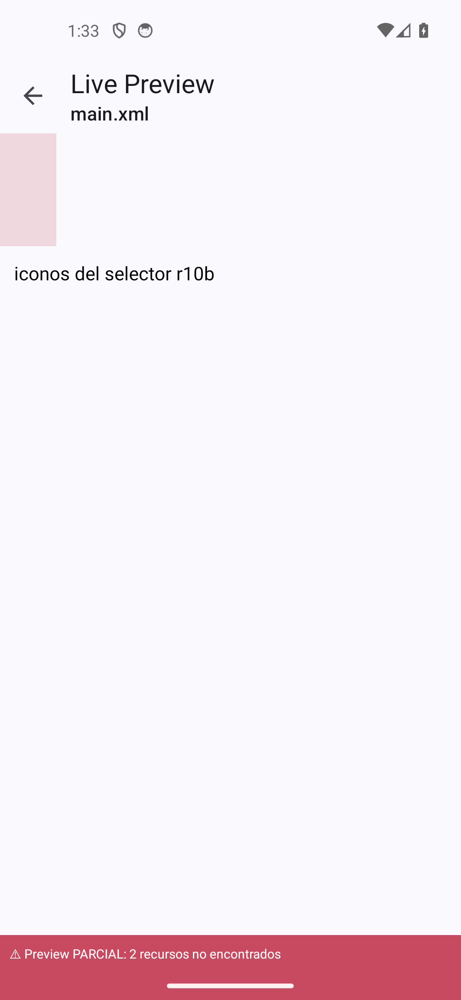 | 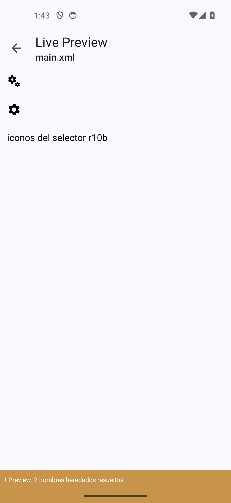 |

### 14.2 Estilos del proyecto: el `<style ... />` autocerrado y las rutas que faltaban

- **Ruta real.** Lo que edita el usuario es `files/resource/values/styles.xml` (y variantes `value/`, `values-v21`,
  `values-night`); lo que **compila aapt2** es el `res` GENERADO del build
  `.sketchware/mysc/<sc_id>/app/src/main/res/values/styles.xml`. Y, si el proyecto no tiene el fichero en disco, el IDE
  lo **genera** (`yq.getXMLStyle()`), incluyendo en las ramas Material3/AppCompat los **autocerrados**
  `AppTheme.AppBarOverlay` y `AppTheme.PopupOverlay` — justo los dos que el IDE inyecta en los widgets
  (`AppCompatInjection.getDefaultActivityInjections()`) y los que se veían como «no presentes».
- **Qué fallaba (parseo).** El patrón era `<style\s+([^>]*)>(.*?)</style>` (DOTALL): con un estilo **autocerrado** no se
  reconocía ese estilo **y** el `(.*?)</style>` **se tragaba el cuerpo del siguiente**. Evidencia medida:
  `styles.xml del proyecto leidos: … -> 3 estilos` → ahora `-> 5 estilos`. Arreglo: `<style\s+([^>]*?)(/>|>(.*?)</style>)`
  (el grupo 2 distingue autocierre de cuerpo) admitiendo también `<item name="..."/>` sin valor.
- **Qué fallaba (rutas).** Solo se miraba `files/resource/values/styles.xml` exacto: faltaban `value/`,
  `values-v21`, `values-night` y el `res` generado del build. Ahora se recorren **todos** los `value*` de
  `files/resource` y del `res` generado, y como último recurso se le pregunta al **generador del IDE** (misma fuente
  que usa el compilador).
- **Estilo autocerrado sin items.** Antes se resolvía y **no se aplicaba nada, en silencio**; ahora se envuelve el
  contexto con la **base del framework** de su cadena de padres (`resolveBaseStyleId` + `ContextThemeWrapper`), así que
  el tema del proyecto **sí** se aplica. Si no hay ni items ni base ni resId, sigue el **aviso ámbar con motivo**
  (nunca rojo).
- **Resultado (caso 1: `AppBarLayout android:theme` + `MaterialToolbar app:popupTheme`):** antes, dos avisos
  `no aplicado [estilos y medidas]: @style/AppTheme.AppBarOverlay …` y `@style/AppTheme.PopupOverlay …`; después,
  `info: styles.xml del proyecto leidos: … -> 5 estilos` · `info: tema del proyecto @style/AppTheme.AppBarOverlay, base
  del framework resId=2132018148` · **cero avisos de estilo** · `Preview OK · vistas: 5`.

### 14.3 Constructores perdidos en release (R8): 62 clases, y varias vistas de librería

- **El síntoma (release-only, reproducido en el caso F):** `com.google.android.gms.common.SignInButton` se dibujaba
  como **contenedor aproximado** y no recibía `buttonSize`/`colorScheme` (en debug sí).
- **La causa exacta.** Fuente: `app/build/outputs/mapping/release/usage.txt`. R8 borra en release los **3
  constructores** de `SignInButton` (y `setStyle`), de `FlexboxLayout`, y `<init>(Context)` de `LottieAnimationView`,
  `bobur.androidsvg.SVGImageView` y `caverock.androidsvg.SVGImageView`; en total **62 clases** pierden
  `<init>(android.content.Context)`. La clase sigue en el APK (no es `ClassNotFoundException`), pero R8 solo conserva
  los miembros que alguien referencia desde el bytecode, y esas vistas las construye **solo** la reflexión de la vista
  previa → las borra.
- **Arreglo A (el que resuelve el fallo medido):** 5 reglas `-keepclassmembers` acotadas a
  `extends android.view.View` para `com.google.android.gms.**`, `com.google.android.flexbox.**`,
  `com.airbnb.lottie.**`, `com.bobur.androidsvg.**` y `com.caverock.androidsvg.**`.
- **Arreglo B (robustez):** se **elimina la reflexión** (`app:x → setX`) y se sustituye por **mapeo explícito** con
  llamadas directas (`SignInButton`, `Lottie`, `Flexbox`); lo no mapeado va al **aviso ámbar** con su motivo, nunca en
  silencio.
- **Delta de tamaño (APK release arm64-v8a):** `115.990.072` → **`115.999.964`** = **+9.892 B** (+0,0085 %).
- **Verificado en release:** el **botón real de Google** se dibuja (antes: contenedor ámbar «≈ SignInButton»); el caso
  F pasa de «3 vistas aproximadas · 2 atributos no aplicados» a «2 aproximadas · 0 atributos no aplicados» (las 2 que
  quedan, `AdView` y `YouTubePlayerView`, no están en el APK del editor en ningún build); y los **7/7 casos en claro y
  7/7 en oscuro** mantienen sus colores (caso A `#123456` **162.773 px**, `#EE2222` **111.016 px**).

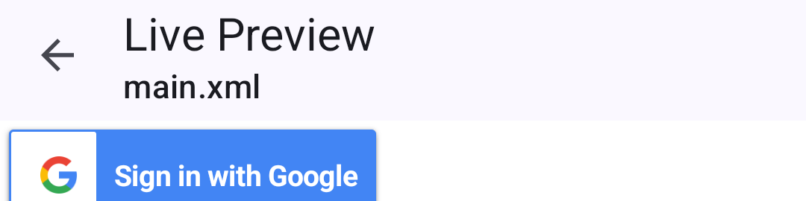

### 14.4 La sospecha que era falsa (corrección honesta)

La ronda 8 se verificó con APK **debug**, y la sospecha al abrir la ronda 10a era que la release con **R8** eliminaba
lo que el aplicador **por reflexión** necesitaba. **Eso no era lo que pasaba.** Medición: en **todos** los logs de r8 y
r10a hay **0 coincidencias** de `info: atributo … aplicado con` — el aplicador genérico de atributos por reflexión
**nunca llegó a dispararse**; los atributos van por appliers con llamadas directas. Y los colores de la **ronda 8 sí
funcionaban en release**: los 7 casos los aplican. Lo que fallaba estaba **antes**: en la **construcción** de la vista
(R8 borra el constructor → cae al contenedor de reserva → el atributo no tiene dónde aplicarse). El mapeo explícito del
arreglo B elimina ese camino frágil para el futuro, pero no porque la reflexión estuviera rota.

### 14.5 Pendientes honestos de la ronda 10

- **Iconos:** el icono del set se dibuja con el relleno del SVG (`#FF000000`) cuando **no** hay fichero del proyecto: el
  color que eligió el usuario vive en el fichero del proyecto (`SvgUtils.convert(..., colorHex)`), no en el zip. Si el
  fichero existe, se usa el suyo y se respeta el color.
- **Etiqueta del aviso:** el grupo ámbar de los iconos del set usa la etiqueta de «nombres heredados resueltos» (viene
  de `LayoutPreviewActivity`, fuera de este carril); el detalle sí explica el origen de cada uno.
- **Estilos:** la base del framework para un tema de proyecto es la del APK del editor, no el tema real de la app
  compilada; y un estilo sin items y sin base se resuelve pero no se aplica (no hay nada que aplicar).
- **Aviso de diseño no arreglado aquí:** la barra inferior solo se muestra si hay avisos **rojos** o de vista
  (`hidePreviewWarning()` no mira `getInformativeWarnings()`), así que un problema **solo de estilos** queda visible en
  el log/detalle pero no en la barra — vive en `LayoutPreviewActivity`.
- **Cambio de superficie aceptado:** al quitar la reflexión, un atributo de librería **sin** mapeo explícito ya no se
  intenta aplicar «a ciegas»: sale en el aviso ámbar. Si aparece un atributo nuevo que sí funcionaba por reflexión, hay
  que añadirlo al mapeo (una línea).
- **Regresión:** la de las rondas 1‑9 se reejecutó para la pieza de iconos/estilos (r10b: **32/32** capturadas, ningún
  `Preview OK` perdido, y `caseR4_variants` **mejora** porque ahora también se mira el `res` generado del build). La
  regresión r1‑r7 de la pieza **release** (r10a) **no** se re-ejecutó.
- **El proyecto real del usuario y su APK no se han probado**: todo está medido con el proyecto de pruebas 601 y los
  XML de la ronda 8; el emulador de la pieza release fue un clon propio de `RV_API34` (`emulator-5556`) porque el
  `emulator-5554` lo conducía otro carril.
- **Sin commitear** en el árbol de trabajo; `versionCode`/`versionName` los pone esta release a **173 / v7.0.11.0**.

### 14.6 Reproducir (ronda 10)

```bash
cd /Users/zota/.openclaw/workspace/preview-evidence/r10b
DIR=$PWD bash run_case_r10b.sh case2_icons case2_icons.xml r10b2_root after_i2_
bash run_regression_r10b.sh
# pieza release (R8), emulador propio emulator-5556:
cd /Users/zota/.openclaw/workspace/preview-evidence/r10a && bash run_case_r10a.sh
```

### 14.7 Toolchain de Flutter para x86_64 (nota corta)

El APK de la ABI **x86_64** ya **viaja con** su propio toolchain: `jniLibs/x86_64/libdartaotruntime.so`
(5.873.176 B; el ELF real del `.deb` x86_64 de Termux, que vive en `lib/dart-sdk/bin/`, no el script de shell de
115 B) y `jniLibs/x86_64/libfluttergensnapshot.so` (5.123.768 B, **compilado** desde las fuentes del Dart SDK 3.13.4
con `--arch x64c --mode product --os android`, porque Android x64 exige **compressed pointers**; evidencia: el
`gen_snapshot` oficial del engine, el error del VM y el `strings` del binario). El bloqueo por ABI se sustituye por
`abiHasAotBackend` (`arm64-v8a` | `x86_64`), mientras `armeabi-v7a`/`x86` siguen avisando; **+4,34 MB solo en x86_64**
(release 112.136.131 → 116.476.809), arm64 idéntico. **Honesto: la ejecución real en x86_64 no está verificada** — no
hay imagen x86_64 disponible y compilar/ejecutar en Apple Silicon es inviable. Detalle completo:
[docs/flutter-consent.md](flutter-consent.md).

---

## 15. Ronda 11 (v7.0.12.0)

Fecha: 2026-09-24 · Versión: **v7.0.12.0** (versionCode 174) · Repo: `Sketchware-Pro-main`

Release: <https://github.com/aurenox-global/Sketchware-Pro/releases/tag/v7.0.12.0>

Tres piezas de la vista previa de diseños: el botón **Copiar** del diálogo de avisos (petición del usuario), la
causa confirmada de "no veo los colores" (**el permiso de almacenamiento**) con su arreglo, y una **segunda causa
real** medida (`colors.xml` solo se leía de `values/`). Ficheros tocados:
`app/src/main/java/pro/sketchware/activities/preview/LayoutPreviewActivity.java` (+221) y
`app/src/main/java/pro/sketchware/activities/preview/ProjectResourceResolver.java` (+72); **261 inserciones y 32
borrados** en total. Todo se volvió a comprobar después en el **APK release (R8)** (§15.4).

| El diálogo de avisos, con el botón **Copiar** | Con el permiso denegado: línea y barra en **ámbar** |
| --- | --- |
| 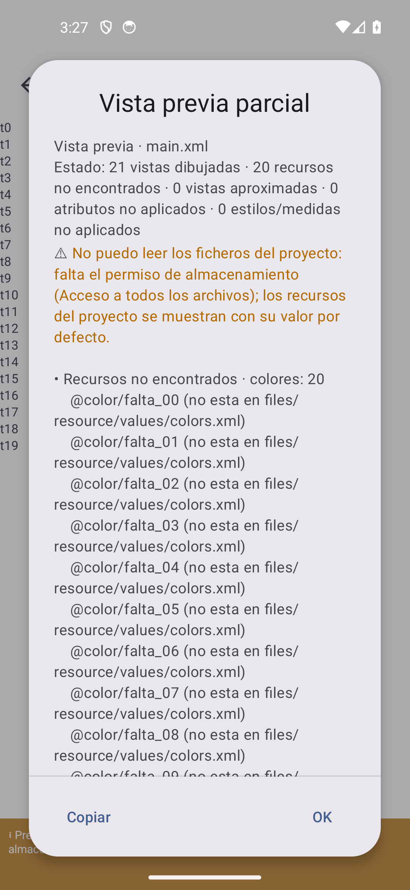 | 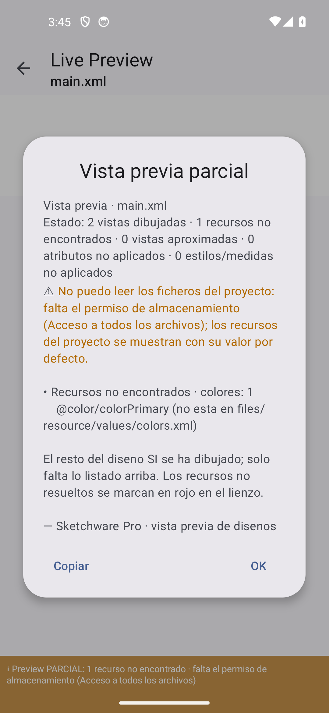 |

### 15.1 Botón "Copiar" en el diálogo de avisos

**Qué hace.** El diálogo de la vista previa — tanto el de la barra **parcial** como el del caso **OK** — tiene un
botón **neutro "Copiar"** que lleva al portapapeles el **informe completo, sin truncar**, y confirma con el toast
**"Aviso copiado"**. El botón `OK` se mantiene.

**Por qué "completo" está medido y no solo dicho.** El diálogo corta cada grupo a **12 líneas**
(`…y N mas (pulsa Copiar para el aviso completo; tambien en el log LayoutPreview)`). El copiado usa el mismo
generador con `truncate=false`:

| caso | diálogo | copiado |
| --- | --- | --- |
| 2 recursos no encontrados | 12 líneas por grupo | log `info: aviso copiado al portapapeles (1119 caracteres)` |
| `caseD`, **20** colores rotos | 12 + `…y 8 mas` | **1869 caracteres** (crece con los 20, no con los 12) |
| `caseE` (estilos/iconos) | 12 líneas por grupo | **572 caracteres** |

**Prueba end-to-end de que el portapapeles tiene el texto entero** (no solo el log interno): el portapapeles se pegó
en el buscador de Ajustes (`KEYCODE_PASTE`, 279) y en pantalla aparece el **final** del informe
(`…ware Pro · vista previa de disenos`), es decir, está completo, con su última línea. Leer el portapapeles desde
shell **no** es posible en API 34: `cmd clipboard` responde *"No shell command implementation."* y
`service call clipboard 1..8` solo devuelve `SecurityException`/"No items"; por eso el pegado real.

**Contenido del texto copiado** (autosuficiente, se entiende sin la app): cabecera `Vista previa · <layout>`, la
línea `Estado:` (vistas dibujadas · recursos no encontrados · vistas aproximadas · atributos no aplicados ·
estilos/medidas no aplicados), un bloque por causa con su recuento y **cada** elemento con su motivo, la línea
`Drawables buscados en: …`, las notas explicativas y la firma `— Sketchware Pro · vista previa de disenos`.

### 15.2 Causa confirmada (con prueba): el permiso de almacenamiento

Emulador `RV_API34` (arm64, API 34). Caso `caseC`: un `LinearLayout` con
`android:background="@color/color_proyecto"` (#0000FF, del `values/colors.xml` del proyecto 601), un `TextView` con
ese color y un `ImageView` con `@drawable/r8_anillo`. **Mismo APK, misma pantalla: solo cambia el permiso.**

| estado del permiso | (0,0,255) px | barra |
| --- | --- | --- |
| `MANAGE_EXTERNAL_STORAGE allow` | **373.070 px**, bbox `x[0,1079] y[182,599]` | `Preview OK · vistas: 4` |
| `MANAGE_EXTERNAL_STORAGE deny` | **AUSENTE** | `⚠ Preview PARCIAL: 2 recursos no encontrados` |

Con el permiso denegado, logcat confirma la causa raíz (no es una suposición):

```
warning: recurso no resuelto [colores]: @color/color_proyecto (no esta en files/resource/values/colors.xml)
warning: recurso no resuelto [drawables/imagenes]: @drawable/r8_anillo (buscado en: 2 carpetas drawable* ...)
E MediaProvider: Permission to access file: /storage/emulated/0/.sketchware/mysc/list/601/project is denied
E ERROR: /storage/emulated/0/.sketchware/mysc/list/601/project: open failed: EACCES (Permission denied)
```

=> **Sin el permiso, los colores `@color/` del proyecto y los iconos desaparecen y la vista previa se queda con
valores por defecto, en silencio.** (Además la app no puede leer ni el fichero del proyecto.)

**Arreglado en tres piezas:**

1. **Línea explícita en el diálogo, en ÁMBAR** (`ForegroundColorSpan(0xFFB26A00)`):
   `⚠ No puedo leer los ficheros del proyecto: falta el permiso de almacenamiento (Acceso a todos los archivos);
   los recursos del proyecto se muestran con su valor por defecto.`
2. **La barra de estado** ya no se pinta roja por culpa del permiso: con el permiso ausente va en **ámbar** y añade
   `· falta el permiso de almacenamiento (Acceso a todos los archivos)`. Con el permiso concedido se comporta
   **exactamente** como antes (rojo solo si faltan recursos de verdad): regresión intacta.
3. **Diálogo "Permiso de almacenamiento" antes de dibujar**: si la app no puede leer `.sketchware`, sale un diálogo
   con **Conceder** (abre los ajustes de "Acceso a todos los archivos" de `pro.sketchware` vía
   `FileUtil.requestAllFilesAccessPermission` → `com.android.settings.spa.SpaActivity`) y **Ahora no**. No bloquea el
   dibujado: sin permiso se dibuja igual, pero ya no en silencio.

**Relectura al volver.** Al cambiar el permiso se reconstruye el `ProjectResourceResolver` (que cacheaba "no pude
leer nada" y no se recuperaba sin reiniciar la app). Verificado por log:
`info: permiso de almacenamiento concedido: se releen los recursos del proyecto (.sketchware) en la siguiente
previsualizacion`, seguido de `Preview OK`. Con permiso: **373.070 px exactos, mismo bbox** que antes de los cambios.

### 15.3 Segunda causa real: los colores del proyecto (el `colors.xml` del `res` generado)

La hipótesis del permiso está confirmada **como mecanismo**, pero encaja mal con "veo el diseño pero no los
colores": sin permiso la app no puede leer ni el fichero del proyecto (`mysc/list/601/project` → `EACCES`), así que
la lista de proyectos estaría vacía. Por eso se fue también a la otra vía y **se encontró un fallo real y medido**:

`ensureColorsLoaded()` leía **solo** `files/resource/values/colors.xml`. Nunca miraba `value/`, `values-v21`,
`values-night` **ni el `res` generado del build** (`.sketchware/mysc/<sc_id>/app/src/main/res/value*`) — justo las
rutas que sí se arreglaron en `styles.xml` en la ronda 9a. Y en el proyecto 601 el `res` generado define colores que
la app **sí** tiene:

```xml
<!-- .sketchware/mysc/601/app/src/main/res/values/colors.xml -->
<color name="colorPrimary">#007FAC</color>  (colorPrimaryDark, colorAccent, colorControlHighlight, colorControlNormal)
```

Medición con `caseE` (`android:background="@color/colorPrimary"`), mismo APK, solo cambia el resolvedor:

| | logcat | (0,127,172) px | barra |
| --- | --- | --- | --- |
| resolvedor viejo | `warning: recurso no resuelto [colores]: @color/colorPrimary (no esta en files/resource/values/colors.xml)` | **AUSENTE** (banda blanca **359.604 px**) | ROJO `⚠ Preview PARCIAL: 1 recurso no encontrado` |
| resolvedor nuevo | `info: colors.xml del proyecto leidos: [values/colors.xml, mysc/601/.../values/colors.xml] -> 6 colores` | **356.400 px**, bbox `x[0,1079] y[182,511]` | sin rojo (`Preview: 1 nombre heredado resuelto`) |

Es decir: **cualquier `@color/…` que exista en el `res` generado del build (`colorPrimary`, `colorAccent`, …) se
daba por no encontrado y la banda salía con el color por defecto.** Cambios hechos (misma mecánica que en
`styles.xml`): enumera `value*` en `files/resource` y en el `res` generado, lee `colors.xml`/`color.xml`, orden
estable, prioridad para `values/colors.xml` (el comportamiento anterior no cambia: `putIfAbsent`) y parseo de color
algo más tolerante. Resultado: **359.604 px blancos → 356.400 px con su color, cero rojo**.

### 15.4 Smoke test del APK release (R8)

| | |
| --- | --- |
| APK | `app/build/outputs/apk/release/app-arm64-v8a-release.apk` |
| versionCode / versionName | **174** / `v7.0.12.0` |
| md5 | `bcdaf0b16c7f55a90eebd4c5d11ff94c` |
| Firma | mismo cert `testkey` que el debug → `adb install -r` conservó datos |
| Dispositivo | emulador `emulator-5554` (`RV_API34`, arm64, API 34) |

**Veredicto corto: ninguna diferencia con debug.** Los cuatro puntos se comportan igual (mediciones idénticas, salvo
el texto exacto del informe, que depende del fixture):

- **Copiar.** Botón neutro presente en el diálogo de la barra, tanto en el caso parcial (`caseD`, 20 colores rotos)
  como en el `OK`. Al pulsar: toast **"Aviso copiado"** y log `info: aviso copiado al portapapeles (1627
  caracteres)`. **Pegado real** (`KEYCODE_PASTE`): aparece el informe entero, con los **20** colores
  (`@color/nx_1` … `@color/nx_20`) y la firma final. Completo. ✔
- **Permiso denegado.** `0 colores`, diálogo **"Permiso de almacenamiento"** antes de dibujar (Conceder →
  `com.android.settings/.spa.SpaActivity`) y línea **ámbar** `0xFFB26A00` **15.488 px** con **0 px** de
  `0xFFB00020`; barra ámbar `(200,148,75)` **148.517 px, 0 rojo** (idéntica a debug). La banda `@color/` desaparece
  con `deny` (0 px teal).
- **Permiso concedido.** `colors.xml … -> 6 colores`, la banda vuelve **teal `(0,127,172)` = 356.400 px**, bbox
  `x[0,1079] y[312,641]`, barra `Preview OK · vistas: 2`; y el log de relectura al volver de Ajustes. ✔
- **`@color/` del `res` generado.** `@color/colorPrimary` → **356.400 px** teal con bbox exacto;
  `@color/color_proyecto` → **356.400 px** azul.
- **Regresión r8/r5.** `caseA_layouts` `Preview OK · vistas: 4`; `caseC_widgets` `Preview OK · vistas: 5`;
  `r8 caseC` colores **púrpura 18.933 · verde 11.764 · azul 90.564 · cian 21.428 · magenta 18.896 px** con **bbox
  idénticos pixel a pixel**; `r5 caseR5_families` con el mismo estado post-fix; y el rojo sigue reservado a recursos
  realmente ausentes (`caseD` → barra roja `Preview PARCIAL: 20 recursos no encontrados`).

**Nota de herramienta** (útil para futuras rondas): tras conceder por el toggle de Ajustes, `appops get` deja **dos
entradas** (`Uid mode: allow` + entrada de paquete `deny`); `appops set pro.sketchware … deny` **no** deniega (gana
el uid mode), hay que usar `appops set --uid pro.sketchware MANAGE_EXTERNAL_STORAGE deny`.

### 15.5 Pendientes honestos de la ronda 11

- **No se ha probado el móvil del usuario.** Se verificó el *mecanismo* (sin permiso → valores por defecto, con
  evidencia de píxel y logcat) y la causa #2 (`colors.xml`) con antes/después medido.
- **La relectura tras conceder el permiso está verificada por log, no por color en la misma pantalla**: al volver de
  Ajustes, `onResume` redibuja el layout del *proyecto* (que no usa `@color/`), y el caso de prueba con `--es xml`
  no se puede redibujar ahí. Lo probado: el resolvedor se reconstruye (log) y un resolvedor nuevo sí lee los 6
  colores.
- **Portapapeles:** el entorno no expone lectura del portapapeles desde shell en API 34; la evidencia es el log de la
  propia copia + el pegado real (texto completo, con su última línea).
- **Al recrear los fixtures cambió el *texto* del informe** (1627 vs 1869 caracteres): lo verificado es la propiedad
  "completo y sin truncar", no la cadena literal.
- **Regresión:** no se reejecutaron las 10 suites originales (sus XML/scripts ya no están en disco); sí casos
  representativos (r5 y r8 con recuento de píxeles) más los cuatro puntos de la ronda, en debug **y** en release.
- **Sin commitear** en el árbol de trabajo; `versionCode`/`versionName` los pone esta release a **174 / v7.0.12.0**.

---

## 16. Ronda 12 (v7.0.13.0)

Fecha: 2026-09-24 · Versión: **v7.0.13.0** (versionCode 175) · Repo: `Sketchware-Pro-main`

Release: <https://github.com/aurenox-global/Sketchware-Pro/releases/tag/v7.0.13.0>

Un bug **heredado del Sketchware Pro original**: los colores elegidos en el editor se escribían en el XML con el
**alfa a cero** (`#00RRGGBB` = **transparente**), así que no se veían **ni en la vista previa ni en la app compilada**
— y encima la app decía *"Preview OK"*. Fichero tocado: `app/src/main/java/a/a/a/Ox.java` (**4 inserciones / 4
borrados**; **no** se tocó `formatColor`). Se verificó en el **APK release (R8)** con el **flujo real** (editor →
`Ox` → vista previa) y con el **fuente que compila el IDE** (§16.6).

| La vista previa REAL, **antes**: sin azul y sin verde | La vista previa REAL, **después**: botón azul, columna verde, texto rojo |
| --- | --- |
| 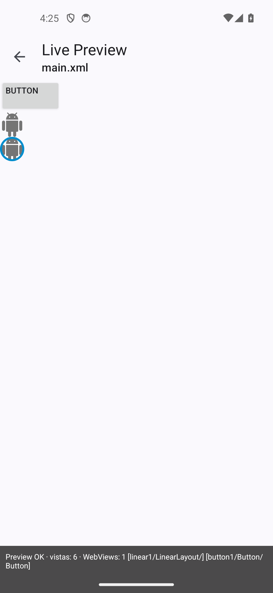 | 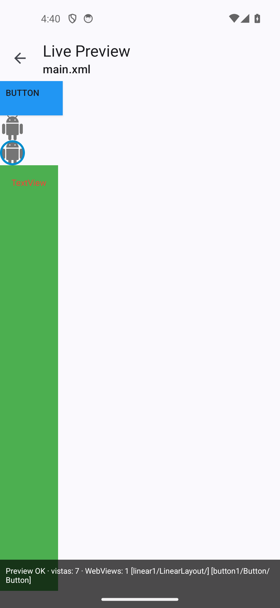 |

### 16.1 El síntoma y por qué había que usar el flujo **real** (no la inyección)

La preview **sí renderiza colores correctamente**. Lo que fallaba era la **generación del XML**: el generador
`a.a.a.Ox` destruía el canal alfa del color de fondo y escribía `#00RRGGBB`, es decir **totalmente transparente**.
Resultado: el `LinearLayout` y el `Button` salían **sin color** y la app **no avisaba de nada**.

El camino "real" del usuario y el "inyectado" (`am start --es xml`) son **el mismo**, salvo quién calcula el XML:
`DesignActivity.openLivePreview()` (`DesignActivity.java:829-855`) llama a `new yq(…).getFileSrc(layoutName, …)`
(`yq.java:1230` → `Ox`, `yq.java:1277-1279`) y pasa ese XML como extra `"xml"` a `LayoutPreviewActivity`, **el mismo
extra** que usa la inyección. Por eso, si el XML es idéntico el render debe ser idéntico, y la fuga solo puede estar
**aguas arriba**.

**Prueba decisiva** (3 medidas de píxeles, sin cambiar nada más):

| # | Camino | XML de entrada | px azul `#2196F3` | px verde `#4CAF50` |
| --- | --- | --- | --- | --- |
| 1 | **REAL**: editor → `yq.getFileSrc` (`Ox`) → preview | generado por el editor | **0** | **0** |
| 2 | Inyectado con **ese MISMO XML** | copia verbatim del de (1) | **0** | **0** |
| 3 | Inyectado con el alfa arreglado (`#FF…`) | sólo `#00`→`#FF` | **30.524** | **593.519** |

(1) == (2) ⇒ la vista previa es fiel; el fallo **no** está en el render. (3) ⇒ con alfa correcto los colores
aparecen. **El fallo está en la generación.** El editor, en cambio, **sí** guardaba bien el color
(`0xFF2196F3` / `0xFF4CAF50`) y **sí** lo pintaba en su lienzo: por eso el usuario lo veía bien en el editor y mal en
la preview/APK.

### 16.2 La causa raíz (una línea, y 4 sitios con el mismo error)

`app/src/main/java/a/a/a/Ox.java`:

```java
// línea 202 (antes del arreglo) — se destruye el alfa ANTES de formatear
int color = backgroundColor & 0xffffff;      // 0xFF2196F3 -> 0x002196F3
// línea 244
nx.addAttribute("android", "background", formatColor(color));
// líneas 62-70 — formatColor imprime 8 dígitos cuando el alfa != 0xFF
if (alpha != 0xff) { return String.format("#%08X", color); }   // -> "#002196F3"
```

Cadena del fallo:

1. El editor guarda `backgroundColor = 0xFF2196F3` (alfa `FF`) — **correcto**.
2. `Ox:202` → `color = 0x002196F3` (alfa machacado a `00`).
3. `Ox:244` → `formatColor(0x002196F3)`.
4. `formatColor` ve `alpha == 0x00 != 0xff` → devuelve **`#002196F3`**.
5. El XML queda **transparente**: ni la preview ni el APK pintan nada.

**Es determinista, no un caso raro:** el picker siempre guarda alfa `FF` y `& 0xffffff` lo mata *siempre* ⇒
**cualquier color de fondo elegido desde la paleta hexadecimal sale transparente**. Afectaba igual a los otros
`formatColor(color)` del mismo método (`backgroundTint`, `cardBackgroundColor`, `contentScrim`, todos alimentados por
el `color` ya enmascarado) y a las rutas de **texto** (`textColor` en `Ox:824`, `sidebar_text_color` en `Ox:418`,
`textColorHint` en `Ox:847`), que hacían el mismo `& 0xffffff`.

### 16.3 El arreglo (4 líneas, `formatColor` intacto)

`git diff --name-only` → **solo** `app/src/main/java/a/a/a/Ox.java`; `git diff --stat` → **4 inserciones / 4
borrados**. Se quitó el `& 0xffffff` en los **4 sitios** (las líneas reales del árbol actual son **201, 418, 824,
847**):

```diff
-                    int color = backgroundColor & 0xffffff;
+                    int color = backgroundColor;
@@
-                widgetTag.addAttribute("app", "sidebar_text_color", formatColor(textColor & 0xffffff));
+                widgetTag.addAttribute("app", "sidebar_text_color", formatColor(textColor));
@@
-                nx.addAttribute("android", "textColor", formatColor(viewBean.text.textColor & 0xffffff));
+                nx.addAttribute("android", "textColor", formatColor(viewBean.text.textColor));
@@
-                        nx.addAttribute("android", "textColorHint", formatColor(viewBean.text.hintColor & 0xffffff));
+                        nx.addAttribute("android", "textColorHint", formatColor(viewBean.text.hintColor));
```

**No se tocó `formatColor()`** (líneas 60-70). Comprobación previa: `grep -rn formatColor app/src/main/java | grep
-v Ox.java` → **vacío**, ningún otro consumidor dependía del valor enmascarado. Invariantes de `formatColor` que se
cumplen tras el arreglo: opaco → **6 dígitos** (`#2196F3`); translúcido (alfa ≠ `FF`) → **8 dígitos** (`#802196F3`).

### 16.4 Medición: antes → después (release, flujo real)

`./gradlew :app:assembleRelease` → **BUILD SUCCESSFUL in 4m 45s**; APK nuevo instalado con `adb install -r` →
`Success`; `dumpsys package pro.sketchware` → `flags=0x0`, **no debuggable** (`versionName=v7.0.12.0`, es la base
sobre la que se construyó la ronda). El flujo se hizo **desde el editor** (se arrastró un `TextView` dentro del
`LinearLayout` verde → `textview1`, con `#F44336`), se guardó y se abrió la **preview en vivo**.

| Medida (release) | ANTES (bug) | DESPUÉS (fix) |
| --- | --- | --- |
| fondo Button `#2196F3` | **0 px** | **30.398 px** |
| fondo LinearLayout `#4CAF50` | **0 px** | **333.317 px** |
| texto TextView `#F44336` | **0 px** | **577 px** |
| `android:background` del Button en el XML | `#002196F3` (transparente) | `#2196F3` |
| `android:background` del `linear1` | `#004CAF50` | `#4CAF50` |
| `android:textColor` del TextView | *(no medido antes)* | `#F44336` |

Log de la preview tras el arreglo: `xml main.xml len=1720` + `info: Preview OK · vistas: 7 · WebViews: 1`.
Comprobación automática sobre el XML generado: contiene `#2196F3`, `#4CAF50` y `#F44336` (6 dígitos) y **ningún**
atributo `#00RRGGBB`. Capturas comparables: **`assets/preview-r12-before.png`** (todo gris, sin verde) vs
**`assets/preview-r12-after.png`** (botón azul, columna verde, texto rojo).

### 16.5 El alfa real se conserva (`#802196F3`)

El picker **sí** permite alfa: el creador de color personalizado acepta 8 dígitos hex
(`ColorPickerDialog` → `String.format("#%8s", hex).replace(" ","F")`, y `ColorInputValidator` acepta hasta 8
dígitos). Se eligió `#802196F3` como fondo de `textview1` y:

- el swatch queda como **`#802196F3`** y el panel lo muestra igual;
- la preview genera `android:background="#802196F3"` — **8 dígitos, alfa `0x80` intacto**;
- el **fuente que compila el IDE** también lleva `#802196F3` (§16.6).

Contraste con el bug: antes, `& 0xffffff` habría dejado `#002196F3` (alfa `0x80` → `0x00` = transparente).

> Incidencia de UI honesta: el primer intento de guardar el color personalizado “no hizo nada” porque al abrirse el
> teclado el diálogo **sube** y el tap de *Save* cayó fuera del botón. Re-localizado tras el teclado (`[761,964]
> [937,1096]`) el guardado funcionó.

### 16.6 Impacto en el APK compilado (fuente intermedio del IDE)

El IDE **genera los fuentes** (`yq.java:801-808`, `new Ox(N, layout)` → `res/layout/`) antes de enlazar. Se pulsó
**Run** en el editor y `mysc/601/…/layout/main.xml` **se regeneró**:

| ANTES (build viejo, 628 B) | DESPUÉS (build con el fix, 1785 B) |
| --- | --- |
| Button sin `android:background` | `android:background="#2196F3"` (Button) |
| sin LinearLayout/TextView | `android:background="#4CAF50"` (`linear1`) |
| — | `android:background="#802196F3"` (`textview1`, **alfa conservado**) |
| — | `android:textColor="#F44336"` |

⇒ **el layout que se compila lleva los colores correctos** (`#2196F3`, `#4CAF50`, `#802196F3`, `#F44336`), no
`#00…`. Es el mismo `Ox` que usa `Jx.java:102` (build) y `yq.getFileSrc` (preview). **Honesto:** la fase de
*source-gen* terminó bien, pero el **enlazado de recursos `aapt2` falló después** por un problema **ajeno**:
`resource style/ThemeOverlay.AppCompat.Dark.ActionBar … not found` → `failed linking references`. Es una limitación
preexistente del entorno/librerías del proyecto 601 (faltan recursos AppCompat locales), **no** de este cambio de 4
líneas.

### 16.7 Regresión en release (r8/r11)

Ejecutado con el APK nuevo en release por el mismo camino de inyección (`--es xml`, que comparte renderizador):

| Caso | Línea base | Medido tras el fix | ¿Igual? |
| --- | --- | --- | --- |
| r8 **caseA** (4 vistas) | 162.773 / 2.272 / 111.016 / 308 | 162.773 / 2.272 / 111.016 / 308 | **SÍ** |
| r8 **caseC** (5 vistas) | 18.964 / 11.924 / 90.660 / 21.453 / 18.907 | 18.964 / 11.924 / 90.660 / 21.453 / 18.907 | **SÍ** |
| r11 **caseE** `@color/colorPrimary` | **356.400 px**, bbox `y[312,641]` | **356.400 px**, bbox `y[312,641]` | **SÍ** |

Recuentos de vistas `Preview OK · vistas: 4` (caseA), `5` (caseC) y `2` (caseE), como en la base.

### 16.8 Pendientes honestos de la ronda 12

- **No se ha probado el móvil del usuario.** Se verificó el **mecanismo** con píxeles medidos y con el XML real
  (0 px antes → con color después) en release y por el flujo real del editor.
- **Impacto en el APK compilado:** probado con el **fuente intermedio** que regenera el IDE
  (`mysc/…/layout/main.xml`), **no** con un APK final, porque el enlazado `aapt2` del IDE falla por el problema
  AppCompat **preexistente** (§16.6).
- **Efecto colateral de la prueba de UI** en el proyecto 601: a `textview1` se le quedó `android:singleLine="true"`
  (probablemente un tap en el switch *Single line* al navegar el panel). No afecta a la verificación de color; se
  documenta para que nadie lo tome por intencional. El proyecto no se revirtió.
- **Regresión:** no se reejecutaron las 10 suites originales (sus XML/scripts ya no están en disco); sí casos
  representativos con recuento de píxeles (r8 caseA/caseC y r11 caseE), idénticos a la base.
- **Sin commitear** en el árbol de trabajo; `versionCode`/`versionName` los pone esta release a **175 / v7.0.13.0**.


## 17. Ronda A (v7.0.14.0)

Fecha: 2026-09-24 · Versión: **v7.0.14.0** (versionCode 176) · Repo: `Sketchware-Pro-main`

Release: <https://github.com/aurenox-global/Sketchware-Pro/releases/tag/v7.0.14.0>

La ronda que pedía el dueño del fork era una sola frase: *al compilar, poder elegir APK o AAB y firmarlo con su
propia firma de una sola vez*. Se hizo en tres carriles (A1: gestor de keystores + firma; A2: build on-device + APK y
AAB firmados; A3: diálogo unificado), más dos carriles cortos que salieron **midiendo** (un XML sin raíz que tumbaba
el build entero; un `<init>` que R8 borraba de su propio R8). El resultado: **el IDE firma con el keystore del
usuario** (antes ni lo miraba) y **compilar es un solo diálogo** — formato × firma, con memoria de la última
elección. Por el camino aparecieron **bugs reales del propio IDE** que bloqueaban *cualquier* build release/AAB —
no eran los proyectos de prueba.

| Diálogo unificado **"Compile project"** (formato + firma recordados) | **Gestor de keystores**: certificado = el de `keytool` | Resultado: ruta + con qué se firmó + certificado |
| --- | --- | --- |
| 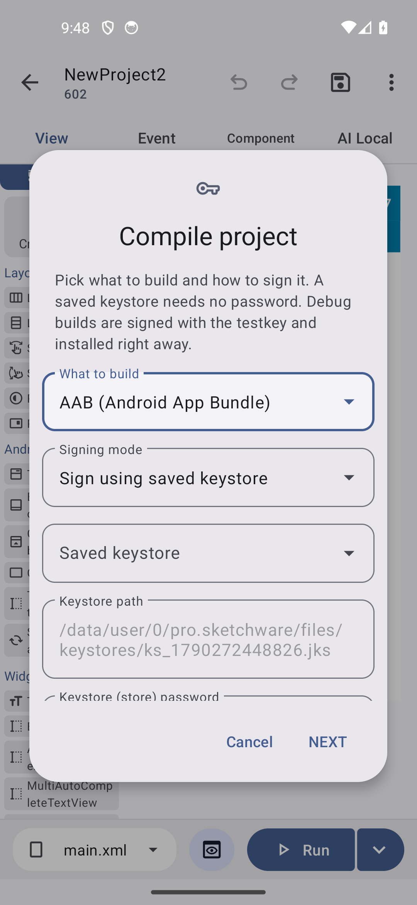 | 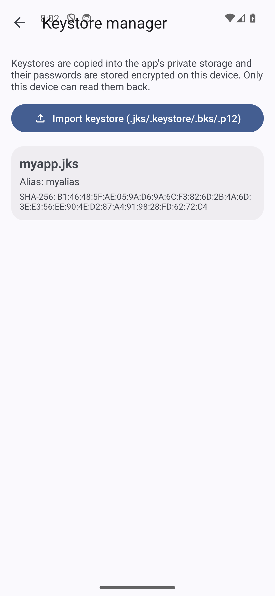 | 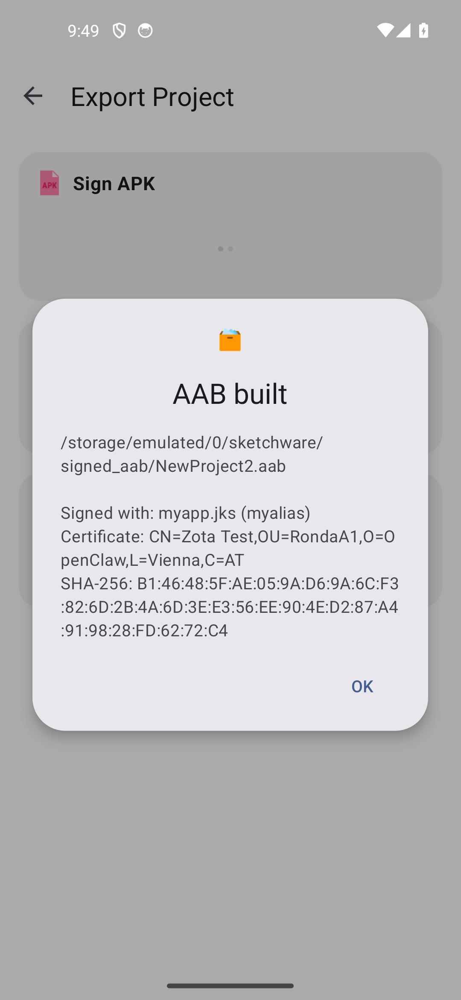 |

### 17.1 El punto de partida (recon): la herramienta de firmar **ignoraba** tu keystore

Recon previo (`sw-features-recon.md`), todo **verificado** en código (fichero:línea) y en pantalla:

- **Ajustes → "Sign an APK file with testkey"** firmaba con la **testkey de AOSP**, pasara lo que pasara: las dos
  llamadas de `AppSettings` (`:241`, `:246`) iban con **`useTestkey=true` hardcodeado**. Con un keystore propio
  guardado, la herramienta **ni lo miraba**. Medido: el APK resultante verificaba con `a40da80a…`, la testkey AOSP.
- **El diálogo de firma del Export** (mismo widget para APK y AAB) asumía **ruta fija**
  (`/storage/emulated/0/sketchware/keystore/release_key.jks`, `wq.j()`), **no tenía campo de ruta** y tenía **un solo
  campo de contraseña**: `GetKeyStoreCredentialsDialog` construía `new Credentials(alg, etPassword, etAlias,
  etPassword)` → la misma contraseña para keystore y para alias. Un `.jks` real (contraseñas distintas, lo normal de
  `keytool`) **no se podía usar**; si el fichero no estaba en la ruta fija: toast "Keystore not found" y el diálogo
  se cerraba perdiendo lo escrito.
- **Bug latente en la rama APK** (`ExportProjectActivity.java:677`): se llamaba a `CustomKeySigner.signZip(…)` con
  `wq.j()` (ignoraba la ruta) y con `signingKeystorePassword` **también** como contraseña de alias. La rama AAB sí
  usaba las variables correctas.
- **Editar Java YA existía.** `FeatureFlags.Key.CODE_VIEWER_EDIT_AND_SAVE` está **ON por defecto** (`FeatureFlags.java:15`),
  y el guardado **sobrevive al build**: `yq` genera el `.java` **solo si no existe** el override en
  `data/<sc_id>/files/java/` y `ProjectBuilder.compileJavaCode()` añade ese directorio a las fuentes. No había que
  crear ningún mecanismo nuevo: lo que faltaba era UX (y la conversión de proyectos de Android Studio/GitHub, que
  sigue sin existir).

### 17.2 Gestor de keystores (nuevo)

`pro/sketchware/security/SecurePrefs.java` (extrae el patrón `EncryptedSharedPreferences` + `MasterKey` AES256_GCM
que ya usaba el IDE en `pro/sketchware/ai/AiSecretStore`, con fallback si el cifrado no está disponible) y
`pro/sketchware/keystore/KeystoreStore.java`:

- copia el `.jks` al **almacenamiento privado de la app** (`filesDir/keystores/<id>.jks`, **no** `/sdcard`, que es
  legible por cualquiera) y guarda alias + contraseña de store + contraseña de clave + algoritmo, cifrados;
- lista, importa, borra y **lee el certificado** (SHA-256 + subject) con el cargador agnóstico de tipo
  (`KeyStoreFileManager`), el mismo que usa el firmado del Export.

`KeystoreManagerActivity` + `activity_keystore_manager.xml` + `item_keystore.xml` + `dialog_import_keystore.xml`:
pantalla en **Ajustes → General → Keystore manager**; importa `.jks` / `.keystore` / `.bks` / `.p12` **validando las
credenciales antes de guardar**.

Prueba (contraseñas **distintas a propósito**: store `StorePass123`, alias `myalias`, key `KeyPass456`): la app
muestra `SHA-256: B1:46:48:5F:AE:05:9A:D6:9A:6C:F3:82:6D:2B:4A:6D:3E:E3:56:EE:90:4E:D2:87:A4:91:98:28:FD:62:72:C4`,
el **mismo valor** que `keytool -list -v -keystore myapp.jks`. Es decir: el guardado cifrado de **las dos**
contraseñas funciona y el keystore se lee de verdad desde `filesDir`.

**Dato que cambia el diagnóstico previo:** antes de esta ronda, tocar `KeyStoreFileManager` **mataba la app** en
release (ver §17.6, `spongycastle`).

### 17.3 Diálogo de firma con **ruta explícita** y **dos contraseñas** (APK y AAB)

`dialog_keystore_credentials.xml` + `GetKeyStoreCredentialsDialog.java`:

- Modos: **Sign using saved keystore** / **Sign using a keystore file** / **Sign using a test key** / **Don't sign**
  (por defecto: guardado si hay alguno; si no, "keystore file").
- Campos nuevos: **selector de keystore guardado**, **ruta del keystore**, **contraseña de store** — separada de
  **alias password**. Al elegir un keystore guardado se rellenan ruta, alias, ambas contraseñas y algoritmo sin
  re-teclear.
- `Credentials` gana `keyStorePath` y un constructor `(path, storePassword, alias, keyPassword, algorithm)`.
- El diálogo **ya no se cierra** cuando la validación falla.
- `ExportProjectActivity`: se pasa `credentials.getKeyStorePath()` y `signingAliasPassword` (los dos bugs de §17.1).

Medido en pantalla (`72-export-sign-dialog.png`, `73-aab-sign-dialog.png`), el dump de UI real sale ya así **para APK
y para AAB** (idéntico, mismo widget):

```
'Saved keystore'
'/data/user/0/pro.sketchware/files/keystores/ks_…jks'     et_keystore_path
'StorePass123'                                            et_store_password
'myalias'                                                 et_alias
'KeyPass456'                                              et_password
'SHA256withRSA'                                           et_signing_algorithm
```

Hay **ruta explícita** y **las dos contraseñas son distintas** — imposible antes (un solo campo). Ya no hace falta
copiar nada a `release_key.jks`.

### 17.4 Ajustes → "Sign an APK file": firma con **tu** keystore y lo demuestra

- La entrada de Ajustes pasa de *"Sign an APK file with testkey"* a **"Sign an APK file"**. Tras elegir el APK
  aparece un selector **"Sign with"**: *testkey* o cada keystore guardado (`Sign with myapp.jks (myalias)`). Se acabó
  el `useTestkey=true` fijo.
- `mod/alucard/tn/apksigner/ApkSigner.java`: `signWithKeyStore(...)` deja de usar el **CLI** de apksig y usa la **API
  programática** (cargador agnóstico de tipo + `com.android.apksig.ApkSigner`, V1+V2+V3). Esto arregla de golpe dos
  fallos de §17.6: Android no puede abrir un JKS real con `getInstance("JKS")`, y el CLI llama a `System.exit()` al
  fallar → **mataba Sketchware** (`System.exit called, status: 2` → `Process pro.sketchware has died`).
- Al terminar, la app **muestra el certificado resultante** (subject + SHA-256) leyendo el APK firmado con
  `ApkVerifier`.

Verificación independiente del APK sacado del dispositivo (`apksigner verify --print-certs`):

```
Signer #1 certificate DN: CN=Zota Test, OU=RondaA1, O=OpenClaw, L=Vienna, C=AT
Signer #1 certificate SHA-256 digest: b146485fae059ad69a6cf3826d2b4a6d3ee356ee904ed287a4919828fd6272c4
```

`b146485f…` = **el certificado del usuario**, no la testkey. Antes de la ronda, ese mismo APK salía firmado en
silencio con `a40da80a…`.

### 17.5 Los tres bugs reales que bloqueaban el build release/AAB

Al medir la firma apareció la verdad: **no se podía compilar ningún proyecto on-device** (el *Run* debug sí iba,
porque el merge de dex se salta en debug). Tres bugs del propio IDE:

| # | Bug real | Síntoma medido | Arreglo | Verificación |
| --- | --- | --- | --- | --- |
| 1 | `DexMerger` (el dx del fork) | `java.nio.BufferOverflowException` en **cualquier** build release/AAB | dedupe de `debug_info_item` por (dex de entrada, offset), +28 líneas | offline **y** en dispositivo: **2.297 → 361** debug info items |
| 2 | `Export AAB` roto por R8 | `Failed to build bundle: … missing method "getBundletool"` | `-keep` de `com.android.bundle.**`, `bundletool.**`, `com.google.protobuf.**` | `getBundletool` **0 → 7** ocurrencias en el dex release; el AAB se genera |
| 3 | Firma del APK release **V1-only** | `INSTALL_PARSE_FAILED_NO_CERTIFICATES` (Android 11+) | kellinwood `ZipSigner` → **apksig V1+V2+V3** | `apksigner verify`: `Verifies` + **instala y arranca** |

**Causa raíz del (1), medida y no deducida:** los `.dex` de librería que el IDE inyecta (generados con d8)
**comparten un mismo `debug_info_item` entre hasta 116 métodos** (2201 code items → solo 265 debug info items en
`http-legacy-android-28.dex`, el que se inyecta siempre); `DexMerger` reservaba el hueco con el byteCount **ya
deduplicado** (`debugInfo += byteCount * 2 + 8` → **5.824 B**) pero escribía **una copia nueva por `code_item`**
(2.315 items). Reproducido **offline** con los dos dex reales, mismo stack que el dispositivo, y el fix desaparece el
fallo (margen medido: `debugInfo reserved=5824 used=2901`).

**Y un cuarto arreglo:** el AAB salía con **digests SHA-1** (en el firmador vendorizado `kellinwood`), así que
`jarsigner -verify` (JDK 17) lo trataba como **no firmado**. Cambiado a **SHA-256** (nombres de atributo + prefijo
`DigestInfo` PKCS#1). Verificado: `jar verified.`

### 17.6 Dos fallos de R8 más (familia "la minificación borra algo que solo se usa por reflexión")

1. **`org.spongycastle` sin constructores.** R8 borraba los constructores vacíos de las clases `*$Mappings` que
   `BouncyCastleProvider` instancia **por reflexión**; al abrir el gestor, `KeyStoreFileManager.<clinit>` reventaba
   con `InternalError: cannot create instance of … has no zero argument constructor`. No era solo la pantalla nueva:
   ese mismo camino lo toca **la firma del Export**, así que la firma con keystore propio estaba rota en release
   **desde antes** de esta ronda. Arreglo: `-keep class org.spongycastle.** { *; }` (+ `-dontwarn`).
2. **El `<init>` de los proveedores de threading del R8/D8 embebido.** La app **embebe R8/D8** para compilar
   proyectos; su propio R8 minificaba esas clases y borraba el **constructor sin argumentos** de los dos proveedores
   de threading, que la factory instancia **por reflexión con el nombre de la clase en un String** → crash
   `Failure creating provider for the threading module` (y el nombre de la clase **sobrevive**, por eso el error era
   `NoSuchMethodException`, no `ClassNotFoundException`: **determinista en cualquier dispositivo**). Corroborado con
   las tres vías: `usage.txt` de R8 lista los dos `<init>` eliminados, `dexdump` los muestra vacíos y el
   desensamblado localiza la factory. Arreglo: `-keep class com.android.tools.r8.threading.** { *; }`; verificado
   **antes/después en dispositivo** con un probe que replica la factory (`NoSuchMethodException` → `OK`). Coste
   medido: **+1.196 B** en arm64-v8a (≈0,001 %). Enumeración completa: **es el único caso** de "clase propia del APK
   instanciada por reflexión" en el R8/D8 embebido.

### 17.7 El XML sin raíz que rompía **todo** el build (`NONE.xml`)

El diálogo "Create a new file" del editor de recursos escribía el fichero con **solo la cabecera**
(`<?xml version="1.0" encoding="utf-8"?>`), y aapt2 respondía:

```
…/drawable/NONE.xml:1: error: no element found.
…/drawable/NONE.xml: error: file failed to compile.
```

Un fichero suelto tumbaba **el build entero**. Arreglo en tres piezas (+91/−7 en 2 ficheros, +1 nuevo):

- **Plantillas válidas por carpeta** (`values*` → `<resources>`, `layout*` → `<LinearLayout …>`, `drawable*` →
  `<shape …>`, etc.).
- **Validación del nombre**: rechaza vacío, `NONE`/`TRANSPARENT` (reservados), `.xml` sin base, sin extensión,
  empezando por `.` o dígito, y caracteres fuera de `[a-zA-Z0-9_]`.
- **Guardia en el build** (`ResourceXmlGuard`, invocada antes de cada `aapt2 compile --dir`): si un `.xml` no tiene
  elemento raíz, se **aparta** a un directorio hermano `.invalid-xml-skipped/` con un aviso — **no se borra** y el
  build sigue. Decisión explicada: el problema reportado era justo que un fichero aislado bloqueaba todo; fallar con
  mensaje claro seguía dejando al usuario sin compilar.

Reproducido con el **aapt2 real del dispositivo** (`libaapt2_exec.so`, arm64) y verificada la guardia (sin ella
aapt2 falla; con el fichero apartado, `EXIT=0`).

**Límite honesto de este carril:** no se ejecutó el ciclo in-app (crear el fichero y compilar desde la app) porque el
emulador y gradle estaban ocupados por los otros carriles; la verificación fue **equivalente**: el mismo binario
aapt2 + el código real de la guardia (compilado y probado: 10/10 casos + 8/8 integración) + las plantillas
compiladas con aapt2 del host **y** del dispositivo.

### 17.8 El diálogo unificado "Compile project" (formato × firma)

Un solo diálogo donde se elige **qué construir** y **cómo firmarlo**, accesible desde **dos sitios**:

- **Desde el editor de diseño** (donde ya está `Run ▶`): menú ▾ → **"Compile APK / AAB..."** (entrada nueva).
  * APK (debug) → lanza el **mismo `BuildTask` de Run** (rápido, testkey, instala); el selector de firma se
    desactiva con la nota *"Debug builds are always signed with the testkey"*.
  * APK (release) / AAB → abren `ExportProjectActivity` con el formato y **la firma recordada**, y arrancan el build
    sin preguntar nada más.
- **Desde Export Project**: **Sign APK** y **Export AAB** abren **el mismo diálogo** (con el formato que sugiere cada
  botón preseleccionado y pudiendo cambiarlo).

Matriz soportada: **saved keystore / keystore file / testkey / sin firmar** × **APK debug / APK release / AAB** (el
debug siempre testkey). Salidas: `signed_apk/<Proyecto>_release.apk`, `signed_aab/<Proyecto>.aab` y las variantes
`.unsigned`. **Recuerda la última elección** (`CompilePreferences`, en `SecurePrefs`): medido reabriendo el diálogo
tras elegir `AAB` y `APK (release)` + `Don't sign`, con ruta/alias/contraseñas del keystore guardado ya rellenos.
**No se tocó el motor de build** (`BuildingAsyncTask` ya exponía los cuatro modos).

### 17.9 Verificación en el APK release

Todo medido en `emulator-5554` (Android 14, arm64-v8a) con el **APK release reconstruido** (R8 activo):

- **APK release firmado con el keystore del usuario** (proyecto `602`): `apksigner verify` → `Verifies`, V1+V2+V3,
  `b146485f…` (el certificado del usuario); `adb install` OK e **instalado desde el botón Install del propio
  diálogo** (el instalador del sistema ofreció *"Do you want to update this app?"*, `lastUpdateTime` cambiado).
- **AAB firmado** (proyecto `602`): `jarsigner -verify` → `jar verified.`; estructura de bundle completa
  (`BundleConfig.pb`, `base/manifest/AndroidManifest.xml`, `base/dex/classes.dex`, `base/res/…`, `base/resources.pb`);
  el `classes.dex` interno es **byte a byte el mismo** que el del APK firmado; el diálogo de resultado mostró
  `Signed with: myapp.jks (myalias)` + `SHA-256: B1:46:48:5F:…:C4`.
- **Run ▶ intacto** (modo debug): el APK sale con la **testkey AOSP** `a40da80a…`, idéntica a las rondas previas.
- **Sin firmar**: salida `…_release.unsigned.apk`, resultado sin botón Install (no ofrece instalar algo que el
  sistema rechazaría).
- El proyecto `601` — el que A1 dejó bloqueado — **compila y firma de punta a punta** una vez reparado su override
  de estilos (el fallo AppCompat era de **sus datos**, no del IDE).

### 17.10 Los 5 bugs de UI encontrados y arreglados durante la verificación

Encontrados **midiendo**, no leyendo, y **todos** corregidos y verificados en el dispositivo:

1. **El selector de formato no se veía** (quedó `android:visibility="gone"` y nadie lo ponía visible).
2. **La etiqueta del selector de firma mentía**: al pasar de `APK (debug)` a `AAB` seguía diciendo "test key" aunque
   el modo real era *saved keystore* (habría firmado bien, pero la UI engañaba).
3. **`NEXT` se salía de la pantalla** cuando el formulario mostraba todos los campos (defecto heredado del diálogo
   de A1 que la fila nueva empeoraba): arreglado acotando la altura y desplazando arriba.
4. **Pulsar `Install` mataba la app** (`IllegalArgumentException: Failed to find configured root that contains
   /storage/emulated/0/sketchware/signed_apk/…`): el `FileProvider` solo exponía `.sketchware/` → añadida la ruta
   `sketchware/signed_apk/` a `provider_paths.xml`.
5. **Se ofrecía instalar un APK sin firmar**: el botón `Install` ahora solo aparece si el resultado está firmado
   (más el foco/teclado, que ya solo aparece cuando hay que escribir).

### 17.11 Pendientes honestos de la ronda A

- **El AAB no se ha probado contra `bundletool` ni contra Play.** No hay `bundletool` en esta máquina (`which
  bundletool` → no encontrado, tampoco en el SDK) y no se subió nada. Verificado: estructura de bundle + `jarsigner`
  + certificado + integridad del dex. Lo que falta para cerrarlo:
  `java -jar bundletool.jar validate --bundle=NewProject2.aab` en una máquina con bundletool.
- **En el diálogo no se ejecutaron en release los modos "keystore file" ni "testkey"** (solo verificados en UI): el
  wiring es el mismo que el del keystore guardado, ya probado, pero no se han corrido.
- **`Export AAB` (el botón del Export Project) no se pulsó** en la ronda: abre el mismo `showCompileDialog(AAB)` que
  *Sign APK* (verificado en pantalla); el build de AAB sí se ejecutó, desde la entrada del editor.
- **La conversión de proyectos de Android Studio/GitHub sigue pendiente.** El recon concluye que la inversa **no
  existe** (no hay parser de Gradle/Manifest ni cliente git) y que es viable **solo parcialmente y "best effort"**:
  crear un proyecto vacío e importar `res/layout` y `.java` **como overrides** (que el motor ya soporta). Es trabajo
  nuevo y considerable → **siguiente ronda: viabilidad + MVP**.
- **Firma V3.1/V4** no añadidas (el APK sale V1+V2+V3; V4 no es requisito de Play con `minSdk 21`).
- **El `-keep` de `bundletool`/`protobuf` engorda el APK release** (~2 MB en arm64-v8a: 118,49 vs 116,43 MB). Es el
  precio de que el AAB funcione; se puede afinar a las clases realmente usadas.
- **Pendientes pequeños conocidos, no tocados:** `NewKeyStoreActivity` (drawer → *Create keystore*) sigue
  escribiendo en `wq.j()` con **una sola** contraseña; `AiSecretStore` sigue duplicando el patrón de `SecurePrefs`;
  `Build Settings` y *Show Apk signatures* siguen como estaban.
- **Sin commitear** en el árbol de trabajo; `versionCode`/`versionName` los pone esta release a **176 / v7.0.14.0**.
